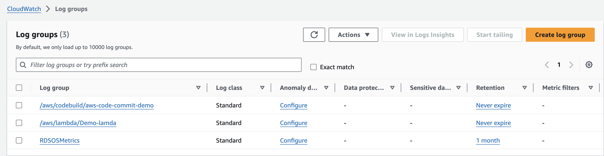
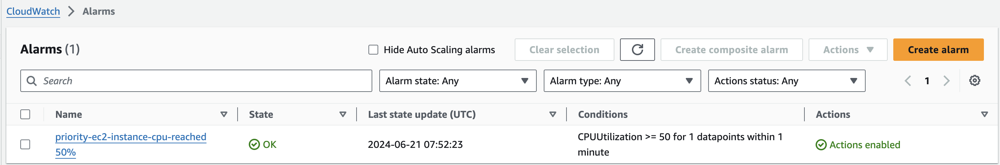

## AWS Technical Essentials ##

## IAM (Identity Access Management) ##

`Authentication:`

Login with the AWS root user and `create a IAM test user and don't add any permissions`. Logout the root user and login with the IAM user and try to access with the services in AWS console, but not able to access. Here you have a access with the AWS console but not in the services here comes with the authorization.

`Authorization:`

Login with the AWS root user and and add the permissions i.e `S3 full access or Ec2 admin access etc`. and logout root login again login with the IAM user now you can check with the S3 and EC2 services you can able to see the existing buckets, create buckets and list the same similarway for the EC2 instace as well.

## EC2 (Elastic Compute Cloud) ##

As below link describes different types of EC2 Instances.

https://github.com/viswa2/DevOps/tree/master/aws-fundamentals#different-type-of-ec2-instances

`Go to EC2 console launch instance and deploy jenkins and test it.`

1. Launch and Ubuntu Ec2 insatnce with the necessary details.
2. After launch connect Ec2 with the ssh -i <key pair name> ubuntu@public ip
3. Enter the super user i.e sudo su -
4. Update the packages `apt update -y`
5. Install java `apt install openjdk-17-jdk -y`
6. Install jenkins by using official documentaion.
7. check the status of Jenkins by using systemctl status jenkins
8. By default jenkins is running 8080 port, we can't able to access the app, until we can allow the port in Ec2 instance i.e Security --> Inbound Rules --> edit Inboud Rules and add the custom tcp port 8080 and save the rule.
9. Now the hit the http://public ip: 8080 you can able to access the jenkins application in the browser.

1. Create IAM role --> Role --> Create role --> AWS service --> s3 --> AmazonDynamoDBFullAccess --> next --> Rolename
2. Create s3 bucket for objects --> create bucket --> AWS region ex: us-east-1 --> bucket name Ex: employee-photo-bucket-00 --> Add the bucket policy --> Create bucket
3. Launch Ec2 Instance --> Instance name --> AMI from catalog --> Instance type t2.micro --> Key pair you can select or create a new key pair to connect the instance --> VPC earlier I have create app-vpc select the same --> Subnet created earlier select the same --> Create security group for Http and Https --> Advandced details --> IAM Instance profile --> select the  AmazonDynamoDBFullAccess --> Under the user data add the script for the Employee directory app --> Create Instance --> Wait a minute and check the app is working or not with the public ip in the browser.

4. IAM Instance Profile added in Advance details as created role in the first step.

4. Create the dynamo db --> Create table --> Table name --> Employees --> Partition key is id for string --> Remaining default options and create table.
5. As per the above screenshot fill the details i.e Name, Location, JobTitle and upload your photo once done save the details.
6. Go to the bucket and click on there should be employee_pic uploaded
7. Go the dynamodb and click on Tables --> Click on Table name Ex: Employees --> Explore Table Items --> There should be your details in the table i.e Name, Location and Jobtitle.

## Amazon Machine Image or AMI ##

1. Launch an EC2 instance with the user data of httpd

2. check with the public ip in the browser

3. Create a image from the EC2 instance which we created on it's first step --> Select the EC2 instance from the 1st Step --> Click on Actions --> Image and Templates --> Image name --> Create image i.e Then click on EC2 dashboard --> Images --> AMIs --> You can find the created image.

5. Launch a instance from AMI list which was created on 3rd step with the user data with the just last line of echo statement.

6. Check instance public ip in the browser it's should work.

7. Find the screenshot for the second instance as below.

## Application Load Balancer ##

1. Launch 2 EC2 instances with the same style --> My first instance --> Number of instances 2 --> Instance type t2.micro --> Proceed without keypair --> Under network settings select existing security group which is having ssh and http indbound rule if not create a new one --> Advance details --> user data --> add user-data-for-load-balancer

2. After launching the 2 instances change the name for one of the instance from My First Instance to My Second Instance

3. Check the public Ip of both Ec2 instances if it's working or not as per below attaching here one instance reference.

4. Click on load balancers --> create load balancer --> click on creat application load balancer --> load abalancer name i.e Demo-ALB, Internet-facing, ip address type ipv4 --> Network mapping --> Select at least two Availability Zones --> Refresh and select the Security group which we created in 5th step --> Refresh and select the target group which we created in 6th step --> Create a load balancer

5. Create a new security group which is allowing http port

  
6. Listner and routing --> choose a target type --> Instances --> Target Group Name --> Protocol port http --> IP address type ipv4--> Health checks HTTP --> Register Targets select the 2 instances --> Include as pending below --> Create Target Group

7. Copy DNS name of the load balancer and open in the browser and refresh it you camn able to observe the two ip address of the 2 EC2 instances.

8. For futrher testing you can stop one instance and refresh the DNS name of load balancer and vice versa

## S3 Bucket ##

1. Search on s3 on amaznon dashboard and click on create bucket
2. Select the region if you want to create a bucket
3. Bucket name must be unique within the global namespace and follow the bucket naming rules
4. Object Ownership  ACL's disabled
5. Block all public access
6. Disable bucket versioning
7. Rest of the options are default and create a bucket
8. Click on the bucket name --> upload --> Add files --> Slect from your computer --> Upload
9. Click on the objects which you have uploaded and click on object url you will get AccessDenied error due to Block all public access on 6th point.
10. Now click on bucket permissions and edit Block public access (bucket settings) uncheck Block all public access and save
11. Edit the Bucket policy click on plocy generator (https://awspolicygen.s3.amazonaws.com/policygen.html) and fill the necessary details add statement and generate policy.

12. Copy the policy and paste policy and click on save changes
13. Now try to refresh the object URl

## Static website hosting ##

1. Click buckets --> Bucket name --> properties --> edit and enable static website hosting --> Save changes
2. Upload the index.html file into the bucket
3. Go to the Static website hosting click on url find the below image as reference.

4. if you want to enable the bucket versioning click on properties Bucket Versioning enable and save it.
5. Then try to upload some modificatiopn with the index.html and upload the same.

## Replication Rules for S3 Bucket ##

1. Create a 2 buckets for replication testing i.e replication-origin and replication-destination0

2. Create a replication rule in `replication-origin` bucket click on Management --> Replication rule name i.e mydemo replication --> Status enabled --> Under source bucket Apply to all objects in the bucket --> Destination choose --> Choose a bucket in this account, add the bucket name i.e `replication-destination0` --> IAM role --> Create a new role --> keep remaining as default and save.

3. Upload the objects for testing with the versioning enabled
4. Go to the `replication-destination0` bucket and refresh the page you can observe same file with the same version id.

5. Replication destination with `replication-destination0`

## S3 Bucket Policy for Restrict Users ##

This policy denies all S3 actions on the `my-demo-test-bucket-prod bucket` and its objects to any principal except the root user of the account with ID 407303443287. In other words, only the root user of this AWS account can access the bucket and its objects; all other users are denied access.

This effectively restricts access to the bucket to only the specified root user, ensuring that no other IAM users or roles (even within the same account) can perform any actions on the bucket or its objects.

`How This was Tested` ?

1. In the root it's tested by creating a IAM test user with the permissions of policy IAMUserChangePassword AmazonS3FullAccess.
2. In the root account we have created a bucket called `my-demo-test-bucket-prod` upload the objects and added the bucket policy called `s3-bucket-policy-restrict-users`
3. Login with the IAM user account and click on s3 section you can't able to view the objects, permissions, listout objects etc. i.e as below image.

## Cloud Formation ##

CloudFormation, It's infrastructure as code. This means that you can build an environment by writing lines of code instead of using the AWS Management Console to individually provision your infrastructure resources.

1. Select the region as us-east-1 otherwise things will not work.
2. Create a stack & Prerequisite –-> Prepare template--> select Template is ready
3. Specify Template --> select Upload a template file i.e upload from your computer or you can select Amazon S3 url as well.

4. Provide a stack name called i.e Demo Cloudformation and click on next
5. Configure stack options provide key and value fields and click on next and submit
6. Then You can observe Events

7. Open the next tab and you can able to see the Ec2 intsance through the cloudformation which we have provisioned.

8. If you want to update stack click on update stack --> replace current template --> Upload a template file with the changes. Once done it will terminate the existing resources and re-create with the new one.
   
9. If we want to delete the resources there is no need to go each and indivual resources to delete simply go and delete the stack

   `Note:` While creating the cloud formation template check the AZ and subnet in the same AZ.

## Cloud Front ##

Amazon CloudFront is a content delivery network (CDN) service built for high performance, security, and developer convenience. Caches and serves static & dynamic content it's a `global` service.

**Protection against network and application layer attacks**
Amazon CloudFront, AWS Shield, AWS Web Application Firewall (WAF), and Amazon Route 53 work seamlessly together to create a flexible, layered security perimeter against multiple types of attacks including network and application layer DDoS attacks.

1. Create a bucket in S3
2. Upload with the files for cloudfront testing.

3. Now open the Object url it won't work due to AccessDenied error because we blocked the public access. This we can able to acheive by using cloudfront.

4. Next in Amaznon search i.e cloudfront & Create distribution ie choose the name of bucket object url which we was created the bucket in 1st step
5. Name of this origin i.e demo-cloudfront10.s3.us-east-1.amazonaws.com (it's same like the distrubution)
6. Origin access public 
7. Under Web Application Firewall (WAF) select Do not enable security protections
8. under Default root object type `index.html` which we were uploaded earlier in s3 bucket and then click create distribution.
9. Need to copy the policy of cloud front and paste under the bucket policy.
10. Once the distribution status is enabled click on Distribution domain name and see the magic.

11. You can try with the domain name with the index.html and image.jpg etc.

## AWS Shared Responsibility Model ##

Under the AWS Shared Responsibility Model, customer's responsibility is determined by the AWS Cloud services that a customer selects. For abstracted services, such as Amazon S3 and Amazon DynamoDB, AWS operates the infrastructure layer, the operating system, and platforms, and customers access the endpoints to store and retrieve data. Customers are responsible for managing their data (including encryption options), classifying their assets, and using IAM tools to apply the appropriate permissions.

For the given use-case, the customer is responsible for maintaining the versions of an AWS Lambda function.

## Create a VPC, launch EC2 Instance and Test with Http Sample Application ##

1. In AWS by default VPC should be available.
2. Create a VPC and under VPC settings click on vpc and more
3. Add the name of vpc, IPv4 CIDR block number AZ's and rest of the options are default and click on create vpc.
4. Then vpc created with the name of demo-vpc, under you can see the resource map as below.

5. Launch EC2 instance by selecting ubuntu flavor with the key pair, network settings select as what we have created above, select one public subnet which we have created as above and enable the Auto-assign public IP and launch instance.

6. Once EC2 instance start running try to connect the instance by using ssh
EX: ssh -i "key pair name" ubuntu@< PUblic IP of EC2 Instance >

7. Then update the package by using `sudo apt update` command
8. Just try with the simple application by using as below command `python3 -m http.server 8000`

9. Then try to check in the browser `http://<public ip:8000>` it won't work since your Ec2 instance in bound rules are not enabled with the 8000 port. Enbale and try it's should works.

10. You can able to restrict the port on top of the subnet under network ACLs i.e under VPC--> Network ACLs --> Click on which VPC connected on top of NACL's and edit the inbound rules, allow or denay specific port, ip address and ranges of the ip addresses based on the rule number of assending order it's should work's on subnet level.

## Deploy a Sample Application in Private Subnet ## 

1. Create a VPC as per above diagram i.e 2 public and 2 private subnets 2 nat gateways and internet gateway with 2 AZ

2. Create a auto scaling group with launch template and attach with the private subnet.
3. Create a bastion host or jump server it’s should be work as a mediator b/w private subnets and public subnets to connect the EC2 instances.
4. Create if you don't have key pair (.pem) and copy into the bastion host server
   `Example command:` scp -i /Users/viswanathareddy/Downloads/.pem file /Users/viswanathareddy/Downloads/.pem file ubuntu@3.80.93.106:/home/ubuntu
5. Try to connect bastion host with the ssh command i.e ssh -i .pem file ubuntu@public iP and then check /home/ubuntu path .pem file is available or not.
6. Take the private ip address of first instance and try to connect by using ssh it should connect by using .pem file, what we have copied in the previous step.
7. Create basic index.html file content
8. Deploy the sample python http application. `python3 -m http.server 8000`
9. Create a application load balancer with the public subnet.
10. Copy of the load balancer of dns name and hit the url in browser It's should work as below.

`Observation:ch` I have tried with the 2 instances to create basic `index.html file` and deploy with the sample python application, Even though my 2 EC2 instances are healthy traffic is routing into the single instance only.

## AWS CodeCommit ##

AWS CodeCommit is a f`ully-managed source control service that hosts secure Git-based repositories`. It makes it easy for teams to collaborate on code in a secure and highly scalable ecosystem.

1. Create a IAM user Ex: `test-user` and add the permissions with the attach policies directly `policy name`: AWSCodeCommitPowerUser which allow the user full access to AWS CodeCommit repositories.
2. Under IAM --> Users --> test-user --> Security credentials --> HTTPS Git credentials for AWS CodeCommit --> click on generate credentials and download the credentials.
3. Search on AWS console codecommit and add the repository name, add meaningful description and click on create.
4. Once create the repository, click on repositories, repository name clone https URL
5. Git clone <Https Url name>
6. It will ask username and password provide the credentials which was downloaded in 2nd step.
7. Then add some files Ex: s3-bucket.yaml 
8. Use git commands i.e git add, commit, and push the changes into the repo.
9. Once pushed go to the AWS console and refresh the code commit repository we can able to see the `s3-bucket.yaml` file

## AWS CodeBuild ##

AWS CodeBuild is a fully managed continuous integration service that compiles source code, runs tests, and produces software packages that are ready to deploy. With CodeBuild, you don’t need to provision, manage, and scale your own build servers.

1. Search codecommit and click on create project add the project name.
2. Under source select source provider is Github since source code is present in Github. We can selectother options based on source code availability.
3. GitHub repository Since i have been testing `iam-veeramalla` added the same.
4. Click on connect form github it will open another window and add the details and click on connect.
5. Under environment add the operating ssytem as Ubuntu, Runtime:standard, Image:latest and Image version: always use the latest image for this runtime version.
6. Under build spec click on insert build commands `add the yaml configuration details`
7. Go to IAM roles and add the `AWSCodeBuildAdminAccess` and create the role.
8.  Under service role permissions `service role` updae the role created on 7th step and click on create build project.
9.  Since we are using docker we need credentails for the docker authentication search on aws console `AWS Systems Manager`
10.  Under Application Management --> parameter store --> Create parameter as per the screenshot and add the name and value of it.

11. Now Click on start build under CodeBuild project check the build history and build logs check the erros and resolve one by one. i.e Yaml indendation errors in the phases i have added `pre-build` but actually `pre_build` and check the spaces `python: 3.11` etc.
12. Error docker buildx build" requires exactly 1 argument
Fix: We need add the docker build command . in the last so that it's should identify the `Dockerfile` and build the process.
13. I have added the credentails invaild refernce format under `AWS Systems Manager --> Parameter store`
Fix: Check username and password correctly along with the docker registry name Ex: docker.io
14. Once everything fine it's should build and pushed the image into docker hub.
15. Adding the build spec yaml file into the github for reference.

## AWS CodePipeline ##

AWS CodePipeline is a continuous delivery service you can use to model, visualize, and automate the steps required to release your software. You can quickly model and configure the different stages of a software release process.

1. Click on codepipeline add the pipeline name, select the pipeline type V2 
2. Add the existing service role if already have otherwise create and add it.
3. Click on next add source --> source provider Github version2 --> Connection --> connect to github --> Add the repository name --> provide the default branch name.
4. Click add on build stage i.e AWS CodeBuild click on next and skip on deploy stage review and click on code pipeline.
5. Once done pipeline will trigger and it will complete with the succeeded.
6. Now make a small change and push into the repo the codepipeline will trigger automatically.

## AWS CodeDeploy ##

CodeDeploy is a deployment service that automates application deployments to Amazon EC2 instances, on-premises instances, serverless Lambda functions, or Amazon ECS services.

1. Create a role for Amazon Ec2 & AWSCodedeploy.
2. Launch a Ec2 instance and attach the IAM role which we have created in 1st step.
3. Install codedeploy agent for ubuntu server as per the reference link.

`Reference Link`: https://docs.aws.amazon.com/codedeploy/latest/userguide/codedeploy-agent-operations-install-ubuntu.html

4. In the AWS console search for the codedeploy under --> Applications --> Create application.
5. Click on application name and crete deployment group as per the options.
6. Start authenticate for the github and deploy the application.

## AWS CloudWatch ##

Amazon CloudWatch monitors your resources and the applications you run on AWS in real time. You can use CloudWatch to collect and track metrics, which are variables you can measure for your resources and applications. i.e logs, metrics, alarms, custom metrics and cost-optimization etc.

`For Testing:`
1. AWS console search for cloudwatch and click on `Log groups` we can observe our recent activities are performed under our aws account. we chck on log group with the log stream what kind of different activities we are performed on particulatr event time. this logs are collected cloudwatch by default will track as per below screenshot.

2. Create a EC2 instance and observe the monitoring section we have a CPU, Network in bytes, etc.
3. Login into EC2 instance and run the command called `stress --cpu 4 --timeout 60` this will increase the CPU spike in EC2 instance.
4. EC2 Instance --> Monitoring --> Enable the manage detailed monitoring and we can able to see the maximum spike of CPU.

5. In the Cloudwatch we can create the alarms In alarms --> Create alaram --> Select the metric --> Mettric --> EC2 --> Per instance metrics --> Serach per cpu --> Findout with the Instance-id --> Select Metric --> statistic --> maximum and period --> 1 minute and conditions greater or equals to 50 and click on next
6. Under Notification Create a topic --> topic name and email to send a notification when thresold reaches to what we have configured and then click on next.
7. Add a name and description and then reveiew and create.
8. Once done you will receive a mail AWS Notification - Subscription Confirmation, click on confirm subscription.
9. Once confirm the subscription your cloudwtach alarm should be as below.

10. After reaching the CPU spike we can get the notification through mail based on our configuration.

11. Not only this we can able to see the diffrenet types of metrics based on our actvity on daily basis.

## AWS Lambda ##

