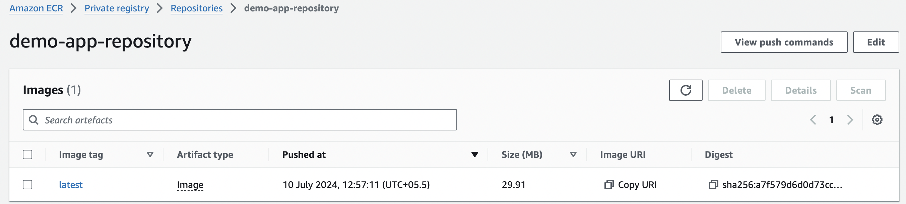

# AWS Technical Essentials

## Table of Contents
- [Connecting to Private EC2 Instances via Jump Host](#connecting-to-private-ec2-instances-via-jump-host)
- [IAM (Identity and Access Management)](#iam-identity-and-access-management)
- [EC2 (Elastic Compute Cloud)](#ec2-elastic-compute-cloud)
- [Amazon Machine Image (AMI)](#amazon-machine-image-ami)
- [Application Load Balancer](#application-load-balancer)
- [S3 Bucket Management](#s3-bucket-management)
- [Static Website Hosting](#static-website-hosting)
- [S3 Replication Rules](#s3-replication-rules)
- [S3 Bucket Policy for Restricted Access](#s3-bucket-policy-for-restricted-access)
- [CloudFormation](#cloudformation)
- [CloudFront CDN](#cloudfront-cdn)
- [AWS Shared Responsibility Model](#aws-shared-responsibility-model)
- [VPC and EC2 Deployment](#vpc-and-ec2-deployment)
- [Private Subnet Application Deployment](#private-subnet-application-deployment)
- [AWS CodeCommit](#aws-codecommit)
- [AWS CodeBuild](#aws-codebuild)
- [AWS CodePipeline](#aws-codepipeline)
- [AWS CodeDeploy](#aws-codedeploy)
- [AWS CloudWatch](#aws-cloudwatch)
- [AWS Lambda](#aws-lambda)
- [AWS Cost Optimization](#aws-cost-optimization)
- [ECR (Elastic Container Registry)](#ecr-elastic-container-registry)

---

## Connecting to Private EC2 Instances via Jump Host

### How to connect from jump host/jump box server to other private EC2 instance?

#### Step-by-Step Process:

1. **Create the jump host server** with the public subnet, public route table with the internet gateway
2. **Auto-enable the public IP**
3. **Create the .pem file**
4. **Download the .pem file**
5. **Set proper permissions:**
   ```bash
   chmod 0400 <.pem file name>
   ```
6. **Connect to jump host:**
   ```bash
   ssh -i <.pem file> ec2-user@<public_ip>
   ```
7. **Copy the .pem file to the jump host:**
   ```bash
   scp -i /Users/mekalaviswanathareddy/Downloads/new-env.pem \
       /Users/mekalaviswanathareddy/Downloads/new-env.pem \
       ec2-user@<public_ip>:/home/ec2-user
   ```
8. **Set permissions on jump host:**
   ```bash
   chmod 400 /home/ec2-user/new-env.pem
   ```
9. **Connect to private EC2 instance:**
   ```bash
   ssh -i new-env.pem ec2-user@<private_ip>
   ```

### Connecting Using Hostname Instead of Private IP:

1. **Edit hosts file:**
   ```bash
   sudo vi /etc/hosts
   # Add: <private_ip> <hostname>
   # Example: 3.80.93.106 nifi-test
   ```

2. **Configure SSH:**
   ```bash
   vi ~/.ssh/config
   ```
   Add the following content:
   ```
   Host nifi-qa
       HostName <Private_IP>
       User ec2-user
       IdentityFile /Path/to/key.pem
   ```

3. **Connect using hostname:**
   ```bash
   ssh nifi-qa
   ```

## IAM (Identity and Access Management)

### Authentication vs Authorization Demo

#### Authentication:
1. Login with the AWS root user and **create an IAM test user without any permissions**
2. Logout from root user and login with the IAM user
3. Try to access AWS services in the console - **access will be denied**
4. You have access to the AWS console but not to services - this demonstrates **authorization** control

#### Authorization:
1. Login with the AWS root user and add permissions (e.g., **S3 Full Access** or **EC2 Admin Access**)
2. Logout from root and login again with the IAM user
3. Now you can access S3 and EC2 services, view existing buckets, create buckets, and manage EC2 instances

## EC2 (Elastic Compute Cloud)

For different types of EC2 instances, refer to: [AWS Fundamentals - EC2 Instance Types](https://github.com/viswa2/DevOps/tree/master/aws-fundamentals#different-type-of-ec2-instances)

### Deploy Jenkins on EC2

#### Step-by-Step Process:

1. **Launch Ubuntu EC2 instance** with necessary configuration
2. **Connect to EC2:**
   ```bash
   ssh -i <key pair name> ubuntu@<public_ip>
   ```
3. **Switch to super user:**
   ```bash
   sudo su -
   ```
4. **Update packages:**
   ```bash
   apt update -y
   ```
5. **Install Java:**
   ```bash
   apt install openjdk-17-jdk -y
   ```
6. **Install Jenkins** using official documentation
7. **Check Jenkins status:**
   ```bash
   systemctl status jenkins
   ```
8. **Configure Security Group:** Add inbound rule for port 8080 (Custom TCP)
9. **Access Jenkins:** Navigate to `http://<public_ip>:8080`

### Employee Directory Application Deployment

#### Prerequisites Setup:

1. **Create IAM Role:**
   - Role → Create role → AWS service → EC2 → AmazonDynamoDBFullAccess → Role name

2. **Create S3 Bucket:**
   - Create bucket → AWS region (e.g., us-east-1) → Bucket name (e.g., employee-photo-bucket-00) → Add bucket policy → Create bucket

3. **Launch EC2 Instance:**
   - Instance name → AMI from catalog → Instance type t2.micro → Key pair
   - VPC (select existing app-vpc) → Subnet (select existing) → Security group for HTTP and HTTPS
   - Advanced details → IAM Instance profile → Select AmazonDynamoDBFullAccess role
   - User data → Add script for Employee directory app → Create Instance


4. **Create DynamoDB Table:**
   - Create table → Table name: **Employees** → Partition key: **id** (String) → Create table

5. **Test the Application:**
   - Fill details (Name, Location, JobTitle) and upload photo → Save
   - Check S3 bucket for uploaded employee photo
   - Check DynamoDB table for employee details


## Amazon Machine Image (AMI)

### Creating and Using Custom AMI

#### Step-by-Step Process:

1. **Launch EC2 instance with HTTPD user data:**


2. **Verify HTTPD is running:** Check with public IP in browser


3. **Create AMI:**
   - Select EC2 instance → Actions → Image and Templates → Create Image → Image name → Create image
   - Check EC2 dashboard → Images → AMIs for the created image


4. **Launch instance from custom AMI:**


5. **Verify the new instance works with public IP**


## Application Load Balancer

### Setting up Application Load Balancer

#### Step-by-Step Process:

1. **Launch 2 EC2 instances:**
   - Launch instance → Name: **My First Instance** → Number of instances: **2**
   - Instance type: **t2.micro** → Proceed without key pair
   - Network settings → Select existing security group (SSH and HTTP) or create new
   - Advanced details → User data → Add user-data-for-load-balancer

2. **Rename instances:** Change one instance name to **My Second Instance**


3. **Test both instances:** Check public IP of both instances


4. **Create Security Group for Load Balancer:** Allow HTTP port


5. **Create Target Group:**
   - Target type → **Instances** → Target Group Name → Protocol: **HTTP**
   - IP address type: **IPv4** → Health checks: **HTTP**
   - Register Targets → Select both instances → Create Target Group


6. **Create Application Load Balancer:**
   - Load balancer name: **Demo-ALB** → Internet-facing → IPv4
   - Network mapping → Select at least two Availability Zones
   - Security group → Select created security group
   - Target group → Select created target group → Create


7. **Test Load Balancer:**
   - Copy DNS name and open in browser
   - Refresh to see traffic distribution between instances


8. **High Availability Testing:** Stop one instance and test load balancer functionality

## S3 Bucket Management

### Creating and Configuring S3 Bucket

#### Step-by-Step Process:

1. **Create S3 Bucket:**
   - Search S3 → Create bucket → Select region → Unique bucket name
   - Object Ownership: **ACLs disabled** → Block all public access → Disable versioning
   - Default options → Create bucket

2. **Upload Objects:**
   - Click bucket name → Upload → Add files → Select from computer → Upload

3. **Configure Public Access:**
   - Click uploaded object → Object URL (will show AccessDenied initially)
   - Bucket permissions → Edit Block public access → Uncheck **Block all public access** → Save

4. **Create Bucket Policy:**
   - Edit Bucket policy → Use Policy Generator: https://awspolicygen.s3.amazonaws.com/policygen.html
   - Fill necessary details → Add statement → Generate policy


5. **Test Public Access:**
   - Copy and paste policy → Save changes → Refresh object URL


## Static Website Hosting

### Configuring S3 for Static Website Hosting

#### Step-by-Step Process:

1. **Enable Static Website Hosting:**
   - Buckets → Bucket name → Properties → Edit Static website hosting → Enable → Save changes

2. **Upload index.html:** Upload the index.html file to the bucket

3. **Access Website:** Go to Static website hosting → Click URL


4. **Enable Versioning (Optional):**
   - Properties → Bucket Versioning → Enable → Save
   - Upload modified index.html to test versioning


## S3 Replication Rules

### Setting up Cross-Region Replication

#### Step-by-Step Process:

1. **Create Two Buckets:**
   - Create buckets: **replication-origin** and **replication-destination0**


2. **Create Replication Rule:**
   - In **replication-origin** bucket → Management → Replication rule name: **mydemo replication**
   - Status: **Enabled** → Source bucket: **Apply to all objects**
   - Destination: **Choose bucket in this account** → Bucket name: **replication-destination0**
   - IAM role: **Create new role** → Save

3. **Test Replication:**
   - Upload objects with versioning enabled
   - Check **replication-destination0** bucket for replicated files


## S3 Bucket Policy for Restricted Access

### Restricting Bucket Access to Root User Only

This policy denies all S3 actions on the `my-demo-test-bucket-prod` bucket and its objects to any principal except the root user of account ID 407303443287.

#### Testing Process:

1. **Root Account Setup:**
   - Create IAM test user with permissions: **IAMUserChangePassword**, **AmazonS3FullAccess**
   - Create bucket: **my-demo-test-bucket-prod**
   - Upload objects and add bucket policy: **s3-bucket-policy-restrict-users**

2. **IAM User Testing:**
   - Login with IAM user account
   - Try to access S3 section - access will be denied


## CloudFormation

### Infrastructure as Code with CloudFormation

CloudFormation allows building environments by writing code instead of using the AWS Management Console.

#### Step-by-Step Process:

1. **Region Selection:** Select region **us-east-1** (required for some resources)

2. **Create Stack:**
   - Create stack → Prerequisite: **Template is ready**
   - Specify Template → **Upload template file** or **Amazon S3 URL**


3. **Stack Configuration:**
   - Stack name: **Demo CloudFormation** → Next
   - Configure stack options → Key-value fields → Next → Submit

4. **Monitor Events:**


5. **Verify Resources:**


6. **Update Stack:** Update stack → Replace current template → Upload modified template

7. **Delete Resources:** Delete stack to remove all associated resources

> **Note:** Ensure AZ and subnet are in the same AZ when creating CloudFormation templates.

## CloudFront CDN

### Setting up Content Delivery Network

Amazon CloudFront is a global CDN service that caches and serves static & dynamic content with high performance and security.

#### Step-by-Step Process:

1. **Create S3 Bucket:** Create bucket and upload files for CloudFront testing


2. **Enable Static Website Hosting:**
   - Properties → Enable Static website hosting
   - Index document: **index.html** → Save changes


3. **Create CloudFront Distribution:**
   - Search CloudFront → Create distribution
   - Origin: Select bucket object URL
   - Origin access: **Legacy access identities** → Create new OAI
   - Bucket Policy: **Yes, update bucket policy**
   - WAF: **Do not enable security protections**
   - Default root object: **index.html** → Create distribution

4. **Test CloudFront:**
   - Wait for distribution status: **Enabled**
   - Access content via CloudFront domain name


## AWS Shared Responsibility Model

### Understanding Security Responsibilities


Under the AWS Shared Responsibility Model:

- **AWS Responsibilities:** Infrastructure layer, operating system, platforms for abstracted services
- **Customer Responsibilities:** Data management, encryption options, asset classification, IAM tools, application-level security

For services like Amazon S3 and DynamoDB, customers are responsible for:
- Managing data (including encryption options)
- Classifying assets
- Using IAM tools for appropriate permissions
- Maintaining versions of AWS Lambda functions

## VPC and EC2 Deployment

### Creating VPC and Deploying HTTP Application


#### Step-by-Step Process:

1. **Create VPC:**
   - VPC settings → **VPC and more** → VPC name
   - IPv4 CIDR block → Number of AZs → Default options → Create VPC

2. **View Resource Map:**


3. **Launch EC2 Instance:**
   - Ubuntu AMI → Key pair → Network settings: Select created VPC
   - Public subnet → Enable Auto-assign public IP → Launch

4. **Connect and Test:**
   ```bash
   ssh -i "key-pair-name" ubuntu@<public_ip>
   sudo apt update
   python3 -m http.server 8000
   ```


5. **Configure Security Group:** Enable port 8000 in inbound rules

6. **Test Application:** Access `http://<public_ip>:8000`


7. **Network ACL Configuration:**
   - VPC → Network ACLs → Edit inbound rules
   - Allow/deny specific ports, IP addresses, and ranges


## Private Subnet Application Deployment

### Deploying Applications in Private Subnets


#### Step-by-Step Process:

1. **Create VPC:** 2 public and 2 private subnets, 2 NAT gateways, internet gateway across 2 AZs


2. **Create Auto Scaling Group:** Launch template attached to private subnets

3. **Create Bastion Host:** Jump server for connecting to private instances

4. **Copy Key Pair to Bastion:**
   ```bash
   scp -i /Users/viswanathareddy/Downloads/.pem \
       /Users/viswanathareddy/Downloads/.pem \
       ubuntu@<bastion_public_ip>:/home/ubuntu
   ```

5. **Connect to Private Instance:**
   ```bash
   ssh -i .pem ubuntu@<bastion_public_ip>
   chmod 400 /home/ubuntu/.pem
   ssh -i .pem ubuntu@<private_ip>
   ```

6. **Deploy Application:**
   - Create basic index.html
   - Deploy sample Python HTTP application: `python3 -m http.server 8000`

7. **Create Application Load Balancer:** Configure with public subnets

8. **Test Application:** Access via load balancer DNS name


> **Observation:** Even with 2 healthy instances, traffic may route to single instance only during testing.

## AWS CodeCommit

### Fully-Managed Source Control Service

AWS CodeCommit hosts secure Git-based repositories for team collaboration.

#### Step-by-Step Process:

1. **Create IAM User:**
   - User: **test-user** → Attach policy: **AWSCodeCommitPowerUser**

2. **Generate Git Credentials:**
   - IAM → Users → test-user → Security credentials
   - HTTPS Git credentials for AWS CodeCommit → Generate credentials → Download

3. **Create Repository:**
   - CodeCommit → Create repository → Repository name → Description → Create

4. **Clone Repository:**
   ```bash
   git clone <https_url>
   # Enter username and password from step 2
   ```

5. **Add and Push Files:**
   ```bash
   # Add files (e.g., s3-bucket.yaml)
   git add .
   git commit -m "Initial commit"
   git push origin main
   ```

6. **Verify in Console:** Check CodeCommit repository for uploaded files


## AWS CodeBuild

### Fully-Managed Continuous Integration Service

CodeBuild compiles source code, runs tests, and produces deployment-ready packages.

#### Step-by-Step Process:

1. **Create Build Project:**
   - CodeBuild → Create project → Project name
   - Source provider: **GitHub** → Repository: Connect from GitHub

2. **Environment Configuration:**
   - Operating system: **Ubuntu** → Runtime: **Standard**
   - Image: **Latest** → Image version: **Always use latest**

3. **Build Specifications:**
   - Build spec → Insert build commands → Add YAML configuration

4. **IAM Role Setup:**
   - Create role with **AWSCodeBuildAdminAccess**
   - Service role → Update with created role → Create build project

5. **Docker Authentication:**
   - AWS Systems Manager → Parameter Store → Create parameter
   - Add Docker credentials (username/password)


6. **Build Execution:**
   - Start build → Monitor build history and logs
   - Fix YAML indentation errors and syntax issues

7. **Common Fixes:**
   - Use `pre_build` instead of `pre-build`
   - Add `docker build .` command
   - Verify Docker registry credentials format
   - Check buildspec.yaml syntax

## AWS CodePipeline

### Continuous Delivery Service

CodePipeline models, visualizes, and automates software release processes.

#### Step-by-Step Process:

1. **Create Pipeline:**
   - CodePipeline → Pipeline name → Pipeline type: **V2**
   - Service role: Create new or use existing

2. **Source Configuration:**
   - Source provider: **GitHub Version 2** → Connection: Connect to GitHub
   - Repository name → Default branch name

3. **Build Stage:**
   - Build provider: **AWS CodeBuild** → Select project

4. **Deploy Stage:** Skip deploy stage → Review → Create pipeline

5. **Automatic Triggers:** Pipeline triggers automatically on code changes

## AWS CodeDeploy

### Application Deployment Automation

CodeDeploy automates deployments to EC2, on-premises, Lambda, or ECS.

#### Step-by-Step Process:

1. **Create IAM Roles:** Create roles for Amazon EC2 and AWS CodeDeploy

2. **Launch EC2 Instance:** Attach IAM role from step 1

3. **Install CodeDeploy Agent:**
   - Reference: [CodeDeploy Agent Installation](https://docs.aws.amazon.com/codedeploy/latest/userguide/codedeploy-agent-operations-install-ubuntu.html)

4. **Create Application:**
   - CodeDeploy → Applications → Create application

5. **Create Deployment Group:** Configure deployment group options

6. **Deploy Application:** Authenticate with GitHub and deploy

## AWS CloudWatch

### Real-Time Monitoring and Observability

CloudWatch monitors AWS resources and applications, collecting metrics, logs, and alarms.

#### Key Features:
- **Logs:** Application and system logs
- **Metrics:** Performance and operational data
- **Alarms:** Threshold-based notifications
- **Custom Metrics:** Application-specific monitoring
- **Cost Optimization:** Resource usage tracking

#### Testing Process:

1. **Log Groups:** CloudWatch automatically tracks AWS account activities


2. **EC2 Monitoring:**
   - Create EC2 instance → Monitor CPU, Network metrics
   - Connect to instance: `stress --cpu 4 --timeout 60`
   - Enable detailed monitoring for maximum CPU spike visibility


3. **Create CloudWatch Alarms:**
   - Alarms → Create alarm → Select metric → EC2 → Per instance metrics
   - Search CPU → Select instance → Statistic: **Maximum**
   - Period: **1 minute** → Condition: **Greater than or equal to 50**

4. **Notification Setup:**
   - Create SNS topic → Topic name → Email notification
   - Confirm subscription via email


5. **Testing:** Trigger CPU spike to receive email notifications

## AWS Lambda

### Event-Driven Serverless Computing

#### Key Features:
- **Event-Driven Execution:** Triggered by events (S3, API, scheduled)
- **No Server Management:** AWS handles infrastructure
- **Automatic Scaling:** Scales from 1 to millions of users
- **Pay-per-Use:** Only pay for compute time consumed
- **Multi-Language Support:** Node.js, Python, Java, Go, etc.

#### Step-by-Step Process:

1. **Create Function:**
   - Lambda → Create function → Author from scratch
   - Function name → Runtime: **Python 3.10**

2. **Configure Function URL:**
   - Advanced settings → Enable function URL
   - Auth type: **None** (for testing) or **AWS_IAM** (production)

3. **Test Function:**
   - Default lambda function code provided
   - Test → Event trigger → Execution results
   - Response: `200` with `"Hello from Lambda!"`

## AWS Cost Optimization

### Automated EBS Snapshot Cleanup

Remove snapshots belonging to volumes not attached to EC2 instances using Lambda.

#### Step-by-Step Process:

1. **Create EC2 Instance and Snapshot:**
   - Launch EC2 instance → Create snapshot of volume

2. **Create Lambda Function:**
   - Function name: **cost-optimization-EBS-snapshot**
   - Runtime: **Python 3.10** → Create function

3. **Add Code:**
   - Remove existing code → Add Python code from repository
   - Reference: `iam-veeramalla/aws-devops-zero-to-hero/tree/main/day-18/ebs_stale_snapshosts.py`

4. **Configure Timeout:**
   - Configuration → Edit → Increase timeout from 3 to 10 seconds

5. **Create IAM Policies:**
   - **Policy 1:** EC2 service → Actions: DeleteSnapshot, DescribeSnapshots
   - **Policy 2:** EC2 service → Actions: DescribeInstances, DescribeVolumes

6. **Attach Policies:**
   - Configuration → Execution role → Attach created policies

7. **Test Function:**
   - Terminate EC2 instance (volume gets deleted)
   - Re-run Lambda function → Snapshot should be deleted

8. **Schedule Automation:**
   - CloudWatch → Events → Rules → Create scheduled rule

## ECR (Elastic Container Registry)

### AWS Managed Container Image Registry

Amazon ECR provides secure, scalable, and reliable container image storage.

#### Step-by-Step Process:

1. **Create Repository:**
   - ECR → Create repository → General settings
   - Visibility: **Private** → Repository name: **demo-repository**

2. **Configure Repository Settings:**
   - **Tag immutability:** Enable (prevents tag overwriting)
   - **Image scan settings:** Enable scan on push

3. **Install AWS CLI:** Ensure AWS CLI is installed on your system

4. **Authentication and Push:**
   - Click repository → **View push commands**
   - Follow OS-specific commands:

   ```bash
   # Login to Docker registry
   aws ecr get-login-password --region <region> | docker login --username AWS --password-stdin <registry_url>
   
   # Build Docker image
   docker build -t demo-repository .
   
   # Tag image
   docker tag demo-repository:latest <registry_url>/demo-repository:latest
   
   # Push image
   docker push <registry_url>/demo-repository:latest
   ```

5. **Verify Upload:** Check repository for pushed Docker image



---

## Summary

This guide covers essential AWS technical implementations including:

- **Infrastructure Setup:** VPC, EC2, Security Groups, Load Balancers
- **Storage Solutions:** S3, EBS, snapshots, and replication
- **Development Tools:** CodeCommit, CodeBuild, CodePipeline, CodeDeploy
- **Monitoring & Security:** CloudWatch, IAM, security policies
- **Serverless & Containers:** Lambda, ECR
- **Content Delivery:** CloudFront CDN
- **Infrastructure as Code:** CloudFormation

Each section provides hands-on implementation steps with screenshots and best practices for AWS technical essentials.

### 📚 Reference Links

- [AWS Documentation](https://docs.aws.amazon.com/)
- [AWS Technical Essentials](https://aws.amazon.com/training/course-descriptions/essentials/)
- [AWS Best Practices](https://aws.amazon.com/architecture/well-architected/)
- [AWS CLI Documentation](https://docs.aws.amazon.com/cli/)

---

*Last updated: September 30, 2025*