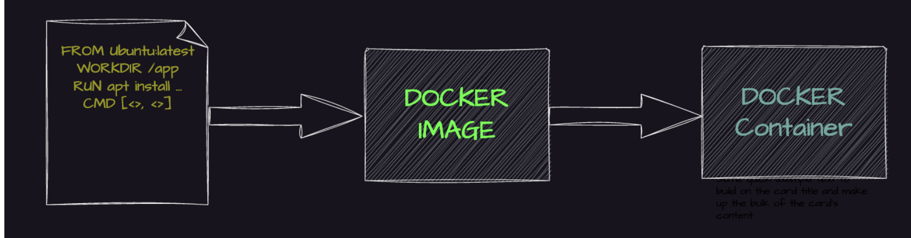

## What is Docker? ##

Docker is an open platform for building, shipping, and running applications. Docker enables you to separate your applications from your infrastructure so you can deliver software quickly. With Docker, you can manage your infrastructure in the same ways you manage your applications.

## What is Docker Platform? ##

Docker provides the ability to package and run an application in a loosely isolated environment called a container. The isolation and security lets you run many containers simultaneously on a given host. `Containers are lightweight and contain everything needed to run the application, i.e (Libraries, application runtime, dependencies) so you don't need to rely on what's installed on the host`. 

## Difference Docker B/w Virtual machine ? ##


Containers and virtual machines are both technologies used to isolate applications and their dependencies, but they have some key differences

`Resource Utilization`: Containers share the host operating system kernel, making them lighter and faster than VMs. VMs have a full-fledged OS and hypervisor, making them more resource it's a wastage of resource i.e CPU, Memory etc compare to docker.

`Portability`: Containers are designed to be portable and can run on any system with a compatible host operating system. VMs are less portable as they need a compatible hypervisor to run.

`Security`: VMs provide a higher level of security as each VM has its own operating system and can be isolated from the host and other VMs. Containers provide less isolation, as they share the host operating system.

`Management`: Managing containers is typically easier than managing VMs, as containers are designed to be lightweight and fast-shipping.

## Docker Architecture ? ##


Docker uses a client-server architecture. The Docker client talks to the Docker daemon, which does the heavy lifting of building, running, and distributing your Docker containers. The Docker client and daemon can run on the same system, or you can connect a Docker client to a remote Docker daemon. The Docker client and daemon communicate using a REST API, over UNIX sockets or a network interface.

## Docker LifeCycle ##

We can use the above Image as reference to understand the lifecycle of Docker.

There are three important things,

docker build -> builds docker images from Dockerfile
docker run -> runs container from docker images
docker push -> push the container image to public/private regestries to share the docker images.



## Understanding the Docker Componets ##

Docker daemon

The Docker daemon (dockerd) listens for Docker API requests and manages Docker objects such as images, containers, networks, and volumes. A daemon can also communicate with other daemons to manage Docker services.

Docker client

The Docker client (docker) is the primary way that many Docker users interact with Docker. When you use commands such as docker run, the client sends these commands to dockerd, which carries them out. The docker command uses the Docker API. The Docker client can communicate with more than one daemon.

Docker Desktop

Docker Desktop is an easy-to-install application for your Mac, Windows or Linux environment that enables you to build and share containerized applications and microservices. Docker Desktop includes the Docker daemon (dockerd), the Docker client (docker), Docker Compose, Docker Content Trust, Kubernetes, and Credential Helper. For more information, see Docker Desktop.

Docker registries

A Docker registry stores Docker images. Docker Hub is a public registry that anyone can use, and Docker is configured to look for images on Docker Hub by default. You can even run your own private registry.

When you use the docker pull or docker run commands, the required images are pulled from your configured registry. When you use the docker push command, your image is pushed to your configured registry. Docker objects

When you use Docker, you are creating and using images, containers, networks, volumes, plugins, and other objects. This section is a brief overview of some of those objects.

Dockerfile

Dockerfile is a file where you provide the steps to build your Docker Image.

Images

An image is a read-only template with instructions for creating a Docker container. Often, an image is based on another image, with some additional customization. For example, you may build an image which is based on the ubuntu image, but installs the Apache web server and your application, as well as the configuration details needed to make your application run.

You might create your own images or you might only use those created by others and published in a registry. To build your own image, you create a Dockerfile with a simple syntax for defining the steps needed to create the image and run it. Each instruction in a Dockerfile creates a layer in the image. When you change the Dockerfile and rebuild the image, only those layers which have changed are rebuilt. This is part of what makes images so lightweight, small, and fast, when compared to other virtualization technologies.

## Installation Of Docker ##

`Refrence Link`: https://docs.docker.com/get-started/get-docker/

Since i'm using Mac so, I have installed docker desktop for mac with apple silicon. Based on your operating system you can install accordingly i.e Windows, Linux etc.

After downloading the package double click and install it and dran and drop docker into applications. We can able to see docker desktop is running as per the screenshot attached below. Then you can login to to the docker desktop then yo will able to see your images and containers if exists.


## How to Dockerize a Project? ##

mkdir day-02

cd day-02

Clone the sample project: git clone git clone https://github.com/docker/getting-started-app.git

cd getting-started-app/

touch Dockerfile

Using the text editor of your choice and paste the as below content.

FROM node:18-alpine -->Linux based alpine OS
WORKDIR /app -->Work directory which we will execute inside the conatiner
COPY . . --> It will copy from source local path to inside container
RUN yarn install --production --> It will install yarn package which requires our project
CMD ["node", "src/index.js"] --> It will execute the container which requires to start the application
EXPOSE 3000 --> Which exposes the port and access the app over the public internet.

Build the docker image based on application code and Dockerfile

docker build -t day02 .

Verify the image has been created and stored locally using the below command:

docker images

Create a public repository on hub.docker.com and push the image to remote repo

docker login --> it will ask username and password provide the same and it will connect to dockerhub

Docker tag day-02:latest mekala/nodejs-test:latest --> day02:latest is local image tag and mekala/nodejs-test:latest is repository tag

docker images --> To check the available images

docker push mekala/nodejs-test:latest --> To push the image into public registry i.e (DockerHub)

docker pull mekala/nodejs-test:latest --> Pull the image from docker hub to local system. If it's not available if will pull otherwise it's shows already available.

docker run -dp 3000:3000 mekala/nodejs-test:latest --> Run the container with the local and container ports with the image name.

docker exec -it f72f59a5b12f sh --> It will execute to inside the container. i.e f72f59a5b12f --> Container ID

docker ps --> To check the all running containers status

docker ps -a --> List all containers whether it is running or not.

docker logs <container id> --> We can check the logs of application container


## Multi Stage Docker Build ##

1. mkdir day-03

2. git clone https://github.com/piyushsachdeva/todoapp-docker

3. cd todoapp-docker

4. vi Dockerfile and add the as below content.

```bash
FROM node:18-alpine AS installer
WORKDIR /app
COPY package*.json ./
RUN npm install 
COPY . .
RUN npm run build
FROM nginx:latest AS deployer
COPY --from=installer /app/build /usr/share/nginx/html
```
5. Uses the official Node.js 18 Alpine-based image, Alpine is a lightweight Linux distribution, reducing the final image size.AS installer part names this build stage (used later in multi-stage copying).

6. Sets /app as the working directory inside the container.

7. COPY package*.json ./ --> Copies package.json and package-lock.json into the container. If dependencies don’t change, Docker reuses the cached npm install layer, making builds faster.

8. RUN npm install --> Installs project dependencies inside the container.

9. COPY . . --> Copies the entire source code into the container.

10. RUN npm run build --> Runs the build command (e.g., for a React, Vue, or Angular project)

11. FROM nginx:latest AS deployer --> Uses the latest NGINX image for serving static and This second stage does not include Node.js, making the final image smaller and optimized for production.

12. COPY --from=installer /app/build /usr/share/nginx/html --> Copies the built static files from the installer stage (/app/build)
→ to the default NGINX web root (/usr/share/nginx/html). This allows NGINX to serve the frontend without Node.js in the final container.

13. docker build -t multistage .

14. docker images

15. docker run -it -dp 3000:3000 multistage

16 docker ps


