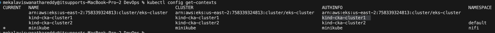
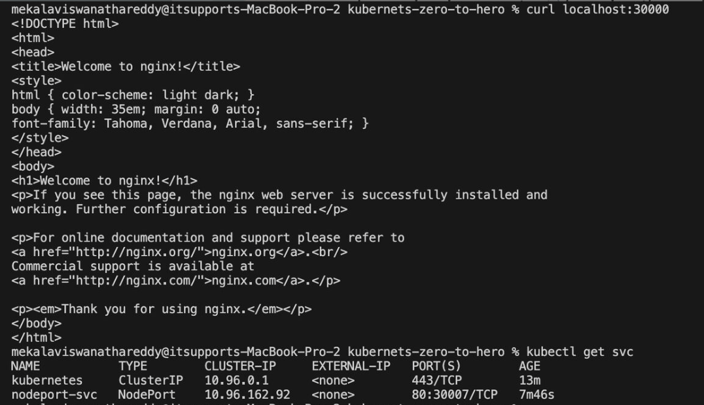
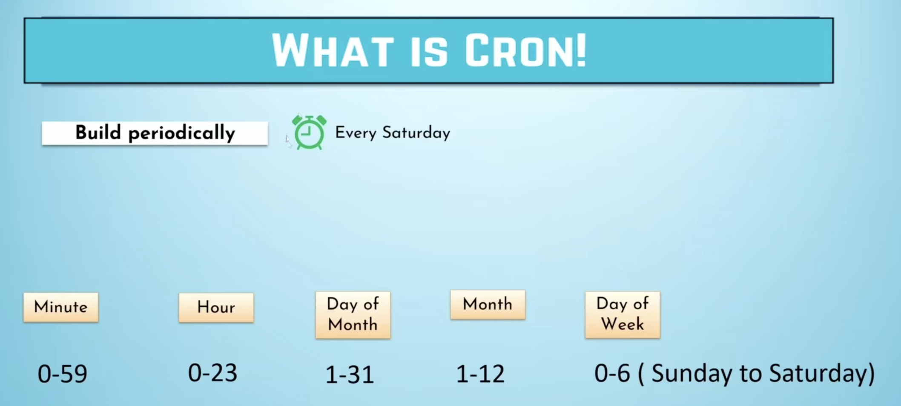
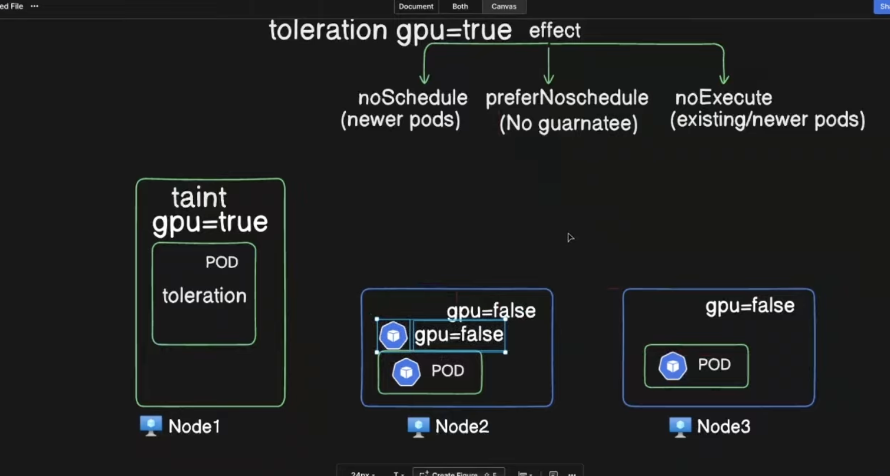

1. What is Kubernetes?
Kubernetes, also known as K8s, is an open-source system for automating deployment, auto-scaling, high availability, self-healing and  management of containerized applications.

2. Kubernetes vs. Docker: When to Use What?


|   Feature          |            Docker                             |              Kubernetes                                                      |
|  ----------        |        --------------                         |            ---------------                                                   |
|  Purpose           | Run and manage containers on a single host    | Orchestrate and manage multiple containers across multiple nodes             |
|                    | Manual (requires running multiple docker      |                                                                              |
|  Scaling           | run commands)                                 | Automatic scaling with Horizontal Pod Autoscaler (HPA)                       |
|                    |                                               |                                                                              |
| High Availability  | No built-in support                           | Self-healing, load balancing, and failover across multiple nodes             |
|                    |                                               |                                                                              |
| Networking         | Basic networking between continers            | Advanced networking with built-in service discovery                          |
|                    |                                               |                                                                              |
| Storage Management | Limited to host volumes & bind mounts         | Persistent Volumes (PV), Persistent Volume Claims (PVC), and Storage Classes |
|                    |                                               |                                                                              |  
| Service Discovery &| Needs external setup                          | Built-in with Kubernetes Services                                            |
| Load Balancing     |                                               |                                                                              |
|                    |                                               |                                                                              |
| Rolling Updates    | Requires manual stopping &                    | Automated rolling updates with zero downtime                                 |
|                    | starting of containers                        |                                                                              |
|                    |                                               |                                                                              |
| Self-Healing       | If a container crashes, manual restart needed | Kubernetes automatically restarts failed containers or moves workloads       |


3. Scenarios: When to Use Kubernetes?

1️⃣ Large-Scale Applications
When your application consists of multiple microservices (e.g., frontend, backend, database, message queues).
Example: A banking application with independent services for authentication, transactions, notifications, etc.

2️⃣ High Availability & Fault Tolerance
Kubernetes ensures your application remains available even if a node crashes by rescheduling workloads.
Example: E-commerce platforms (Amazon, Flipkart) need 24/7 availability.

3️⃣ Automated Scaling
Kubernetes automatically adjusts resources based on traffic or CPU/memory usage.
Example: Streaming platforms (Netflix, YouTube) see high traffic during peak hours and need dynamic scaling.

4️⃣ CI/CD & DevOps Integration
Kubernetes enables zero-downtime deployments with automated updates & rollbacks.
Example: Software development teams deploying frequent updates to a SaaS product.

5️⃣ Hybrid & Multi-Cloud Deployments
Kubernetes runs seamlessly across AWS, Azure, GCP, and on-premises.
Example: Enterprise-grade needing cloud-agnostic application deployment.


When Docker Alone is Enough?

Local Development & Testing: Running a single containerized app on your laptop (docker run -d nginx).

Small-scale Applications: If you have just a few containers and don’t need scaling or load balancing.

Quick Prototyping: Deploying a simple blog or personal website.

4. What we can achieve by using Kubernetes?

High availability --> No down time

High scalability --> High performance

Disaster recovery --> Backup and restore

5. What is Kubernetes orchestration?
Kubernetes orchestration allows you to build application services that span multiple containers, schedule containers across a cluster, scale those containers, and manage their health over time.

6. Kubernetes Architecture?

Kubernetes Mainly having 2 components

	Master Node --> Control plane Components
  Worker Node --> Worker Node Components


A Kubernetes cluster consists of a set of worker machines, called nodes, that run containerized applications. Every cluster has at least one worker node.
The worker node(s) host the Pods that are the components of the application workload. The control plane manages the worker nodes and the Pods in the cluster. In production environments, the control plane usually runs across multiple computers and a cluster usually runs multiple nodes, providing fault-tolerance and high availability.
This document outlines the various components you need to have for a complete and working Kubernetes cluster.

## Control plane components ##

The control plane's components make global decisions about the cluster (for example, scheduling), as well as detecting and responding to cluster events (for example, starting up a new pod when a deployment's replicas field is unsatisfied).

1. Kube-apiserver

The API server is a component of the Kubernetes control plane that exposes the Kubernetes API. The API server is the front end for the Kubernetes control plane.
The main implementation of a Kubernetes API server is kube-apiserver. kube-apiserver is designed to scale horizontally—that is, it scales by deploying more instances. You can run several instances of kube-apiserver and balance traffic between those instances. kube-apiserver and balance traffic between those instances.

2.	etcd
	
Consistent and highly-available key value store used as Kubernetes' backing store for all cluster data. If your Kubernetes cluster uses etcd as its backing store, make sure you have a backup plan for the data. You can find in-depth information about etcd in the official documentation.

3.	kube-scheduler
   
Control plane component that watches for newly created Pods with no assigned node, and selects a node for them to run on.
Factors taken into account for scheduling decisions include: individual and collective resource requirements, hardware/software/policy constraints, affinity and anti-affinity specifications, data locality, inter-workload interference, and deadlines.

4. kube-controller-manager

Control plane component that runs controller processes.

Logically, each controller is a separate process, but to reduce complexity, they are all compiled into a single binary and run in a single process.
There are many different types of controllers. Some examples of them are:

-->	Node controller: Responsible for noticing and responding when nodes go down.

--> Job controller: Watches for Job objects that represent one-off tasks, then creates Pods to run those tasks to completion.

--> Endpoint Slice controller: Populates Endpoint Slice objects (to provide a link between Services and Pods).

--> Service Account controller: Create default Service Accounts for new namespaces.

The above is not an exhaustive list.

## Worker Node Components ##

Node components run on every node, maintaining running pods and providing the Kubernetes runtime environment.

1. kubelet

An agent that runs on each node in the cluster. It makes sure that containers are running in a Pod. The kubelet takes a set of PodSpecs that are provided through various mechanisms and ensures that the containers described in those PodSpecs are running and healthy. 

2. kube-proxy 

kube-proxy is a network proxy that runs on each node in your cluster, implementing part of the Kubernetes Service concept. kube-proxy maintains network rules on nodes. These network rules allow network communication to your Pods from network sessions inside or outside of your cluster.

3. Pod

A Pod is a Kubernetes abstraction that represents a group of one or more application containers (such as Docker), and some shared resources for those containers.

## How to Setup Kubernetes Multi Node Cluster Setup In a Local Machine ##

`Reference Link to Install Kuberenets Cluster`: https://kind.sigs.k8s.io/docs/user/quick-start/#installation

`Kind Cluster Releases Link`: https://github.com/kubernetes-sigs/kind/releases

Follow as per the reference link according to the Operating Systems I.e Windows, MacOS, Linux etc.

1. We are following the kind kubernets cluster to install in our local machine.

2. brew install kind

3. kind create cluster —image kindest/node:v1.31.0@sha256:53df588e04085fd41ae12de0c3fe4c72f7013bba32a20e7325357a1ac94ba865 —name cka-cluster1 

i.e Here Kind create cluster --> Creaeting the cluster 

    --image kindest/node:v1.31.0@sha256:53df588e04085fd41ae12de0c3fe4c72f7013bba32a20e7325357a1ac94ba865 --> Image release version of sha code
    -- name cka-cluster1 --> Name of the cluster

4. kubectl cluster-info --context kind-cka-cluster1 --> Get the cluster info

5. Install kubectl command line interface in your system which matches the kubernetes version.

6. kubectl get nodes --> Shows in available nodes on the system

7. Currently we have single node which is control plane, we want to setup multi node cluster which requires additional details.

8. Create vi config.yaml and paste the below contenet

```bash
kind: Cluster
apiVersion: kind.x-k8s.io/v1alpha4
nodes:
- role: control-plane
- role: worker
- role: worker
```

9. kind create cluster --image kindest/node:v1.31.0@sha256:53df588e04085fd41ae12de0c3fe4c72f7013bba32a20e7325357a1ac94ba865 --name cka-cluster2 --config config.yaml --> based on the yaml configuration we are installing the 1 control plane and 2 worker nodes.

10. kubectl cluster-info --context kind-cka-cluster2 --> It will display the cluster informationas below.

Kubernetes control plane is running at https://127.0.0.1:50868
CoreDNS is running at https://127.0.0.1:50868/api/v1/namespaces/kube-system/services/kube-dns:dns/proxy

To further debug and diagnose cluster problems, use 'kubectl cluster-info dump'.

11. kubectl config get-contexts --> It will display the available kubernetes clusters list



`Note`: There are multiple clusters how it's should interact each other we need to set the context here.

12. kubectl config use-context kind-cka-cluster1 --> It will switch the kind-cka-cluster1

13. kubectl config use-context kind-cka-cluster2 --> It will switch the kind-cka-cluster2

14. Finally check the nodes We have one control-plane and 2 worker nodes for kind cluster

kubectl get nodes 

NAME                        STATUS     ROLES         AGE    VERSION
cka-cluster2-control-plane  Ready   control-plane    11m    v1.31.0
cka-cluster2-worker         Ready         <none>     10m    v1.31.0
cka-cluster2-worker2        Ready        <none>      10m    v1.31.0

## Kubernetes Pods ##

In Kubernetes, Pods are the smallest deployable units. You can create

Imperative Approach → Quick, command-based (best for ad-hoc changes)

Declarative Approach → YAML-based, version-controlled (best for production)


Imperative (Command-Based) Approach

1. kubectl run mypod --image=nginx --> Create a Pod instantly

2. kubectl run mypod --image=nginx --dry-run=client --> Dry Run (Preview Before Applying):

3. kubectl run mypod --image=nginx --dry-run=client -o yaml > pod.yaml --> Generate YAML from Dry Run (For Future Use)

4. Declarative (YAML-Based) Approach: --> day-07-pods/pod.yaml

5. kubectl apply -f pod.yaml --> To create a pod based on the yaml structure

6. kubectl describe pod mypod --> To debugging and monitoring and check the events also if in case any errors

7. kubectl get pods --nginx-pod --show-labels --> To check the labels associated with.

8. kubectl get pods nginx-pod --show-labels --> To check on which node pod is running

9. kubectl edit pod nginx-pod --> we can edit the running pod configuration once save it will apply the editable configuration.

## ReplicationController vs ReplicaSet ##

ReplicationController: Ensures a specified number of pod replicas are running at any given time.
                       Uses equality-based selectors (key=value) to match pods.
                       Considered deprecated in favor of ReplicaSet. i.e (Old Legacy based)

ReplicaSet: An improved version of ReplicationController.
            Supports both equality-based and set-based selectors (in, notin operations).
            Used as part of Deployments to manage pods more efficiently.

Commands to execute to replicaset:

kubectl create -f replicaset.yaml --> Creating a ReplicaSet
kubectl get rs --> Listing ReplicaSets
kubectl describe rs <replicaset-name> --> Describing a ReplicaSet       

Check for more details: `day-08-replicasset & deployment/replicaset.yaml`

## Deployment ##

Deployments provide declarative updates for Pods and ReplicaSets.

Manage rollouts, rollbacks, and scaling of applications.

Check for more details: `day-08-replicasset & deployment/deploy.yaml`

kubectl create -f deployment.yaml --> Creating a Deployment

kubectl get deployments --> Listing Deployments

kubectl rollout status deployment <deployment-name> --> Checking the rollout status

kubectl scale deployment <deployment-name> --replicas=5 --> Scaling a Deployment

kubectl rollout undo deployment <deployment-name> --> Rolling back a Deployment
 
## Kubernetes Services ##

What is a Kubernetes Service?

In Kubernetes, a Service is a method for exposing a network application that is running as one or more Pods in your cluster.

Types of Kubernetes Services ⬇️

ClusterIP (Default) 🌐

✅ Exposes the service internally within the cluster.

✅ Pods can communicate using the service name.

✅ Example use case: Internal microservices communication.

`Check for more details for laod balancer`: `day-09-kubernetes-services/clusterip.yaml`

🔸 NodePort 🚪

✅ Exposes the service on each node’s IP and a static port (30000-32767).

✅ Accessible externally via NodeIP:NodePort.

✅ Example use case: Direct external access without a LoadBalancer.

🔸 LoadBalancer ⚖️

✅ Provisions an external load balancer (cloud provider-specific).

✅ Distributes traffic to backend pods.

✅ Example use case: Exposing an application to the internet.

`Check for more details for laod balancer`: `day-09-kubernetes-services/lb.yaml`

🔸 ExternalName 🔗

✅ Maps a Kubernetes service to an external DNS name.

✅ Example use case: Redirecting traffic to an external database or API.

`Note`: Since I'm using the KIND cluster which requires an additional step for `extra port mappings of cluster`, It can be useful if using NodePort services or daemonsets exposing host ports. There is no need of additional configuration of extra port mapping yif you were using the AWS EKS, GKS, AKS etc.

`Reference Link for extra ports from the nodes to the host`: https://kind.sigs.k8s.io/docs/user/quick-start/#installation

✅ Deployed a Sample Application 🚀

✅ Exposed the application using ClusterIP, NodePort, and LoadBalancer Services 🌍

✅ Created the load balancer SVC but we are not provisioned the external load balancer with in our system that's the reason external ip is pending.

✅ Tested connectivity within the cluster using kubectl get services and curl <localhost>:<hostport> 🔎 by using the node port service.

kubectl get svc
NAME           TYPE        CLUSTER-IP      EXTERNAL-IP   PORT(S)        AGE
nodeport-svc   NodePort    10.96.228.8     <none>        80:30007/TCP   5d23h

`This means:`

The service is running inside the cluster at port 80.
The NodePort is 30007.

We have mapped containerPort: 30007 → hostPort: 30000, you should test it using: curl localhost:30000



Check the details: `day-09-kubernetes-services/nodeport.yaml`

## Kubernetes Namespaces ##

In Kubernetes, namespaces provide a mechanism for isolating groups of resources within a single cluster. Without specifying a namespace, Kubernetes defaults to the default namespace and there are other namepsaces are avilable by default i.e kube-public, kube-system etc.

When to use namespaces?

Namespaces are intended for use in environments with many users spread across multiple teams, or projects. Proper namespace usage avoids conflicts and enhances security in large-scale deployments.

As part of hands on for the Namespaces:

✅ Created two namespaces: `test and test1`

✅ Deployed an Nginx application in both namespaces

✅ Logged into the pod and tested communication using NodeIP

Attached the Screen shot for reference:


✅ Scaled the deployment to multiple replicas

✅ Exposed the deployment as a service

`Note:` If we use the service In different namespaces the pods won't commuinicate by simply using curl command?

📌 When to Use FQDN (Fully Qualified Domain Name)?

`Note:` When two pods in different namespaces need to communicate using ClusterIP, the `FQDN` must be used. Kubernetes service discovery follows the format:

<service-name>.<namespace>.svc.cluster.local

For example, if a service `nginx-service exists in the test namespace, a pod in test1 namespace can reach it` using as below.

`Ex:` curl nginx-service.test.svc.cluster.local 

This ensures the correct service resolution across namespaces.

📌 Why Don’t Services in Different Namespaces Communicate by Default?

Even though all services exist within the same cluster, Kubernetes limits inter-namespace communication by default due to network policies and DNS resolution rules. Here’s why:

1️⃣ ClusterIP is Namespace-Scoped: When a service is exposed with a ClusterIP, it is only resolvable within its own namespace unless explicitly referenced with FQDN.

2️⃣ Network Policies Can Restrict Access: If NetworkPolicies are applied, they might block traffic between namespaces unless explicitly allowed.

3️⃣ Default DNS Behavior: A pod in test1 querying nginx-service without FQDN will fail because Kubernetes defaults to resolving within the same namespace (test1).

🚀 Solution? If inter-namespace communication is required, use the FQDN and ensure network policies permit the traffic.


## Multi Container Pod ##

What are Init Containers in Kubernetes?

✅ Init containers are specialized containers in a Pod that run before the main application containers start. They help with `pre-initialization tasks like setting up configurations, checking dependencies`, or waiting for services to be ready.

`Note:` Unlike regular application containers, init containers always run to completion before the main container starts. If an init container fails, Kubernetes will restart it until it succeeds.

Why do we need Init Containers?

✅ Dependency Management: Ensure required services are running before starting the main application.

✅ Configuration Preparation: Fetch configuration files or secrets before launching the application.

✅ Data Initialization: Pre-populate databases or prepare data for the main container.

✅ Security: Run pre-start security checks before the main app runs.

Created a multi-container pod where an init container runs a script before launching an Nginx container.

Check the Configuration details: `day-11-multi-container-pod/pod.yaml`

kubectl apply -f pod.yaml 
kubectl get pod 
kubectl logs myapp -c init-myservice

✅ Created Two Deployments and Two Services: Defined and deployed two Kubernetes deployments and corresponding services—myservice and mydb. Each deployment ensures that the required pods are up and running to support application functionality.

✅ Used Init Containers for Service Dependency Management: Added initContainers in the pod specification to ensure that dependent services (myservice and mydb) are available before the main container starts. The initContainers use a busybox:1.35 image with nslookup commands to continuously check for service availability, ensuring proper startup sequencing

## DaemonSet ##

What is DaemonSet?

A DaemonSet ensures that all (or some) Nodes run a copy of a Pod. When a new node added to the cluster, a DaemonSet automatically schedules a pod on that node. As nodes are removed from the cluster, those Pods are garbage collected. Deleting a DaemonSet will clean up the Pods it created.

🔹Use Cases for DaemonSet:

✅ Log Collection Agents: Running a centralized logging agent like Fluentd or Logstash on every node.

✅ Monitoring Agents: Deploying node-level monitoring tools like Prometheus Node Exporter.

✅ Network Plugins: Installing network components like Calico, Cilium, or Weave Net.

✅ Storage Daemons: Running a pod on every node for distributed storage solutions like Ceph or GlusterFS.

Check the Configuration details: `day-12-daemoset:jobvscronjob/daemonset.yaml`

🔹 Hands-on Command:

kubectl apply -f daemonset.yaml 
kubectl get ds -A --> To check the all pods 
k config use-context kind-cka-cluster2 --> To switch the context and check the daemonset pods in the cluster

Reference link for more details: `https://kubernetes.io/docs/concepts/workloads/controllers/daemonset/`

🔹 Job vs. CronJob in Kubernetes

📌 Job:
✅ Runs a task once and ensures it completes successfully.
✅ Use Case: Data processing, batch jobs, or one-time tasks like database migration

Reference link for job: `https://kubernetes.io/docs/concepts/workloads/controllers/job/`

📌 CronJob:
✅ Runs a Job on a schedule (like a Linux cron job).
✅ Use Case: Automated periodic tasks such as log rotation, backups, or cleanup jobs.



Reference link for cronjob: `https://kubernetes.io/docs/concepts/workloads/controllers/cron-jobs/`

## Static Pods, Manual Pods & Selectors ##

Each kubernetes node act as a docker container. By default a namespace called `kube-system` which is having a pods for kubernetes components i.e etcd, kube-apiserver, kube-proxy, kube-scheduler etc.

docker exec -it cka-cluster3-control-plane bash

cd /etc/kubernetes/manifests/

ls -lrt i.e etcd.yaml, kube-apiserver.yaml, kube-scheduler.yaml, kube-controller-manager.yaml etc.

📌 Static Pods
✅ Static Pods are directly managed by the Kubelet without an scheduler.

✅ Their manifests are stored in /etc/kubernetes/manifests/.

✅ The Kubelet monitors this directory and automatically creates/deletes pods based on the manifest files.

🛠️ Testing Static Pods Behavior

⚡ If we move kube-scheduler.yaml from /etc/kubernetes/manifests/ to /tmp/, the static pod will not be recreated. 

⚡ Since the scheduler is responsible for assigning pods to nodes, new pods may remain in the Pending state.

🔍 Steps to Verify:
1️⃣ Move the kube-scheduler.yaml file:
sudo mv /etc/kubernetes/manifests/kube-scheduler.yaml /tmp/

2️⃣ Check the status of the scheduler pod:
kubectl get pods -n kube-system
The kube-scheduler pod should disappear or not be recreated.

3️⃣ Create a test pod:
kubectl run nginx --image=nginx

4️⃣ Check the pod status:
kubectl get pods
The pod may remain Pending due to the missing scheduler.

5️⃣ Restore the scheduler by moving the manifest back:
sudo mv /tmp/kube-scheduler.yaml /etc/kubernetes/manifests/

Reference link for static pod: `https://kubernetes.io/docs/tasks/configure-pod-container/static-pod/`

🏗️ Manual Scheduling

⚙️ If a pod does not have a scheduler assigned, it will remain in the Pending state. 

⚙️ You can manually schedule a pod by specifying a node using nodeName in the pod spec:

Check the configuration: `day-13-selectors/node-selector.yaml`

⚙️ Apply it with:
kubectl apply -f node-selector.yaml

⚙️ The pod will be assigned to the specified node directly since we have added the `node name in the pod configuration`.

🔖 Selectors & Labels:

🏷️ Labels are key-value pairs attached to Kubernetes objects. 
🎯 Selectors help in grouping objects based on labels.

In the above node-selector.yaml file we have a label called `run: nginx` after deploying search like as below.

k get pod -n default --show-labels --> Result should be i.e `run=nginx`

## Taints, Tolerations & Node Selectors ##

Taints --> For Nodes
Tolerations --> For pods



🎯 What are Taints & Tolerations?
✅ Taints prevent pods from being scheduled on specific nodes unless they tolerate the taint.

✅ Tolerations allow pods to be scheduled on tainted nodes.

We have 3 types of tolerations:

NoExecute --> This affects pods that are already running on the node as follows:
              Pods that do not tolerate the taint are evicted immediately
              Pods that tolerate the taint without specifying tolerationSeconds in their toleration specification remain bound forever

NoSchedule --> No new Pods will be scheduled on the tainted node unless they have a matching toleration. Pods currently running on the node are not evicted.

PreferNoSchedule --> Is a "preference" or "soft" version of NoSchedule. The control plane will try to avoid placing a Pod that does not tolerate the taint on the node, but it is not guaranteed.

 Where do we use them?
✅ When you want to dedicate nodes for specific workloads (e.g., GPU workloads).

✅ When you need to prevent certain workloads from running on specific nodes.

🛠️ Hands-on with Taints & Tolerations
⚡ Step 1: Cluster Setup

I have a existing KIND cluster with:
✅ 1 Control Plane
✅ 2 Worker Nodes (cka-cluster3-worker, cka-cluster3-worker2)

🛑 Step 2: Tainting the Nodes
I applied a taint to `cka-cluster3-worker` to prevent pods from scheduling unless they have a toleration:

kubectl taint nodes cka-cluster3-worker gpu=true:NoSchedule

📌 Effect: Any pod without a matching toleration will remain in Pending state.

🚀 Step 3: Deploying a Pod (Without Toleration)

kubectl run nginx --image=nginx

🔍 Check Pod Status:
kubectl get pods
❌ The pod is Pending because it doesn’t tolerate the taint.

✅ Step 4: Creating a Pod with Toleration
Now, let’s create a Redis pod that can run on the tainted node.

kubectl run redis --image=redis --dry-run=client -o yaml > taint-redis.yaml

Add the following toleration inside `day-14-tolerations and taints/taint-redis.yaml`

```bash
tolerations:
 - key: "gpu"
 operator: "Equal"
 value: "true"
 effect: "NoSchedule"
 ```
kubectl apply -f taint-redis.yaml

kubectl get pods
✅ Redis pod is Running 🎉

🔄 Step 5: Untainting the Node
The nginx pod is still Pending since it doesn’t tolerate the taint. Let’s remove the taint:
kubectl taint nodes cka-cluster3-worker gpu=true:NoSchedule-

🔍 Check Pod Status:
kubectl get pods
✅ Now, the nginx pod is Running 🚀

🔖 Node Selectors in Kubernetes
📌 Use Case: Scheduling pods on specific nodes based on labels.
🏷️ Step 1: Creating a Pod with a Node Selector

kubectl run nginx-new --image=nginx --dry-run=client -o yaml > node-selector.yaml
Modify node-selector.yaml to include a nodeSelector:

nodeSelector: 
 gpu: "false"

Apply the manifest:
kubectl apply -f node-selector.yaml

kubectl get pods
❌ The pod is Pending because no nodes match the label gpu=false.

🔖 Step 2: Labeling a Node
Let's assign the required label to cka-cluster3-worker2:
kubectl label nodes cka-cluster3-worker2 gpu=false

kubectl get pods
✅ Pod is Running on cka-cluster3-worker2 🎯

`Important Note:`
✅ Taints & Tolerations prevent or allow pod scheduling on specific nodes.

✅ Pods without matching tolerations remain in Pending state.

✅ Node Selectors help schedule pods on labeled nodes.

✅ Labeling a node after deploying a pod updates the pod scheduling automatically.

Refernce link for taints&tolerations: `https://kubernetes.io/docs/concepts/scheduling-eviction/taint-and-toleration/`

## Node Affinity ##

🎯 What is Node Affinity?

Node Affinity controls which nodes a pod can be scheduled on based on labels. It is similar to nodeSelector, but more expressive and flexible.

There are two types of Node Affinity:

✅ requiredDuringSchedulingIgnoredDuringExecution – Hard rule (Pod must be scheduled on a matching node).
✅ preferredDuringSchedulingIgnoredDuringExecution – Soft rule (Scheduler prefers matching nodes but doesn’t enforce it).

🛠️ Hands-on with Node Affinity

🏗️ Step 1: Create a Pod with Required Node Affinity

📌 Define node affinity in `day-15-node-affinity/affinity.yaml`

```bash
nodeAffinity:
 requiredDuringSchedulingIgnoredDuringExecution:
 nodeSelectorTerms:
 - matchExpressions:
 - key: disktype
 operator: In
 values:
 - ssd
 ```

kubectl apply -f affinity.yaml

kubectl get pods --> Check the pod status

❌ Pod is Pending because no nodes have the label disktype=ssd

🏷️ Step 2: Label a Node

kubectl label node cka-cluster3-worker disktype=ssd

kubectl get pods

❌ Still Pending.

🔎 Step 3: Check for Taints

kubectl describe node cka-cluster3-worker | grep "Taints"

💡 The node has a taint! Taints override affinity, preventing pod scheduling.

🚀 Remove the taint:

kubectl taint nodes cka-cluster3-worker gpu=false:NoSchedule-

Check pod status again:

kubectl get pods

✅ Now, the pod is Running! 🎯

⚖️ Step 4: Deploy a Pod with Preferred Node Affinity use the same pod configuration as above only change is node affinity with the preferred during scheduling ignore during execution.

📌 Define `day-15-node-affinity/affinity2.yaml` with a preferred rule:

kubectl apply -f affinity2.yaml

kubectl get pods --> Check the pod status

✅ Pod is Running!

🔄 Step 5: Remove Node Label

kubectl label node cka-cluster3-worker disktype-

🚀 Add a blank label to simulate an empty label:

kubectl label node cka-cluster3-worker disktype=

🔧 Step 6: Modify `affinity.yaml` for a New Pod with the pod name redis3 and key with the disk type and operator exists. remaining configuration as same.

```bash
apiVersion: v1
kind: Pod
metadata:
 name: redis3
spec:
 - key: disktype
 operator: Exists
 ```
 kubectl apply -f affinity.yaml

kubectl get pods --> Check the redis3 pod status

✅ redis3 pod is Running!

🚀 When to use which?

✅ Use Node Affinity when you want pods to prefer or require certain nodes based on labels.

✅ Use Taints & Tolerations when you want nodes to control which pods can run on them.

Reference link for node affinity: `https://kubernetes.io/docs/tasks/configure-pod-container/assign-pods-nodes-using-node-affinity/`

## Kubernetes Resource Requests&Limits ##

📌 Managing Pod Resource Allocation

1️⃣ Deployed Metrics Server

Deployed metrics server in kube-system namespace to collect resource usage metrics.

🚀 Verified deployment

✅ kubectl get pods -n kube-system | grep metrics-server

If not available deploy using `day-16-resource-requests/metrics-server.yaml` file then try again as above command.

🚀Checked node utilization

✅ kubectl top node

2️⃣ Deployed a pod with memory requests & limits

✅ Created `day-16-resource-requests/memory-requests.yaml` with:

Create a namespace called mem-example
✅ kubectl create ns mem-example

✅ kubectl apply -f memory-requests.yaml -n mem-example

Checked pod memory usage:

✅ kubectl describe pod memory-demo -n mem-example

Pod running within limits ✅

3️⃣ Deployed another pod exceeding memory limits

Created `day-16-resource-requests/memory2.yaml` with:

✅ kubectl apply -f memory2.yaml

Pod failed with OOMKilled (Out of Memory) error ❌ due to which is consuming more than limits memory.

`Fix`: Adjust the arguments which we are passing, it's must be with in the range of resource limits, pod doesn't to be exceded i.e `args: ["--vm", "1", "--vm-bytes", "100M", "--vm-hang", "1"]`

4️⃣ Deployed a pod requesting more memory than available on node

✅ Created `day-16-resource-requests/memory3.yaml` with:

✅ kubectl apply -f memory3.yaml 

Pod status → Pending due to insufficient resources ❌ Since node does not have enough resources to schedule a pod

5️⃣ Reduced memory requests & limits → Pod scheduled successfully

`Key Notes:`

✅ Resource Requests: Minimum guaranteed resources for a pod.

✅ Resource Limits: Maximum resource allocation to prevent excessive usage.

✅ OOMKilled: Pod exceeded memory limit, causing the container to be terminated.

✅ Pending Pod: Node doesn’t have enough free memory to satisfy requests.


