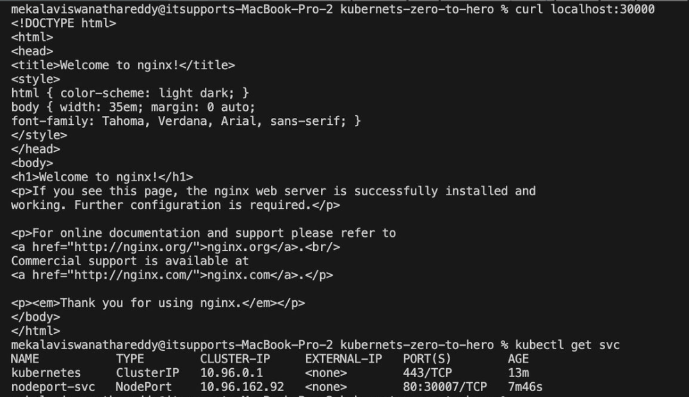

# Kubernetes Zero to Hero

## Table of Contents
- [What is Kubernetes?](#what-is-kubernetes)
- [Kubernetes vs Docker](#kubernetes-vs-docker)
- [When to Use Kubernetes](#when-to-use-kubernetes)
- [What Can We Achieve with Kubernetes?](#what-can-we-achieve-with-kubernetes)
- [Kubernetes Orchestration](#kubernetes-orchestration)
- [Kubernetes Architecture](#kubernetes-architecture)
- [Multi-Node Cluster Setup](#multi-node-cluster-setup)
- [Kubernetes Pods](#kubernetes-pods)
- [ReplicationController vs ReplicaSet](#replicationcontroller-vs-replicaset)
- [Deployments](#deployments)
- [Kubernetes Services](#kubernetes-services)
- [Namespaces](#namespaces)
- [Multi-Container Pods](#multi-container-pods)
- [DaemonSet](#daemonset)
- [Static Pods and Manual Scheduling](#static-pods-and-manual-scheduling)
- [Taints, Tolerations & Node Selectors](#taints-tolerations--node-selectors)
- [Node Affinity](#node-affinity)
- [Resource Requests & Limits](#resource-requests--limits)

---

## What is Kubernetes?

Kubernetes, also known as K8s, is an open-source system for automating deployment, auto-scaling, high availability, self-healing, and management of containerized applications.

## Kubernetes vs Docker

When to Use What?

| Feature | Docker | Kubernetes |
|---------|--------|------------|
| **Purpose** | Run and manage containers on a single host | Orchestrate and manage multiple containers across multiple nodes |
| **Scaling** | Manual (requires running multiple docker run commands) | Automatic scaling with Horizontal Pod Autoscaler (HPA) |
| **High Availability** | No built-in support | Self-healing, load balancing, and failover across multiple nodes |
| **Networking** | Basic networking between containers | Advanced networking with built-in service discovery |
| **Storage Management** | Limited to host volumes & bind mounts | Persistent Volumes (PV), Persistent Volume Claims (PVC), and Storage Classes |
| **Service Discovery & Load Balancing** | Needs external setup | Built-in with Kubernetes Services |
| **Rolling Updates** | Requires manual stopping & starting of containers | Automated rolling updates with zero downtime |
| **Self-Healing** | If a container crashes, manual restart needed | Kubernetes automatically restarts failed containers or moves workloads |

## When to Use Kubernetes?

### 🎯 Large-Scale Applications
When your application consists of multiple microservices (e.g., frontend, backend, database, message queues).
**Example:** A banking application with independent services for authentication, transactions, notifications, etc.

### 🎯 High Availability & Fault Tolerance
Kubernetes ensures your application remains available even if a node crashes by rescheduling workloads.
**Example:** E-commerce platforms (Amazon, Flipkart) need 24/7 availability.

### 🎯 Automated Scaling
Kubernetes automatically adjusts resources based on traffic or CPU/memory usage.
**Example:** Streaming platforms (Netflix, YouTube) see high traffic during peak hours and need dynamic scaling.

### 🎯 CI/CD & DevOps Integration
Kubernetes enables zero-downtime deployments with automated updates & rollbacks.
**Example:** Software development teams deploying frequent updates to a SaaS product.

### 🎯 Hybrid & Multi-Cloud Deployments
Kubernetes runs seamlessly across AWS, Azure, GCP, and on-premises.
**Example:** Enterprise applications needing cloud-agnostic deployment.

### When Docker Alone is Enough?

- **Local Development & Testing:** Running a single containerized app on your laptop (`docker run -d nginx`)
- **Small-scale Applications:** If you have just a few containers and don't need scaling or load balancing
- **Quick Prototyping:** Deploying a simple blog or personal website

## What Can We Achieve with Kubernetes?

- **High Availability** → No downtime
- **High Scalability** → High performance
- **Disaster Recovery** → Backup and restore

## Kubernetes Orchestration

Kubernetes orchestration allows you to build application services that span multiple containers, schedule containers across a cluster, scale those containers, and manage their health over time.

## Kubernetes Architecture

Kubernetes mainly has 2 components:

- **Master Node** → Control Plane Components
- **Worker Node** → Worker Node Components


A Kubernetes cluster consists of a set of worker machines, called nodes, that run containerized applications. Every cluster has at least one worker node.

The worker node(s) host the Pods that are the components of the application workload. The control plane manages the worker nodes and the Pods in the cluster. In production environments, the control plane usually runs across multiple computers and a cluster usually runs multiple nodes, providing fault-tolerance and high availability.

### Control Plane Components

The control plane's components make global decisions about the cluster (for example, scheduling), as well as detecting and responding to cluster events (for example, starting up a new pod when a deployment's replicas field is unsatisfied).

#### 1. kube-apiserver

The API server is a component of the Kubernetes control plane that exposes the Kubernetes API. The API server is the front end for the Kubernetes control plane.

The main implementation of a Kubernetes API server is kube-apiserver. kube-apiserver is designed to scale horizontally—that is, it scales by deploying more instances. You can run several instances of kube-apiserver and balance traffic between those instances.

#### 2. etcd

Consistent and highly-available key-value store used as Kubernetes' backing store for all cluster data. If your Kubernetes cluster uses etcd as its backing store, make sure you have a backup plan for the data. You can find in-depth information about etcd in the official documentation.

#### 3. kube-scheduler

Control plane component that watches for newly created Pods with no assigned node, and selects a node for them to run on.

Factors taken into account for scheduling decisions include: individual and collective resource requirements, hardware/software/policy constraints, affinity and anti-affinity specifications, data locality, inter-workload interference, and deadlines.

#### 4. kube-controller-manager

Control plane component that runs controller processes.

Logically, each controller is a separate process, but to reduce complexity, they are all compiled into a single binary and run in a single process.

There are many different types of controllers. Some examples of them are:

- **Node controller:** Responsible for noticing and responding when nodes go down
- **Job controller:** Watches for Job objects that represent one-off tasks, then creates Pods to run those tasks to completion
- **Endpoint Slice controller:** Populates Endpoint Slice objects (to provide a link between Services and Pods)
- **Service Account controller:** Create default Service Accounts for new namespaces

The above is not an exhaustive list.

### Worker Node Components

Node components run on every node, maintaining running pods and providing the Kubernetes runtime environment.

#### 1. kubelet

An agent that runs on each node in the cluster. It makes sure that containers are running in a Pod. The kubelet takes a set of PodSpecs that are provided through various mechanisms and ensures that the containers described in those PodSpecs are running and healthy.

#### 2. kube-proxy

kube-proxy is a network proxy that runs on each node in your cluster, implementing part of the Kubernetes Service concept. kube-proxy maintains network rules on nodes. These network rules allow network communication to your Pods from network sessions inside or outside of your cluster.

#### 3. Pod

A Pod is a Kubernetes abstraction that represents a group of one or more application containers (such as Docker), and some shared resources for those containers.

## Multi-Node Cluster Setup

### How to Setup Kubernetes Multi-Node Cluster in Local Machine

**Reference Link to Install Kubernetes Cluster:** https://kind.sigs.k8s.io/docs/user/quick-start/#installation

**Kind Cluster Releases Link:** https://github.com/kubernetes-sigs/kind/releases

Follow the reference link according to your Operating System (Windows, macOS, Linux, etc.).

### Installation Steps

1. We are following the KIND Kubernetes cluster to install in our local machine:
   ```bash
   brew install kind
   ```

2. Create a single-node cluster:
   ```bash
   kind create cluster --image kindest/node:v1.31.0@sha256:53df588e04085fd41ae12de0c3fe4c72f7013bba32a20e7325357a1ac94ba865 --name cka-cluster1
   ```
   
   Where:
   - `kind create cluster` → Creating the cluster
   - `--image kindest/node:v1.31.0@sha256:...` → Image release version with SHA code
   - `--name cka-cluster1` → Name of the cluster

3. Get cluster information:
   ```bash
   kubectl cluster-info --context kind-cka-cluster1
   ```

4. Install kubectl command line interface that matches the Kubernetes version.

5. Check available nodes:
   ```bash
   kubectl get nodes
   ```

6. Currently we have a single node which is the control plane, it's acts a docker container. To setup a multi-node cluster, we need additional configuration.

```bash
docker exec -it cka-cluster1-control-plane sh --> you are inside control plane node
cd /etc/kubernetes/manifests
ls -lrt --> Manifests for controlplane components
-rw-------. 1 root root 2622 Oct  8 06:19 etcd.yaml
-rw-------. 1 root root 1836 Oct  8 06:19 kube-scheduler.yaml
-rw-------. 1 root root 3615 Oct  8 06:19 kube-controller-manager.yaml
-rw-------. 1 root root 4073 Oct  8 06:19 kube-apiserver.yaml
```

### Multi-Node Cluster Configuration

7. Create `config.yaml` with the following content:
   ```yaml
   kind: Cluster
   apiVersion: kind.x-k8s.io/v1alpha4
   nodes:
   - role: control-plane
   - role: worker
   - role: worker
   ```

8. Create multi-node cluster based on YAML configuration:
   ```bash
   kind create cluster --image kindest/node:v1.31.0@sha256:53df588e04085fd41ae12de0c3fe4c72f7013bba32a20e7325357a1ac94ba865 --name cka-cluster2 --config config.yaml
   ```
   This installs 1 control plane and 2 worker nodes.

9. Check cluster information:
   ```bash
   kubectl cluster-info --context kind-cka-cluster2
   ```
   
   Output:
   ```
   Kubernetes control plane is running at https://127.0.0.1:50868
   CoreDNS is running at https://127.0.0.1:50868/api/v1/namespaces/kube-system/services/kube-dns:dns/proxy

   To further debug and diagnose cluster problems, use 'kubectl cluster-info dump'.
   ```

10. Display available Kubernetes clusters:
    ```bash
    kubectl config get-contexts
    ```


> **Note:** When you have multiple clusters, you need to set the context to interact with each cluster.

11. Switch between clusters:
    ```bash
    kubectl config use-context kind-cka-cluster1  # Switch to cluster1
    kubectl config use-context kind-cka-cluster2  # Switch to cluster2
    ```

12. Finally, check the nodes in our multi-node cluster:
    ```bash
    kubectl get nodes
    ```
    
    Output:
    ```
    NAME                        STATUS   ROLES           AGE   VERSION
    cka-cluster2-control-plane  Ready    control-plane   11m   v1.31.0
    cka-cluster2-worker         Ready    <none>          10m   v1.31.0
    cka-cluster2-worker2        Ready    <none>          10m   v1.31.0
    ```

## Kubernetes Pods

In Kubernetes, Pods are the smallest deployable units. You can create them using two approaches:

- **Imperative Approach** → Quick, command-based (best for ad-hoc changes)
- **Declarative Approach** → YAML-based, version-controlled (best for production)


### Imperative (Command-Based) Approach

```bash
# Create a Pod instantly
kubectl run mypod --image=nginx

# Dry Run (Preview Before Applying)
kubectl run mypod --image=nginx --dry-run=client

# Generate YAML from Dry Run (For Future Use)
kubectl run mypod --image=nginx --dry-run=client -o yaml > pod.yaml
```

### Declarative (YAML-Based) Approach

See configuration details: `day-07-pods/pod.yaml`

```bash
# Create a pod based on the YAML structure
kubectl apply -f pod.yaml

# Debug, monitor, and check events for any errors
kubectl describe pod mypod

# Check labels associated with the pod
kubectl get pods nginx-pod --show-labels

# Check on which node the pod is running
kubectl get pods nginx-pod -o wide

# Edit the running pod configuration
kubectl edit pod nginx-pod
```

Once you save the edited configuration, it will apply the changes automatically.

## ReplicationController vs ReplicaSet

**ReplicationController:** Ensures a specified number of pod replicas are running at any given time. Uses equality-based selectors (key=value) to match pods. Considered deprecated in favor of ReplicaSet (legacy-based).

**ReplicaSet:** An improved version of ReplicationController. Supports both equality-based and set-based selectors (in, notin operations). Used as part of Deployments to manage pods more efficiently.

### Commands for ReplicaSet:

```bash
# Create a ReplicaSet
kubectl create -f replicaset.yaml

# List ReplicaSets
kubectl get rs

# Describe a ReplicaSet
kubectl describe rs <replicaset-name>
```

Check for more details: `day-08-replicaset & deployment/replicaset.yaml`

## Deployments

Deployments provide declarative updates for Pods and ReplicaSets. They manage rollouts, rollbacks, and scaling of applications.

Check for more details: `day-08-replicaset & deployment/deploy.yaml`

### Commands for Deployments:

```bash
# Create a Deployment
kubectl create deploy nginx-deploy --image=nginx --replicas=4
kubectl create deploy nginx-deploy --image=nginx --replicas=4 -oyaml> deploy.yaml
kubectl create -f deployment.yaml

# List Deployments
kubectl get deployments

# Check the rollout status
kubectl rollout status deployment <deployment-name>

# Scale a Deployment
kubectl scale deployment <deployment-name> --replicas=5

# Roll back a Deployment
kubectl rollout undo deployment <deployment-name>
```

## Kubernetes Services

### What is a Kubernetes Service?

In Kubernetes, a Service is a method for exposing a network application that is running as one or more Pods in your cluster.

### Types of Kubernetes Services

#### 🌐 ClusterIP (Default)
✅ Exposes the service internally within the cluster  
✅ Pods can communicate using the service name  
✅ **Example use case:** Internal microservices communication

Check for more details: `day-09-kubernetes-services/clusterip.yaml`

```bash
After day-08 deploy and day-09 clusterip deploy, we just need to test the cluster ip service as below.
kubectl port-forward svc/cluster-svc 8080:80 --> (8080 is host machine port we can use any other port, which is available and 80 is service port which is defined in `clusterip.yaml`)
curl http://localhost:8080
```

#### 🚪 NodePort
✅ Exposes the service on each node's IP and a static port (30000-32767)  
✅ Accessible externally via NodeIP:NodePort  
✅ **Example use case:** Direct external access without a LoadBalancer

#### ⚖️ LoadBalancer
✅ Provisions an external load balancer (cloud provider-specific i.e EKS, AKE, and GKE)  
✅ Distributes traffic to backend pods  
✅ **Example use case:** Exposing an application to the internet

Check for more details: `day-09-kubernetes-services/lb.yaml`

**Note:** The external ip address pending, due to we don't have cloud controller manager that actually create a load balancer with in the cloud.

#### 🔗 ExternalName
✅ Maps a Kubernetes service to an external DNS name  
✅ **Example use case:** Redirecting traffic to an external database or API

> **Note:** Since I'm using the KIND cluster, it requires an additional step for **extra port mappings of cluster**. This can be useful if using NodePort services or daemonsets exposing host ports. There is no need for additional configuration of extra port mapping if you were using AWS EKS, GKE, AKS, etc.

**Reference Link for extra ports from the nodes to the host:** https://kind.sigs.k8s.io/docs/user/configuration/#extra-port-mappings

### Service Testing Example

✅ Deployed a Sample Application 🚀  
✅ Exposed the application using ClusterIP, NodePort, and LoadBalancer Services 🌍 
✅ Created the load balancer service, but we haven't provisioned an external load balancer within our system, which is why the external IP is pending  
✅ Tested connectivity within the cluster using `kubectl get services` and `curl <localhost>:<hostport>` 🔎 by using the NodePort service

```bash
kubectl get svc
NAME           TYPE        CLUSTER-IP      EXTERNAL-IP   PORT(S)        AGE
nodeport-svc   NodePort    10.96.228.8     <none>        80:30007/TCP   5d23h
```

**This means:**
- The service is running inside the cluster at port 80
- The NodePort is 30007

If you have mapped `containerPort: 30007 → hostPort: 30000`, you should test it using:
```bash
curl localhost:30000
```



Check the details: `day-09-kubernetes-services/nodeport.yaml`

## Namespaces

In Kubernetes, namespaces provide a mechanism for isolating groups of resources within a single cluster. Without specifying a namespace, Kubernetes defaults to the `default` namespace, and there are other namespaces available by default: `kube-public`, `kube-system`, etc.

### When to use namespaces?

Namespaces are intended for use in environments with many users spread across multiple teams or projects. Proper namespace usage avoids conflicts and enhances security in large-scale deployments.

### Hands-on with Namespaces:

✅ Created two namespaces: `test` and `test1`  
✅ Deployed an Nginx application in both namespaces  
✅ Logged into the pod and tested communication using Node IP  


✅ Scaled the deployment to multiple replicas  
✅ Exposed the deployment as a service  

> **Note:** If we use the service in different namespaces, the pods won't communicate by simply using the curl command.

### 📌 When to Use FQDN (Fully Qualified Domain Name)?

When two pods in different namespaces need to communicate using ClusterIP, the **FQDN** must be used. Kubernetes service discovery follows the format:

```
<service-name>.<namespace>.svc.cluster.local
```

For example, if a service `nginx-service` exists in the `test` namespace, a pod in `test1` namespace can reach it using:

```bash
curl nginx-service.test.svc.cluster.local
```

This ensures the correct service resolution across namespaces.

### 📌 Why Don't Services in Different Namespaces Communicate by Default?

Even though all services exist within the same cluster, Kubernetes limits inter-namespace communication by default due to network policies and DNS resolution rules. Here's why:

1️⃣ **ClusterIP is Namespace-Scoped:** When a service is exposed with a ClusterIP, it is only resolvable within its own namespace unless explicitly referenced with FQDN.

2️⃣ **Network Policies Can Restrict Access:** If NetworkPolicies are applied, they might block traffic between namespaces unless explicitly allowed.

3️⃣ **Default DNS Behavior:** A pod in `test1` querying `nginx-service` without FQDN will fail because Kubernetes defaults to resolving within the same namespace (`test1`).

🚀 **Solution:** If inter-namespace communication is required, use the FQDN and ensure network policies permit the traffic.


## Multi-Container Pods

### What are Init Containers in Kubernetes?

✅ Init containers are specialized containers in a Pod that run before the main application containers start. They help with **pre-initialization tasks like setting up configurations, checking dependencies**, or waiting for services to be ready.

> **Note:** Unlike regular application containers, init containers always run to completion before the main container starts. If an init container fails, Kubernetes will restart it until it succeeds.

### Why do we need Init Containers?

✅ **Dependency Management:** Ensure required services are running before starting the main application  
✅ **Configuration Preparation:** Fetch configuration files or secrets before launching the application  
✅ **Data Initialization:** Pre-populate databases or prepare data for the main container  
✅ **Security:** Run pre-start security checks before the main app runs  

Created a multi-container pod where an init container runs a script before launching an Nginx container.

Check the Configuration details: `day-11-multi-container-pod/pod.yaml`

```bash
kubectl apply -f pod.yaml 
kubectl get pod 
kubectl logs myapp -c init-myservice
```

✅ **Created Two Deployments and Two Services:** Defined and deployed two Kubernetes deployments and corresponding services—`myservice` and `mydb`. Each deployment ensures that the required pods are up and running to support application functionality.

✅ **Used Init Containers for Service Dependency Management:** Added initContainers in the pod specification to ensure that dependent services (`myservice` and `mydb`) are available before the main container starts. The initContainers use a `busybox:1.35` image with `nslookup` commands to continuously check for service availability, ensuring proper startup sequencing.

## DaemonSet

### What is DaemonSet?

A DaemonSet ensures that all (or some) Nodes run a copy of a Pod. When a new node is added to the cluster, a DaemonSet automatically schedules a pod on that node. As nodes are removed from the cluster, those Pods are garbage collected. Deleting a DaemonSet will clean up the Pods it created.

### 🔹 Use Cases for DaemonSet:

✅ **Log Collection Agents:** Running a centralized logging agent like Fluentd or Logstash on every node  
✅ **Monitoring Agents:** Deploying node-level monitoring tools like Prometheus Node Exporter  
✅ **Network Plugins:** Installing network components like Calico, Cilium, or Weave Net  
✅ **Storage Daemons:** Running a pod on every node for distributed storage solutions like Ceph or GlusterFS  

Check the Configuration details: `day-12-daemonset:jobvscronjob/daemonset.yaml`

### 🔹 Hands-on Commands:

```bash
kubectl apply -f daemonset.yaml 
kubectl get ds -A  # Check all DaemonSet pods 
kubectl config use-context kind-cka-cluster2  # Switch context to check DaemonSet pods in the cluster
```

**Reference link for more details:** https://kubernetes.io/docs/concepts/workloads/controllers/daemonset/

### 🔹 Job vs. CronJob in Kubernetes

#### 📌 Job:

✅ Runs a task once and ensures it completes successfully  
✅ **Use Case:** Data processing, batch jobs, or one-time tasks like database migration  

**Reference link for job:** https://kubernetes.io/docs/concepts/workloads/controllers/job/

#### 📌 CronJob:

✅ Runs a Job on a schedule (like a Linux cron job)  
✅ **Use Case:** Automated periodic tasks such as log rotation, backups, or cleanup jobs  


**Reference link for cronjob:** https://kubernetes.io/docs/concepts/workloads/controllers/cron-jobs/

## Static Pods and Manual Scheduling

### Static Pods, Manual Pods & Selectors

Each Kubernetes node acts as a Docker container. By default, a namespace called `kube-system` contains pods for Kubernetes components: etcd, kube-apiserver, kube-proxy, kube-scheduler, etc.

```bash
docker exec -it cka-cluster3-control-plane bash
cd /etc/kubernetes/manifests/
ls -lrt  # Shows etcd.yaml, kube-apiserver.yaml, kube-scheduler.yaml, kube-controller-manager.yaml etc.
```

### 📌 Static Pods

✅ Static Pods are directly managed by the Kubelet without a scheduler  
✅ Their manifests are stored in `/etc/kubernetes/manifests/`  
✅ The Kubelet monitors this directory and automatically creates/deletes pods based on the manifest files  

### 🛠️ Testing Static Pods Behavior

⚡ If we move `kube-scheduler.yaml` from `/etc/kubernetes/manifests/` to `/tmp/`, the static pod will not be recreated.

⚡ Since the scheduler is responsible for assigning pods to nodes, new pods may remain in the Pending state.

### 🔍 Steps to Verify:

1️⃣ **Move the kube-scheduler.yaml file:**
```bash
sudo mv /etc/kubernetes/manifests/kube-scheduler.yaml /tmp/
```

2️⃣ **Check the status of the scheduler pod:**
```bash
kubectl get pods -n kube-system
```
The kube-scheduler pod should disappear or not be recreated.

3️⃣ **Create a test pod:**
```bash
kubectl run nginx --image=nginx
```

4️⃣ **Check the pod status:**
```bash
kubectl get pods
```
The pod may remain Pending due to the missing scheduler.

5️⃣ **Restore the scheduler by moving the manifest back:**
```bash
sudo mv /tmp/kube-scheduler.yaml /etc/kubernetes/manifests/
```

**Reference link for static pod:** https://kubernetes.io/docs/tasks/configure-pod-container/static-pod/

### 🏗️ Manual Scheduling

⚙️ If a pod does not have a scheduler assigned, it will remain in the Pending state.

⚙️ You can manually schedule a pod by specifying a node using `nodeName` in the pod spec:

Check the configuration: `day-13-node-selectors&labels/node-selector.yaml`

⚙️ Apply it with:
```bash
kubectl apply -f node-selector.yaml
```

⚙️ The pod will be assigned to the specified node directly since we have added the **node name in the pod configuration**.

### 🔖 Selectors & Labels:

🏷️ Labels are key-value pairs attached to Kubernetes objects.

🎯 Selectors help in grouping objects based on labels.

In the above node-selector.yaml file we have a label called `run: nginx`. After deploying, search like below:

```bash
kubectl get pod -n default --show-labels  # Result should show run=nginx
```

## Taints, Tolerations & Node Selectors

**Taints** → For Nodes  
**Tolerations** → For Pods  


### 🎯 What are Taints & Tolerations?

✅ Taints prevent pods from being scheduled on specific nodes unless they tolerate the taint  
✅ Tolerations allow pods to be scheduled on tainted nodes  

We have 3 types of toleration effects:

- **NoExecute** → This affects pods that are already running on the node as follows:
  - Pods that do not tolerate the taint are evicted immediately
  - Pods that tolerate the taint without specifying tolerationSeconds in their toleration specification remain bound forever

- **NoSchedule** → No new Pods will be scheduled on the tainted node unless they have a matching toleration. Pods currently running on the node are not evicted

- **PreferNoSchedule** → Is a "preference" or "soft" version of NoSchedule. The control plane will try to avoid placing a Pod that does not tolerate the taint on the node, but it is not guaranteed

### Where do we use them?

✅ When you want to dedicate nodes for specific workloads (e.g., GPU workloads)  
✅ When you need to prevent certain workloads from running on specific nodes  

### 🛠️ Hands-on with Taints & Tolerations

⚡ **Step 1: Cluster Setup**

I have an existing KIND cluster with:
✅ 1 Control Plane  
✅ 2 Worker Nodes (cka-cluster3-worker, cka-cluster3-worker2)  

🛑 **Step 2: Tainting the Nodes**

I applied a taint to `cka-cluster3-worker` to prevent pods from scheduling unless they have a toleration:

```bash
kubectl taint nodes cka-cluster3-worker gpu=true:NoSchedule
```

📌 **Effect:** Any pod without a matching toleration will remain in Pending state.

🚀 **Step 3: Deploying a Pod (Without Toleration)**

```bash
kubectl run nginx --image=nginx
```

🔍 Check Pod Status:
```bash
kubectl get pods
```

❌ The pod is Pending because it doesn't tolerate the taint.

✅ **Step 4: Creating a Pod with Toleration**

Now, let's create a Redis pod that can run on the tainted node.

```bash
kubectl run redis --image=redis --dry-run=client -o yaml > taint-redis.yaml
```

Add the following toleration inside `day-14-taints&tolerations/taint-redis.yaml`:

```yaml
tolerations:
- key: "gpu"
  operator: "Equal"
  value: "true"
  effect: "NoSchedule"
```

```bash
kubectl apply -f taint-redis.yaml
kubectl get pods
```

✅ Redis pod is Running 🎉

🔄 **Step 5: Untainting the Node**

The nginx pod is still Pending since it doesn't tolerate the taint. Let's remove the taint:

```bash
kubectl taint nodes cka-cluster3-worker gpu=true:NoSchedule-
```

🔍 Check Pod Status:
```bash
kubectl get pods
```

✅ Now, the nginx pod is Running 🚀

### 🔖 Node Selectors in Kubernetes

📌 **Use Case:** Scheduling pods on specific nodes based on labels.

🏷️ **Step 1: Creating a Pod with a Node Selector**

```bash
kubectl run nginx-new --image=nginx --dry-run=client -o yaml > node-selector.yaml
```

Modify node-selector.yaml to include a nodeSelector:

```yaml
nodeSelector: 
  gpu: "false"
```

Apply the manifest:

```bash
kubectl apply -f node-selector.yaml
kubectl get pods
```

❌ The pod is Pending because no nodes match the label gpu=false.

🔖 **Step 2: Labeling a Node**

Let's assign the required label to cka-cluster3-worker2:

```bash
kubectl label nodes cka-cluster3-worker2 gpu=false
kubectl get pods
```

✅ Pod is Running on cka-cluster3-worker2 🎯

### Important Note:
✅ Taints & Tolerations prevent or allow pod scheduling on specific nodes  
✅ Pods without matching tolerations remain in Pending state  
✅ Node Selectors help schedule pods on labeled nodes  
✅ Labeling a node after deploying a pod updates the pod scheduling automatically  

**Reference link for taints & tolerations:** https://kubernetes.io/docs/concepts/scheduling-eviction/taint-and-toleration/

## Node Affinity

### 🎯 What is Node Affinity?

Node Affinity controls which nodes a pod can be scheduled on based on labels. It is similar to nodeSelector, but more expressive and flexible.

There are two types of Node Affinity:

✅ **requiredDuringSchedulingIgnoredDuringExecution** – Hard rule (Pod must be scheduled on a matching node)  
✅ **preferredDuringSchedulingIgnoredDuringExecution** – Soft rule (Scheduler prefers matching nodes but doesn't enforce it)  

### 🛠️ Hands-on with Node Affinity

🏗️ **Step 1: Create a Pod with Required Node Affinity**

📌 Define node affinity in `day-15-node-affinity/affinity.yaml`:

```yaml
nodeAffinity:
  requiredDuringSchedulingIgnoredDuringExecution:
    nodeSelectorTerms:
    - matchExpressions:
      - key: disktype
        operator: In
        values:
        - ssd
```

```bash
kubectl apply -f affinity.yaml
kubectl get pods  # Check the pod status
```

❌ Pod is Pending because no nodes have the label disktype=ssd

🏷️ **Step 2: Label a Node**

```bash
kubectl label node cka-cluster3-worker disktype=ssd
kubectl get pods
```

❌ Still Pending.

🔎 **Step 3: Check for Taints**

```bash
kubectl describe node cka-cluster3-worker | grep "Taints"
```

💡 The node has a taint! Taints override affinity, preventing pod scheduling.

🚀 Remove the taint:

```bash
kubectl taint nodes cka-cluster3-worker gpu=false:NoSchedule-
```

Check pod status again:

```bash
kubectl get pods
```

✅ Now, the pod is Running! 🎯

⚖️ **Step 4: Deploy a Pod with Preferred Node Affinity**

📌 Define `day-15-node-affinity/affinity2.yaml` with a preferred rule using the same pod configuration as above, only change the node affinity to `preferredDuringSchedulingIgnoredDuringExecution`:

```bash
kubectl apply -f affinity2.yaml
kubectl get pods  # Check the pod status
```

✅ Pod is Running!

🔄 **Step 5: Remove Node Label**

```bash
kubectl label node cka-cluster3-worker disktype-
```

🚀 Add a blank label to simulate an empty label:

```bash
kubectl label node cka-cluster3-worker disktype=
```

🔧 **Step 6: Modify `affinity.yaml` for a New Pod**

With the pod name `redis3` and key with the disk type and operator `Exists`. Remaining configuration same.

```yaml
apiVersion: v1
kind: Pod
metadata:
  name: redis3
spec:
  affinity:
    nodeAffinity:
      requiredDuringSchedulingIgnoredDuringExecution:
        nodeSelectorTerms:
        - matchExpressions:
          - key: disktype
            operator: Exists
```

```bash
kubectl apply -f affinity.yaml
kubectl get pods  # Check the redis3 pod status
```

✅ redis3 pod is Running!

### 🚀 When to use which?

✅ Use **Node Affinity** when you want pods to prefer or require certain nodes based on labels  
✅ Use **Taints & Tolerations** when you want nodes to control which pods can run on them  

**Reference link for node affinity:** https://kubernetes.io/docs/tasks/configure-pod-container/assign-pods-nodes-using-node-affinity/

## Resource Requests & Limits

### 📌 Managing Pod Resource Allocation

#### 1️⃣ Deployed Metrics Server

Deployed metrics server in kube-system namespace to collect resource usage metrics.

🚀 **Verified deployment:**
```bash
kubectl get pods -n kube-system | grep metrics-server
```

If not available, deploy using `day-16-resource-requests/metrics-server.yaml` file then try again with the above command.

🚀 **Checked node utilization:**
```bash
kubectl top node
```

#### 2️⃣ Deployed a pod with memory requests & limits

✅ Created `day-16-resource-requests/memory-requests.yaml`

Create a namespace called mem-example:

```bash
kubectl create ns mem-example
kubectl apply -f memory-requests.yaml -n mem-example
```

Checked pod memory usage:

```bash
kubectl describe pod memory-demo -n mem-example
```

Pod running within limits ✅

#### 3️⃣ Deployed another pod exceeding memory limits

Created `day-16-resource-requests/memory2.yaml`:

```bash
kubectl apply -f memory2.yaml
```

Pod failed with **OOMKilled** (Out of Memory) error ❌ due to consuming more than limits memory.

**Fix:** Adjust the arguments which we are passing. It must be within the range of resource limits; pod doesn't exceed the limits.

Example: `args: ["--vm", "1", "--vm-bytes", "100M", "--vm-hang", "1"]`

#### 4️⃣ Deployed a pod requesting more memory than available on node

✅ Created `day-16-resource-requests/memory3.yaml`:

```bash
kubectl apply -f memory3.yaml 
```

Pod status → Pending due to insufficient resources ❌ Since node does not have enough resources to schedule a pod

#### 5️⃣ Reduced memory requests & limits → Pod scheduled successfully

### Key Notes:

✅ **Resource Requests:** Minimum guaranteed resources for a pod  
✅ **Resource Limits:** Maximum resource allocation to prevent excessive usage  
✅ **OOMKilled:** Pod exceeded memory limit, causing the container to be terminated  
✅ **Pending Pod:** Node doesn't have enough free memory to satisfy requests  

---

## Summary

This comprehensive guide covers Kubernetes from fundamentals to advanced concepts:

- **Kubernetes Architecture** and core components
- **Cluster setup** with KIND for local development
- **Pod management** with imperative and declarative approaches
- **Workload controllers** (ReplicaSets, Deployments, DaemonSets)
- **Service networking** and inter-pod communication
- **Namespace isolation** and FQDN-based communication
- **Advanced scheduling** with taints, tolerations, and node affinity
- **Resource management** with requests and limits

For more advanced topics, refer to the official [Kubernetes Documentation](https://kubernetes.io/docs/)

### 📚 Reference Links

- [Kubernetes Official Documentation](https://kubernetes.io/docs/)
- [KIND - Kubernetes in Docker](https://kind.sigs.k8s.io/)
- [kubectl Cheat Sheet](https://kubernetes.io/docs/reference/kubectl/cheatsheet/)
- [Kubernetes API Reference](https://kubernetes.io/docs/reference/generated/kubernetes-api/v1.31/)

---

*Last updated: September 30, 2025*