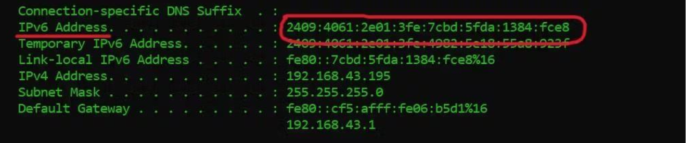
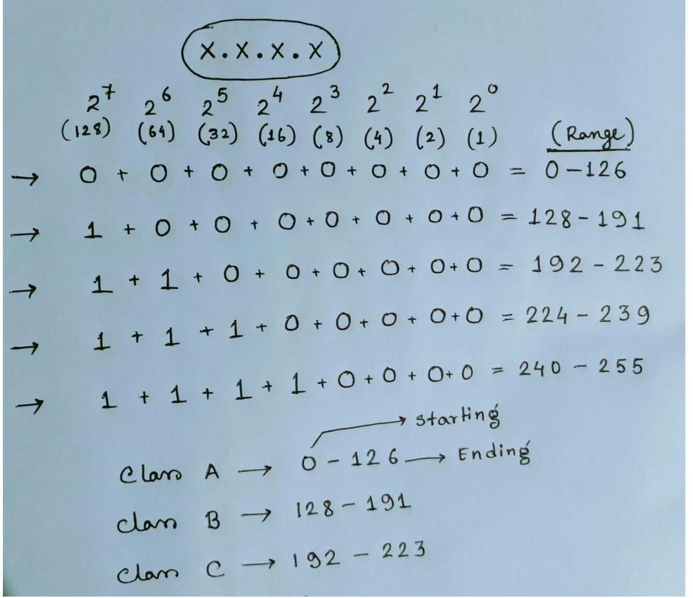

# Network Fundamentals

A computer network is a group of connected devices that communicate with each other to share data and resources.

## Table of Contents

- [Types of Networks](#types-of-networks)
- [Network Devices](#network-devices)
- [Network Protocols](#network-protocols)
- [Basic Networking Commands](#basic-networking-commands)
- [Types of IP Addresses](#types-of-ip-addresses)
- [IP Address Classes](#ip-address-classes-ipv4-only)
- [Network ID and Host ID](#ip-address---network-id-and-host-id)
- [Subnetting](#subnetting)
- [CIDR Notation](#cidr-classless-inter-domain-routing)
- [Network Models](#network-models)

---

## Types of Networks

There are different types of networks. The main two are **LAN** and **WAN**.

1. **LAN (Local Area Network)**
   - Interconnects computers within a limited area, such as residences, schools
   - Examples: Wi-Fi, Ethernet

2. **MAN (Metropolitan Area Network)**
   - Used in metropolitan areas (cities)
   - Covers larger geographic area than LAN but smaller than WAN

3. **WAN (Wide Area Network)**
   - Extends LAN over a large geographic area
   - Example: Optical fiber cable networks

4. **SONET (Synchronous Optical Network)**
   - Used in submarine communications
   - High-speed data transmission over optical fiber

---

## Network Devices

### 1. Router

A **Router** is a gateway device that connects multiple networks and directs data between them.

**Key Functions:**
- Connects local networks to the internet
- Determines the best path for data packets
- Uses IP addresses to forward data correctly

**Router Core Functionalities:**

1. **NAT (Network Address Translation)**
   - Method of remapping an IP address while in transit across a traffic routing device
   - Any device that goes outside via router/gateway gets its IP translated

2. **DMZ (Demilitarized Zone)**
   - A subnetwork that contains and exposes a device to an untrusted network (such as the internet)
   - Adds an extra layer of security

3. **Firewall**
   - Set of rules to control communication with the outside network
   - Filters traffic based on security policies

4. **Port Forwarding**
   - Redirects communication requests from one address and port number combination to another
   - Occurs while packets traverse network gateways (router or firewall)

### 2. Switch

A **Switch** connects devices within the same network and manages internal data communication.

**Key Functions:**
- Connects computers, printers, and servers
- Sends data only to the intended device
- Improves network efficiency and performance

### 3. Hub

A **Hub** is a basic device that connects multiple devices in a network.

**Key Functions:**
- Broadcasts data to all connected devices
- Does not filter or manage traffic
- Less secure and less efficient than a switch

### 4. Bridge

A **Bridge** connects two network segments and filters traffic between them.

**Key Functions:**
- Reduces unnecessary data transmission
- Improves network performance
- Works using MAC addresses

### 5. Gateway

A **Gateway** connects two different networks that use different protocols.

**Key Functions:**
- Translates data between different systems
- Enables communication between dissimilar networks
- Commonly used to connect private networks to external networks

### 6. Access Point (AP)

An **Access Point** provides wireless connectivity to devices in a network.

**Key Functions:**
- Extends a wired network into Wi-Fi
- Allows mobile devices to connect wirelessly
- Improves network coverage area

### 7. Modem

A **Modem** converts digital data into signals suitable for transmission and vice versa.

**Key Functions:**
- Connects a home or office network to the ISP
- Converts digital signals to analog and back
- Enables internet access

### 8. Firewall

A **Firewall** is a security device that monitors and controls network traffic.

**Key Functions:**
- Blocks unauthorized access
- Filters incoming and outgoing data
- Protects networks from cyber threats

---

## Network Protocols

A network protocol is a set of rules that determine how data is transmitted between different devices in the same network.

**Common Network Protocols:**

- **HTTP/HTTPS** (Hypertext Transfer Protocol / Secure)

  - Used for web browsing and website communication

  - HTTPS adds encryption for secure data transmission

- **TCP** (Transmission Control Protocol)

  - Breaks data into smaller packets

  - Ensures packets arrive safely and in order

  - Connection-oriented protocol

- **IP** (Internet Protocol)

  - Assigns addresses to devices on the network

  - Delivers packets to the correct destination

  - Works with TCP to form TCP/IP

- **SMTP** (Simple Mail Transfer Protocol)

  - Used for sending emails

  - Standard protocol for email transmission

- **FTP** (File Transfer Protocol)

  - Used for transferring files between systems

  - Supports file upload and download operations

---

## Basic Networking Commands

Here are essential networking commands for troubleshooting and network diagnostics:

### 1. ipconfig / ifconfig

**Purpose:** Display network configuration information

```bash

# Windows

ipconfig

# Linux/Mac OS

ifconfig

```

### 2. ipconfig /all

**Purpose:** Display detailed network configuration

```bash

ipconfig /all

```

### 3. nslookup


**Purpose:** Query DNS servers to obtain domain name or IP address mapping

```bash

nslookup www.google.com

```

**Output:** Fetches DNS server and underlying IP address


### 4. ping


**Purpose:** Test if a particular host is reachable

```bash

ping www.google.com

ping 8.8.8.8

```

**Use Case:** Check network connectivity and latency


### 5. tracert / traceroute

**Purpose:** Track the path packets take from source to destination


```bash

# Windows

tracert www.google.com


# Linux/Mac OS

traceroute www.google.com

```

**Use Case:** Identify network hops and diagnose intermittent performance issues


### 6. netstat


**Purpose:** Display network statistics and active connections


```bash

netstat

netstat -an  # Show all connections and listening ports

```


**Output:** Shows all open network connection statistics


### 7. telnet


**Purpose:** Test connection to a specific IP address and port


```bash

telnet [hostname or IP address] [port number]

```


**Example:**

```bash

telnet www.example.com 80

telnet 192.168.1.1 22

```

---

## Types of IP Addresses


### 1. IPv4 (Internet Protocol version 4)


**Technical Details:**

- 32-bit address format

- Written as four numbers separated by dots (e.g., `123.89.46.7`)

- Contains a combination of 32 bits (1s and 0s)

- Divided into 4 octets (groups of 8 bits each)

- Each octet represented by a decimal value (0-255)


**Binary to Decimal Conversion:**

```

1 byte = 8 bits

8 bits = 1 octet

8 bits = 2^8 = 256 possible values (0-255)

```

**Example IPv4 Address:**

```

192.168.1.1

```


**Limitations:**

- Limited address space (~4.3 billion addresses)

- Exhaustion of available addresses led to IPv6 development


---

### 2. IPv6 (Internet Protocol version 6)


**Technical Details:**

- 128-bit address format

- Written in eight groups of hexadecimal numbers

- Separated by colons


**Example IPv6 Address:**

```

2001:0db8:85a3:0000:0000:8a2e:0370:7334

```

**Advantages:**

- Vastly larger pool of addresses

- Designed to replace IPv4 as it runs out of available addresses

- Enhanced security and efficiency features




---

### 3. Public IP Address


**Characteristics:**

- Used to identify devices on the internet

- Assigned by Internet Service Providers (ISPs)

- Globally accessible and routable

- Required for internet-facing services

---

### 4. Private IP Address


**Characteristics:**

- Used within private networks (home, office, enterprise)

- Not accessible directly from the internet

- Must use NAT to communicate with the internet


**Reserved Private IP Ranges:**

```

Class A: 10.0.0.0 - 10.255.255.255

Class B: 172.16.0.0 - 172.31.255.255

Class C: 192.168.0.0 - 192.168.255.255

```

---


### 5. Static IP Address


**Characteristics:**

- Manually assigned to a device

- Does not change over time

- Used for servers and devices requiring consistent addressing

- Ideal for hosting services (web servers, email servers)


---

### 6. Dynamic IP Address

**Characteristics:**

- Automatically assigned by DHCP (Dynamic Host Configuration Protocol) server

- Changes periodically when lease expires

- Commonly used for home devices and clients

- More efficient use of limited IP addresses

---

## IP Address Classes (IPv4 Only)

The **IANA (Internet Assigned Numbers Authority)** divides IPv4 addresses into different classes based on the starting number, which determines their usage in networks.

> **Note:** You need to understand binary to decimal conversion to fully understand IP address classification.

### IP Address Class Overview

IPv4 addresses are divided into five classes (A through E) based on the first octet value.

| Class | IP Range                          | Purpose                                      | Default Subnet Mask |
|-------|-----------------------------------|----------------------------------------------|---------------------|
| A     | 1.0.0.0 - 126.255.255.255        | Large networks (e.g., big organizations)     | 255.0.0.0           |
| B     | 128.0.0.0 - 191.255.255.255      | Medium-sized networks                        | 255.255.0.0         |
| C     | 192.0.0.0 - 223.255.255.255      | Small networks (home or business LANs)       | 255.255.255.0       |
| D     | 224.0.0.0 - 239.255.255.255      | Reserved for multicasting                    | N/A                 |
| E     | 240.0.0.0 - 255.255.255.255      | Experimental (used for research)             | N/A                 |



---

### Special IP Address Ranges

#### 0.0.0.0
- **Not part of Class A** usable range
- Special address with specific networking purposes
- Often represents "any address" or "no particular address"

#### 127.0.0.0 - 127.255.255.255 (Loopback Range)
- **Reserved for loopback addresses** in IPv4
- Not part of the standard Class A range
- Most commonly used: `127.0.0.1` (localhost)

---

### What is Loopback?

A **loopback address** allows a device to communicate with itself.

**Key Points:**
- `127.0.0.1` is commonly known as **"localhost"**
- Any IP address in the `127.x.x.x` range loops back to the same device
- Used for testing network software on the local machine
- No external network connection required

**Common Use Cases:**
- Testing web servers locally
- Application development and debugging
- Network diagnostics
- Inter-process communication on the same machine

---

## IP Address - Network ID and Host ID

Every IP address consists of two main parts:

1. **Network ID** - Identifies the network
2. **Host ID** - Identifies the specific device (host) on that network

> **Note:** Any device that gets an IP address is called a **Host**.

---

### Network ID by IP Class

The Network ID portion differs depending on the IP address class:

| Class | Network ID Portion              | Host ID Portion           |
|-------|---------------------------------|---------------------------|
| A     | 1st octet                       | 2nd, 3rd, and 4th octets  |
| B     | 1st and 2nd octets              | 3rd and 4th octets        |
| C     | 1st, 2nd, and 3rd octets        | 4th octet only            |

---

### Network Communication Rules

#### Direct Connection (Without Router)
- Devices with the **same Network ID** can connect directly
- No routing device needed
- Communication happens at Layer 2 (Data Link layer)

#### Router Required
- Devices with **different Network IDs** need a router to connect
- Router operates at Layer 3 (Network layer)
- Enables inter-network communication

---

### Example Breakdown

**Class A Example:** `10.20.30.40`
- Network ID: `10`
- Host ID: `20.30.40`

**Class B Example:** `172.16.10.5`
- Network ID: `172.16`
- Host ID: `10.5`

**Class C Example:** `192.168.1.100`
- Network ID: `192.168.1`
- Host ID: `100`

---

## Subnetting

**Subnetting** is the process of dividing a larger network into smaller, more manageable sub-networks (subnets). This helps in better network organization, security, and efficient IP address utilization.

### Why Use Subnetting?

**Benefits of Subnetting:**

1. **Improves Network Performance**
   - Reduces broadcast domains
   - Limits broadcast traffic to specific subnets
   - Decreases network congestion

2. **Enhances Security**
   - Allows segregation of different departments or functions
   - Isolates sensitive data in separate subnets
   - Easier to implement security policies

3. **Efficient IP Usage**
   - Prevents wasting IP addresses
   - Allocates only necessary addresses for each subnet
   - Better resource management

4. **Simplified Management**
   - Easier to troubleshoot network issues
   - Better organization of network resources
   - Scalable network design

---

### Subnetting Example

**Given Network:** `192.168.1.0/24`

#### Network Analysis

- **IP Address:** `192.168.1.0`
- **Class:** Class C network
- **Subnet Mask:** `/24` = `255.255.255.0`
- **Network Bits:** 24 bits (for network portion)
- **Host Bits:** 8 bits (32 total bits - 24 network bits = 8 host bits)
- **Total IP Addresses:** 256 (2^8 = 256 addresses from `192.168.1.0` to `192.168.1.255`)

---

### Dividing into Smaller Subnets

To divide `192.168.1.0/24` into **two equal subnets**, we use a `/25` subnet mask:

- **New Subnet Mask:** `/25` = `255.255.255.128`
- **Host Bits:** 7 bits (32 - 25 = 7 bits for hosts)
- **Hosts per Subnet:** 2^7 = 128 addresses

#### Subnet 1: 192.168.1.0/25

| Property           | Value                              |
|--------------------|------------------------------------|
| Network Address    | 192.168.1.0                        |
| First Usable IP    | 192.168.1.1                        |
| Last Usable IP     | 192.168.1.126                      |
| Broadcast Address  | 192.168.1.127                      |
| IP Range           | 192.168.1.0 - 192.168.1.127        |
| Subnet Mask        | 255.255.255.128                    |
| Total IPs          | 128                                |
| Usable Host IPs    | 126                                |

#### Subnet 2: 192.168.1.128/25

| Property           | Value                              |
|--------------------|------------------------------------|
| Network Address    | 192.168.1.128                      |
| First Usable IP    | 192.168.1.129                      |
| Last Usable IP     | 192.168.1.254                      |
| Broadcast Address  | 192.168.1.255                      |
| IP Range           | 192.168.1.128 - 192.168.1.255      |
| Subnet Mask        | 255.255.255.128                    |
| Total IPs          | 128                                |
| Usable Host IPs    | 126                                |

---

### Subnetting Summary Table

| Subnet            | IP Range                        | Subnet Mask      | Total IPs | Usable IPs |
|-------------------|---------------------------------|------------------|-----------|------------|
| 192.168.1.0/25    | 192.168.1.0 - 192.168.1.127     | 255.255.255.128  | 128       | 126        |
| 192.168.1.128/25  | 192.168.1.128 - 192.168.1.255   | 255.255.255.128  | 128       | 126        |

**Explanation:**

- By using a `/25` mask instead of `/24`, we split the network into **two subnets** with 128 IP addresses each
- Each subnet has **126 usable host addresses** (first address is network address, last is broadcast address)
- This creates smaller segments within the original network, making it easier to manage specific groups of hosts separately

---

### Important Subnetting Concepts

#### Reserved IP Addresses in Each Subnet

1. **Network Address** (First IP)
   - Identifies the subnet itself
   - Cannot be assigned to a host
   - Example: `192.168.1.0` for subnet `192.168.1.0/25`

2. **Broadcast Address** (Last IP)
   - Used to send data to all hosts in the subnet
   - Cannot be assigned to a host
   - Example: `192.168.1.127` for subnet `192.168.1.0/25`

3. **Usable Host Addresses**
   - All IP addresses between network and broadcast addresses
   - Can be assigned to devices
   - Formula: `2^(host bits) - 2`

---

## CIDR (Classless Inter-Domain Routing)

**CIDR (Classless Inter-Domain Routing)** is a method for allocating IP addresses and routing that replaces the older classful network system. It was introduced to:

- Improve IP address utilization
- Simplify routing tables
- Provide flexible subnet mask allocation
- Reduce routing table size

### Understanding CIDR Notation

CIDR uses a suffix (e.g., `/24`) to indicate how many bits are used for the network portion of the address.

**Format:** `IP_Address/Prefix_Length`

**Example:** `192.168.1.0/24`
- IP Address: `192.168.1.0`
- Prefix Length: `/24` (24 bits for network, 8 bits for hosts)

---

### CIDR Notation Reference Table

The table below outlines the most common CIDR notations with their corresponding subnet masks and address capacities:

| CIDR Prefix | Subnet Mask       | Number of Addresses | Usable Hosts | Relation to Class | Common Use Case                           |
|-------------|-------------------|---------------------|--------------|-------------------|-------------------------------------------|
| /32         | 255.255.255.255   | 1                   | 1            | 1 Host            | Single host route / Loopback              |
| /31         | 255.255.255.254   | 2                   | 2*           | -                 | Point-to-point links (RFC 3021)           |
| /30         | 255.255.255.252   | 4                   | 2            | -                 | Point-to-point links                      |
| /29         | 255.255.255.248   | 8                   | 6            | -                 | Small networks                            |
| /28         | 255.255.255.240   | 16                  | 14           | -                 | Very small networks                       |
| /27         | 255.255.255.224   | 32                  | 30           | -                 | Small office networks                     |
| /26         | 255.255.255.192   | 64                  | 62           | Class C / 4       | Small department                          |
| /25         | 255.255.255.128   | 128                 | 126          | Class C / 2       | Medium department                         |
| /24         | 255.255.255.0     | 256                 | 254          | **Class C**       | Standard small network                    |
| /23         | 255.255.254.0     | 512                 | 510          | Class C × 2       | Multiple small networks                   |
| /22         | 255.255.252.0     | 1,024               | 1,022        | Class C × 4       | Medium-sized network                      |
| /21         | 255.255.248.0     | 2,048               | 2,046        | Class C × 8       | Large department                          |
| /20         | 255.255.240.0     | 4,096               | 4,094        | Class C × 16      | Large network                             |
| /19         | 255.255.224.0     | 8,192               | 8,190        | Class C × 32      | Very large network                        |
| /18         | 255.255.192.0     | 16,384              | 16,382       | Class C × 64      | ISP / Large enterprise                    |
| /17         | 255.255.128.0     | 32,768              | 32,766       | Class C × 128     | Large ISP allocation                      |
| /16         | 255.255.0.0       | 65,536              | 65,534       | **Class B**       | Large enterprise network                  |
| /15         | 255.254.0.0       | 131,072             | 131,070      | Class B × 2       | Very large organization                   |
| /14         | 255.252.0.0       | 262,144             | 262,142      | Class B × 4       | ISP regional allocation                   |
| /13         | 255.248.0.0       | 524,288             | 524,286      | Class B × 8       | Large ISP allocation                      |
| /12         | 255.240.0.0       | 1,048,576           | 1,048,574    | Class B × 16      | Major ISP allocation                      |
| /11         | 255.224.0.0       | 2,097,152           | 2,097,150    | Class B × 32      | Very large ISP                            |
| /10         | 255.192.0.0       | 4,194,304           | 4,194,302    | Class B × 64      | Large ISP / National network              |
| /9          | 255.128.0.0       | 8,388,608           | 8,388,606    | Class B × 128     | Major national ISP                        |
| /8          | 255.0.0.0         | 16,777,216          | 16,777,214   | **Class A**       | Major ISP / Large country                 |
| /7          | 254.0.0.0         | 33,554,432          | 33,554,430   | Class A × 2       | Continental network                       |
| /0          | 0.0.0.0           | 4,294,967,296       | -            | Entire Internet   | Default route (0.0.0.0/0)                 |

> **Note:** `/0` (0.0.0.0/0) represents the entire internet and is often used in public firewalls and routing tables as a default route.

---

### Quick CIDR Calculation Formulas

**Total IP Addresses:**
```
Total IPs = 2^(32 - prefix_length)
```

**Usable Host Addresses:**
```
Usable Hosts = 2^(32 - prefix_length) - 2
```
*Subtract 2 for network and broadcast addresses*

**Example Calculations:**

| CIDR     | Calculation            | Total IPs | Usable Hosts |
|----------|------------------------|-----------|--------------|
| /24      | 2^(32-24) = 2^8        | 256       | 254          |
| /25      | 2^(32-25) = 2^7        | 128       | 126          |
| /26      | 2^(32-26) = 2^6        | 64        | 62           |
| /16      | 2^(32-16) = 2^16       | 65,536    | 65,534       |

---

### CIDR vs Classful Addressing

| Aspect                  | Classful (Old)                          | CIDR (Modern)                          |
|-------------------------|-----------------------------------------|----------------------------------------|
| **Flexibility**         | Fixed subnet masks per class            | Variable-length subnet masks (VLSM)    |
| **IP Efficiency**       | Wastes many IP addresses                | Efficient use of IP space              |
| **Routing**             | Larger routing tables                   | Smaller, aggregated routing tables     |
| **Allocation**          | Class-based (A, B, C)                   | Prefix-based (any length)              |
| **Example**             | Must use /8, /16, or /24                | Can use /20, /22, /25, etc.            |

---  

## Network Models

Network models define how data is transmitted across a network through standardized layers. There are two primary network models:

1. **OSI Reference Model** (7 Layers)
2. **TCP/IP Model** (4 Layers)

---

### 1. OSI Reference Model

The **OSI (Open Systems Interconnection) Model** is a conceptual framework that explains how different computer systems communicate over a network. It was developed by the **International Organization for Standardization (ISO)**.

The OSI Model consists of **7 layers**, each with specific functions and responsibilities.

#### OSI Model - 7 Layers

| Layer # | Layer Name        | Function                                                                 | Protocols/Examples           | Data Unit  |
|---------|-------------------|--------------------------------------------------------------------------|------------------------------|------------|
| **7**   | Application       | User interface, network services for applications                        | HTTP, HTTPS, FTP, SMTP, DNS  | Data       |
| **6**   | Presentation      | Data translation, encryption, compression                                | SSL/TLS, JPEG, ASCII, MPEG   | Data       |
| **5**   | Session           | Establishes, manages, and terminates sessions                            | NetBIOS, RPC, PPTP           | Data       |
| **4**   | Transport         | Reliable data transfer, error correction, flow control                   | TCP, UDP                     | Segment    |
| **3**   | Network           | Routing, logical addressing, packet forwarding                           | IP, ICMP, ARP, Routers       | Packet     |
| **2**   | Data Link         | Physical addressing (MAC), error detection, frame transmission           | Ethernet, Wi-Fi, Switch      | Frame      |
| **1**   | Physical          | Physical connection, transmits raw bits over cables/wireless             | Cables, Hubs, Radio signals  | Bit        |

---

#### Detailed Layer Description

##### Layer 7: Application Layer
- **Function:** Provides network services directly to end-users and applications
- **Responsibilities:**
  - User interface for network services
  - Application-to-application communication
  - Resource sharing
- **Protocols:** HTTP, HTTPS, FTP, SMTP, DNS, SNMP, Telnet
- **Examples:** Web browsers, email clients, file transfer applications

##### Layer 6: Presentation Layer
- **Function:** Translates data formats to ensure compatibility between systems
- **Responsibilities:**
  - Data translation and code formatting
  - Encryption and decryption
  - Data compression
  - Character encoding conversion
- **Protocols:** SSL/TLS, JPEG, GIF, MPEG, ASCII
- **Examples:** Encryption protocols, media codecs

##### Layer 5: Session Layer
- **Function:** Establishes, maintains, and manages communication sessions
- **Responsibilities:**
  - Session establishment and termination
  - Dialog control (half-duplex/full-duplex)
  - Synchronization
  - Session recovery
- **Protocols:** NetBIOS, RPC (Remote Procedure Call), PPTP
- **Examples:** Authentication sessions, API sessions

##### Layer 4: Transport Layer
- **Function:** Ensures reliable data transfer with error correction and flow control
- **Responsibilities:**
  - Segmentation and reassembly
  - End-to-end error recovery
  - Flow control
  - Port addressing
- **Protocols:** 
  - **TCP** (Transmission Control Protocol) - Reliable, connection-oriented
  - **UDP** (User Datagram Protocol) - Unreliable, connectionless
- **Data Unit:** Segment

##### Layer 3: Network Layer
- **Function:** Manages packet forwarding and routing through networks
- **Responsibilities:**
  - Logical addressing (IP addresses)
  - Routing and path determination
  - Packet forwarding
  - Fragmentation and reassembly
- **Protocols:** IP (IPv4, IPv6), ICMP, ARP, IGMP
- **Devices:** Routers, Layer 3 switches
- **Data Unit:** Packet

##### Layer 2: Data Link Layer
- **Function:** Manages data transfer between directly connected nodes
- **Responsibilities:**
  - Physical addressing (MAC addresses)
  - Frame creation and transmission
  - Error detection (not correction)
  - Flow control
- **Protocols:** Ethernet, Wi-Fi (802.11), PPP, HDLC
- **Devices:** Switches, Bridges, Network Interface Cards (NICs)
- **Data Unit:** Frame

##### Layer 1: Physical Layer
- **Function:** Handles physical connection and transmits raw data bits
- **Responsibilities:**
  - Physical topology
  - Bit transmission
  - Signal encoding
  - Cable specifications
- **Components:** Cables (fiber, copper), connectors, radio signals, hubs, repeaters
- **Data Unit:** Bit

---

### 2. TCP/IP Model

The **TCP/IP Model** (also known as the Internet Protocol Suite) is a practical, widely-implemented networking model. It's the foundation of the modern internet.

The TCP/IP Model consists of **4 layers**.

#### TCP/IP Model - 4 Layers

| Layer # | Layer Name           | Function                                              | Protocols/Examples           | Equivalent OSI Layers |
|---------|----------------------|-------------------------------------------------------|------------------------------|-----------------------|
| **4**   | Application          | Application services, user interface                  | HTTP, FTP, SMTP, DNS, SSH    | 7, 6, 5               |
| **3**   | Transport            | End-to-end communication, reliability                 | TCP, UDP                     | 4                     |
| **2**   | Internet             | Routing, logical addressing                           | IP, ICMP, ARP                | 3                     |
| **1**   | Network Access       | Physical transmission, hardware addressing            | Ethernet, Wi-Fi              | 2, 1                  |

---

#### Detailed TCP/IP Layer Description

##### Layer 4: Application Layer
- **Function:** Combines functions of OSI Layers 5, 6, and 7
- **Responsibilities:**
  - Application services
  - Data formatting
  - Session management
- **Protocols:** HTTP, HTTPS, FTP, SMTP, DNS, SSH, Telnet, DHCP
- **Examples:** Web services, email, file transfers

##### Layer 3: Transport Layer
- **Function:** Same as OSI Layer 4
- **Responsibilities:**
  - Reliable/unreliable data delivery
  - Port-based communication
  - Error detection and recovery
- **Protocols:**
  - **TCP:** Connection-oriented, reliable
  - **UDP:** Connectionless, fast but unreliable

##### Layer 2: Internet Layer
- **Function:** Similar to OSI Layer 3
- **Responsibilities:**
  - Packet routing
  - IP addressing
  - Fragmentation
- **Protocols:** IPv4, IPv6, ICMP, ARP, IGMP

##### Layer 1: Network Access Layer
- **Function:** Combines OSI Layers 1 and 2
- **Responsibilities:**
  - Physical data transmission
  - Hardware addressing (MAC)
  - Frame formatting
- **Technologies:** Ethernet, Wi-Fi, Token Ring, PPP

---

### OSI vs TCP/IP Model Comparison

| Aspect                  | OSI Model                           | TCP/IP Model                        |
|-------------------------|-------------------------------------|-------------------------------------|
| **Number of Layers**    | 7 Layers                            | 4 Layers                            |
| **Development**         | Theoretical/Conceptual              | Practical/Implementation-based      |
| **Developer**           | ISO (International Standards Org)   | Department of Defense (DoD)         |
| **Approach**            | Protocol-independent                | Protocol-specific                   |
| **Usage**               | Learning and reference              | Real-world implementation           |
| **Application Support** | Not built in                        | Built-in (HTTP, FTP, etc.)          |
| **Transport Layer**     | Connection-oriented only            | Both connection and connectionless  |
| **Flexibility**         | More rigid, clear separation        | More flexible                       |
| **Adoption**            | Educational standard                | Internet standard                   |

---

### Layer Mapping: OSI to TCP/IP

```
OSI Model (7 Layers)          TCP/IP Model (4 Layers)
┌────────────────────┐        
│  7. Application    │        ┌────────────────────┐
├────────────────────┤        │                    │
│  6. Presentation   │   →    │  4. Application    │
├────────────────────┤        │                    │
│  5. Session        │        └────────────────────┘
├────────────────────┤        
│  4. Transport      │   →    ┌────────────────────┐
│                    │        │  3. Transport      │
├────────────────────┤        └────────────────────┘
│  3. Network        │   →    ┌────────────────────┐
│                    │        │  2. Internet       │
├────────────────────┤        └────────────────────┘
│  2. Data Link      │        ┌────────────────────┐
├────────────────────┤   →    │                    │
│  1. Physical       │        │  1. Network Access │
└────────────────────┘        └────────────────────┘
```

---

### Mnemonic to Remember OSI Layers

**From Layer 7 to Layer 1:**
> **A**ll **P**eople **S**eem **T**o **N**eed **D**ata **P**rocessing

- **A**pplication
- **P**resentation
- **S**ession
- **T**ransport
- **N**etwork
- **D**ata Link
- **P**hysical

**From Layer 1 to Layer 7:**
> **P**lease **D**o **N**ot **T**hrow **S**ausage **P**izza **A**way

---

## Summary

This document covers the fundamental concepts of computer networking including:

- ✅ Different types of networks (LAN, WAN, MAN, SONET)
- ✅ Essential network devices and their functions (Router, Switch, Hub, Bridge, Gateway, Access Point, Modem, Firewall)
- ✅ Key networking protocols (TCP/IP, HTTP, SMTP, FTP)
- ✅ Basic networking commands for troubleshooting (ping, tracert, nslookup, netstat, telnet)
- ✅ IP addressing (IPv4 and IPv6)
- ✅ IP address types (Public, Private, Static, Dynamic)
- ✅ IP address classes (A, B, C, D, E) and special ranges
- ✅ Network ID and Host ID concepts
- ✅ **Subnetting** - Dividing networks into smaller segments
- ✅ **CIDR notation** - Classless Inter-Domain Routing with comprehensive reference table
- ✅ **Network Models** - OSI (7 layers) and TCP/IP (4 layers) models with detailed layer descriptions

Understanding these concepts is essential for anyone working in:
- 🔹 IT and Network Administration
- 🔹 DevOps and Cloud Engineering
- 🔹 System Administration
- 🔹 Cybersecurity
- 🔹 Software Engineering

---

## Additional Resources

**Practice Tools:**
- Subnet calculators for CIDR practice
- Network simulation tools (Packet Tracer, GNS3)
- Online IP address calculators

**Further Learning:**
- Network+ certification materials
- CCNA certification resources
- Advanced routing and switching concepts
- Network security fundamentals

---

**Last Updated:** 2026
**Author:** DevOps Learning Resources

