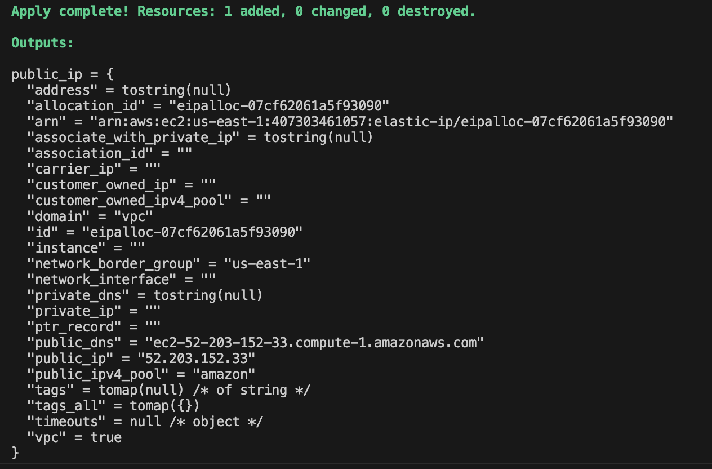

## What Is Terraform ? ##

HashiCorp Terraform is an infrastructure as code tool that lets you define both cloud and on-prem resources in human-readable configuration files that you can version, reuse, and share.

### How does Terraform work? 

Terraform creates and manages resources on cloud platforms and other services through their application programming interfaces (APIs). Providers enable Terraform to work with virtually any platform or service with an accessible API.


## Advantages of Terraform ##

Infrastructure as Code (IaC) tools allow you to manage infrastructure with configuration files rather than through a graphical user interface.

`Manage any infrastructure` --> Terraform plugins called providers let Terraform interact with cloud platforms and other services via their application programming interfaces (APIs).

`Standardize your deployment workflow` --> Providers define individual units of infrastructure, for example compute instances or private networks, as resources. You can compose resources from different providers into reusable Terraform configurations called modules, and manage them with a consistent language and workflow. 


`Track your infrastructure` --> Terraform keeps track of your real infrastructure in a state file, which acts as a source of truth for your environment.

`Collaborate` --> Terraform allows you to collaborate on your infrastructure with its remote state backends.

`Reference Link:` https://developer.hashicorp.com/terraform/tutorials/aws-get-started/infrastructure-as-code

## Installtion of Terraform ##

As below Official link of terraform we can use to download and install the terraform in diffrenet operating systems i.e Windows, Linux, Mac etc.

`Download Link:` https://developer.hashicorp.com/terraform/install

## Terraform Commands ##

terraform validate # It's validates syntax configuration, If no syntax errors the output is Success! The configuration is valid

terraform init # Command uses initiliaze and download the providers associated with the terraform provider.tf file `Ex:` .terraform/providers/registry.terraform.io/hashicorp

terraform plan # Command is execute the actual plan before creating the resources.

terraform apply # Command is create the resources are defined in terraform configuration.

terraform fmt # Command is used to rewrite Terraform configuration files to a canonical format and style

terraform destroy # Command is used to destroy the resourtces are created from the terraform configuration.

terraform destory `-target <resource type.local resource name>` # If you want destroy for specific resource need to use -target option.

`EX:` resource "aws_instance" "example_instance" 

`Details:` aws_instance is resource type, . is a separator and example_instance is a local resource name

terraform show # Command showcase the state file resources.

## Terraform State File ##

`Terraform state file` When you run the `terraform apply` command it will create the `terraform.tfstate` file with the resources are provided in the terraform configuration.

## Desired State ##

Terraform's primary function is to create, modify and destroy the infrastrucrture resources to match the desired state described in terraform configuration.

`Ex:` 
```bash
    resource "aws_instance" "example_Instance" {
    ami           = "ami-01b799c439fd5516a"
    instance_type = "t2.micro"
}  
```
## Current State ##

Current is a actual state of resource that is currently deployed.

`Ex:` 
```bash
      resource "aws_instance" "example_Instance" {
      ami           = "ami-01b799c439fd5516a"
      instance_type = "t2.medium"
}
```

`Important Note:` Terraform tries to ensure that the deployed infrastructure is based on the desired state. If there is a difference b/w the two, terraform plan presents a description of the changes necessary to acheive the desired state.

How this tested?

1. Created a EC2 instance by using terraform configuration with the t2. micro
2. Manually stopped the EC2 instance and chnages from t2.micro to t2.medium and started the instance.
3. In Back to terminal and ran the `terraform plan` command it's showing update in-place and 1 to change.
4. After running the `terraform apply` command it's matches the desired state of the Ec2 instance i.e chnages from `t2.medium to t2.micro`.

## Provider Versioning ##

During terraform init, if version argument is not specified the most recent provider will be downloaded during initilization.

`Note:` For production use, you should constrain the acceptable provider version via configuration, to enusre that new versions with breaking changes will not be automatically installed.

`Example code snippet:` 

```bash
terraform {
  required_providers {
    aws = {
      source  = "hashicorp/aws"
      version = "~> 5.0"
    }
  }
}
```

## Controlling the versions of terraform provider ## 

`>= 1.0.0 - Versions greater than or equal to the 1.0.0.`

`<= 1.0.0 - Versions lesser than or equal to 1.0.0.`

`>= 1.0.0, <= 2.0.0 - Any version b/w the 1.0.0 and 2.0.0`

`~> 1.0.0 - Any version in the 1.X range`

`Note:` For version testing earlier i'm not specified any version for provider as below. it's downloaded latest version of aws provider.

# Configure the AWS Provider

```bash
provider "aws" {
  region     = "us-east-1"
}
```
But when i add the as below provider with the specific version constraint terraform lock file is not allowing me to dowload the specific version, due to earlier which is dowloaded the latest version and locked with the file name called `.terraform.lock.hcl`

```bash
terraform {
  required_providers {
    aws = {
      source  = "hashicorp/aws"
      version = "<= 5.0"
    }
  }
}
```

`Error: Failed to query available provider packages`

 Could not retrieve the list of available versions for provider hashicorp/aws: locked provider registry.terraform.io/hashicorp/aws 5.55.0 does not match configured version
 constraint <= 5.0.0; must use terraform init -upgrade to allow selection of new versions.

`Fix:` Delete the `.terraform.lock.hcl` file and re-run the `terraform init` command it's download the `version = "<= 5.0"`

By using `terraform init -upgrade` command you can upgrade the provider version.

## Terraform Refresh ##

`terraform refresh` command chnages the state file when you modified the resources manually in the AWS console.

`1 Example:` You have created Ec2 instance by using terraform, in the instance security group was default. Yoy manually created the custom security group and remove the default one and attached custom SG with the EC2 instance. Then hit the `terraform refresh` it's modified in terraform.tfstate file `default to custom`

`2 Example:` If you change the region in providers.tf form `us-east-1 to us-west-2` and run the `terraform refresh` command `terraform.tfstate` file completely empty and all of our configurations went away and by using `terraform.tfstate.backup` update the `terraform.tfstate` file for our configuration.

`Note:` Don't run manually for the `terraform refresh` command.

## AWS Provider - Authentication Configuration ##

1. Don't add your AWS access keys and secret keys directly in the terraform provider configurations.
2. Create the IAM user and under the user --> security credentials --> create access key and download the keys.
3. Download the aws cli in the specific operating system by using as below link.

`Reference link:` https://docs.aws.amazon.com/cli/latest/userguide/getting-started-install.html

4. Run the `aws configure` and provide the access key id and secret access key from the downloaded credentails from 2nd step.

AWS Access Key ID [****************SD2U]: cxxxxxxxxxxxxxxxxx

AWS Secret Access Key [****************X1GY]: Dxxxxxxxxxxxxxxx

Default region name [us-east-1]: 

Default output format [None]:

5. Now run the terraform commands it's works
6. Another way is add the variables in your terraform configuration and run the terraform commands. i.e refer varaibles.tf 

`For More Details and ways:` https://registry.terraform.io/providers/hashicorp/aws/5.53.0/docs

`Important Note for terraform Versions`: Just because a better approach is recommended, does not always mean that older approach will stop working. Search for specific version documents you will get the example usage based on your requiremnets.

`Example of New version 5.53.0 approach:`

```bash
resource "aws_security_group" "allow_tls" {
  name        = "allow_tls"
  description = "Allow TLS inbound traffic"
  vpc_id      = aws_vpc.main.id

  tags = {
    Name = "allow_tls"
  }
}

resource "aws_vpc_security_group_ingress_rule" "allow_tls_ipv4" {
  security_group_id = aws_security_group.allow_tls.id
  cidr_ipv4         = aws_vpc.main.cidr_block
  from_port         = 443
  ip_protocol       = "tcp"
  to_port           = 443
}
```

`Example of Old Version 4.48.0 Approach:`

```bash
resource "aws_security_group" "allow_tls" {
  name        = "allow_tls"
  description = "Allow TLS inbound traffic"
  vpc_id      = aws_vpc.main.id

  ingress {
    description      = "TLS from VPC"
    from_port        = 443
    to_port          = 443
    protocol         = "tcp"
    cidr_blocks      = [aws_vpc.main.cidr_block]
    ipv6_cidr_blocks = [aws_vpc.main.ipv6_cidr_block]
  }
}
```
`Reference document:` https://registry.terraform.io/providers/hashicorp/aws/5.53.0/docs

## Basics Of Attributes ##

Each resource has its associated set of attributes.
Attributes are the fields in a resource that holds the values that end up in the state.

When you run the terraform apply commands in the `.terraform.tfstate` file we can able to see the attributes.

`Example Attribute`

{
          "schema_version": 0,
          "attributes": {
          "private_dns": null,
          "public_dns": "ec2-100-29-169-75.compute-1.amazonaws.com",
          "public_ip": "100.29.169.75",
          }
}            

`For more Details:` https://registry.terraform.io/providers/hashicorp/aws/5.53.0/docs/resources/instance#attribute-reference

## Cross Referencing Resource Attribute ##

Terraform allows us to refernce the attribute of one resource to be used in a different resource.

`Syntax:`

Ex: `<RESOURCE TYPE>.<NAME>. <ATTRIBUTE>>`

We can specify the resource address with the attribute for cross-referencing.

1. Creating the elastic ip 
2. Creating the security group
3. Creating the inbould rule which we are cross referencing the elastic ip for the cidr ipv4 block.
4. For More details check the cross-reference-attributes.tf file

`Ex:` 

```bash
resource "aws_eip" "lb" {
  domain   = "vpc"
}
```
```bash
resource "aws_vpc_security_group_ingress_rule" "allow_tls_ipv4" {
  security_group_id = aws_security_group.allow_tls.id
  cidr_ipv4         = "${aws_eip.lb.public_ip}/32"
}
```
## String Interpolation in Terraform ##

${...}): This syntx indicates that Terraform will replace the expression inside the curly braces with it's calculated value.

`Ex:` cidr_ipv4         = "${aws_eip.lb.public_ip}/32"

### Output Values

Terraform Output values make information about your infrastructure available on the commandline, and can expose information for terraform configurations to use.

Referer the terraform code for `output-values/output-values.tf` file.

`Ex1:` Yo want a `pubic ip` attribute as a output value.

```bash
resource "aws_eip" "lb" {
    domain = "vpc"
}

output "public_ip" {
    value = aws_eip.lb
}
```


`Ex2:` Since you were not decided which attribute needs to output the code block should be like as below and it's output the values are domain, public ip, public dns etc.

```bash
resource "aws_eip" "lb" {
    domain = "vpc"
}

output "public_ip" {
    value = aws_eip.lb
}
```


`Note:` Output values defined in Project A can be referenced from code in project B as well.

### Variables

Update important values in one central place instead of searching and replacing them throught your code, saving time and potential mistakes. Managing the variables in production env. is one of the very important aspect to keep the code clean and reusable.

Refer `variables/main.tf, variables.tf` for more details.

### TF Vars 

tfvars files are used to store variable definitions. This allows you to externalize your variable definitions and makes it easier to manage them, especially if you have a large number of variables or need to use the same variables in multiple environments.

1. Terraform knows if the values doesn't part of the variables.tf file it will pick from the `terraform.tfvars` file.
2. If you keep the empty `terraform.tfvars` file and it will take value from the `varaibles.tf `file.
3. Even though if the value presents in `varaibles.tf` file it will took value from the `terraform.tfvars` file only.
4. `Note:` HashiCorp recomands creating a separate file with the name of `*.tfvars` to define all variable value in a project.
5. Organization have wide set of environments: Dev, Stage, Prod etc. In this case you need pass the command line arguments explictly.

Ex: `terraform plan -var-file dev.tfvars`

### Variable  Defination Precedence

Terraform loads variables in the following order, with later sources taking precendence over earlier one.

1. Environment variables
2. The terraform.tfvars files, if it's present.
3. The terraform.tfvars.json file, if it's present.
4. Any *.auto.tfvars or *.auto.tfvars.json files, processed in the lexical order of their file names.
5. Any -var and -file-var options on the command line.

**Testing Example1:** Even you have `variables.tf file` in the terraform configuration with the `intsance_type = t2.micro` in the system env `TF_VAR_instance_type=t2.medium`. While running `terraform plan` it's should be considered as a system env only, due it's having higher Precedence.

**Testing Example2:** Even when you have added as a sytem env `TF_VAR_instance_type=t2.micro` or value in `terraform.tfvars` file having `t2.large` while executing the command line `terraform plan -var="instance_type=m5.large"` it's should be considered as a command line only, due it's having higher Precedence.

**Testing Example3:** Even when you have `variables.tf file` in the terraform configuration with the `intsance_type = t2.micro` and `terraform.tfvars` having `instance_type = t2.large` it's should be considered as `t2.large` due it's having higher Precedence.

## Data Types ##

Data type referes to the `type of the value.` Depending on the requirement we can use wide variety of values in terraform configuration.

**Example Data type:** `Hello world` is `string` Refer data-types/string-type/

                       `7576` is a `number`

                       `true` or `false` is a `boolean`

                       `list` or `tuple` collection of values, like `["us-west-1a", "us-west-1c"]` i.e See the example of `datatypes/data-type-list.tf`

                       `set` is acollection of unique values that do not have any secondary identifiers or ordering.

                       `map` or `object` collection of of key values identified by named labels, like `{name = "Mabel", age = 52}.` Refer data-types/map-type=map-type.tf

                       `null` a value that represents absence or omission. If you set an argument of a resource to null, Terraform behaves as though you had completely omitted it.

`Reference Link`: https://developer.hashicorp.com/terraform/language/expressions/types#types

## Count and Count Index ##

count referes total no. of instances, users etc. want's to create Ex: Refer `count/count.tf`

count.index allows us to fetch the index of each iteration in the loop. Ex: Refer `count-index/count-index.tf`

`Note:` Having a username like loadbalancer0, loadbalancer1 might not always suitable. Better names like `dev-loadbalancer`, `test-loadbalancer` etc. count.index help such scenario as well.

## Conditional Expression ##

A conditional expression uses the value of `bool` expression to select one of two values.

`Syntax:` condition ? true_val : false_val

Example: `count = var.istest == true ? 3 : 0` `var.test` is condition as per above syntax then `?` symbol then in `3: 0` `3 is true and 0 is false`. Based on the `terraform.tfvars` we can change the condition.

## Local Values ##

A local value assigns a name to an expression, allowing it to be used multiple times with in a module without repeating it.

Local values can be helpful to avoid repeating the same values or expressions multiple times in a configuration.

Refer for more details `local-values/local-values.tf`
