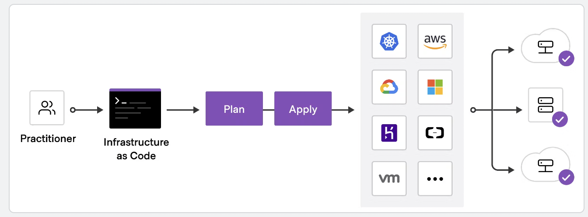
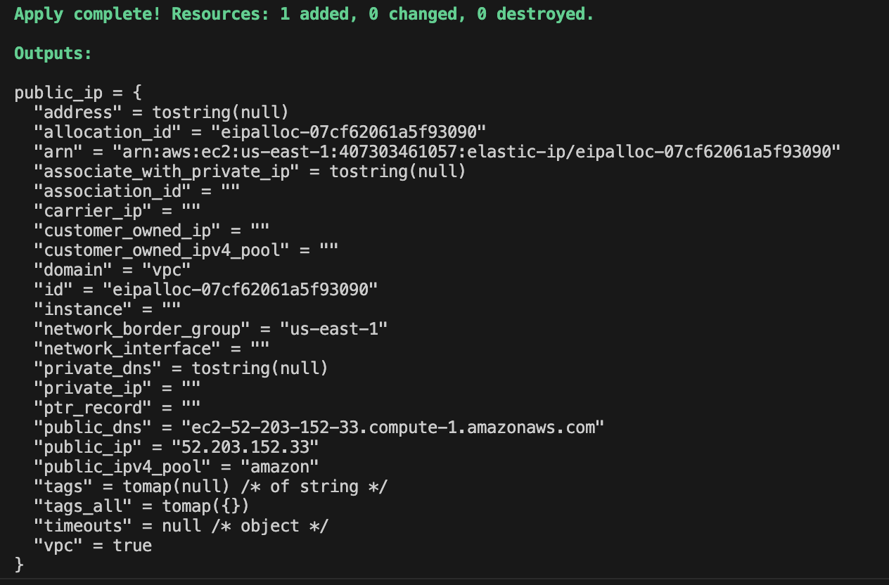
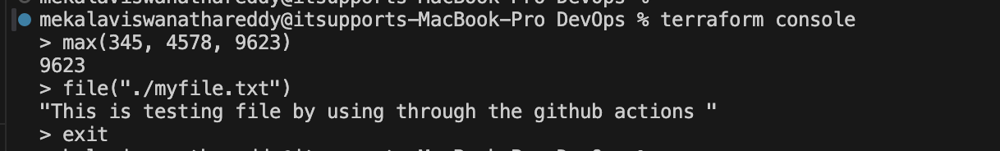
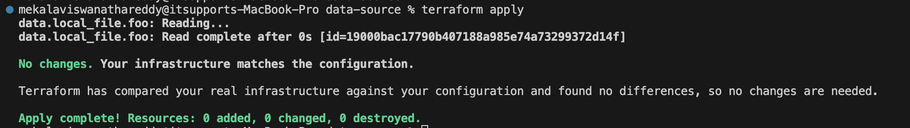
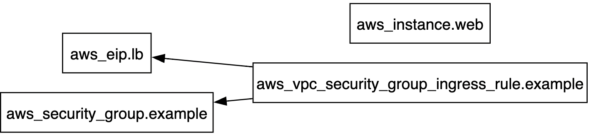
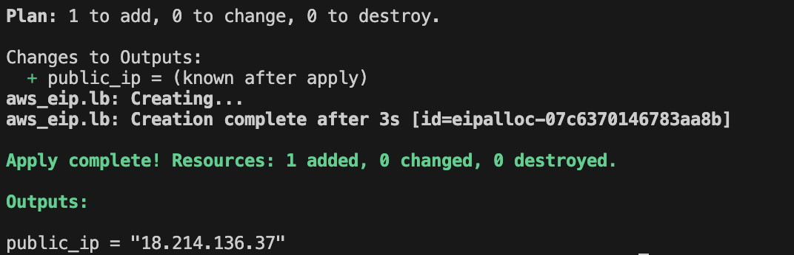
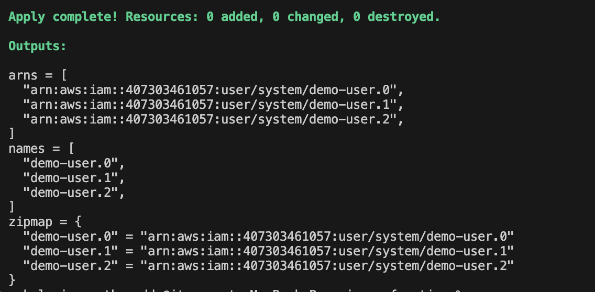
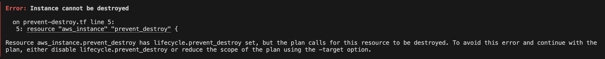

## What Is Terraform ? ##

HashiCorp Terraform is an infrastructure as code tool that lets you define both cloud and on-prem resources in human-readable configuration files that you can version, reuse, and share.

### How does Terraform work? 

Terraform creates and manages resources on cloud platforms and other services through their application programming interfaces (APIs). Providers enable Terraform to work with virtually any platform or service with an accessible API.


## Advantages of Terraform ##

Infrastructure as Code (IaC) tools allow you to manage infrastructure with configuration files rather than through a graphical user interface.

`Manage any infrastructure` --> Terraform plugins called providers let Terraform interact with cloud platforms and other services via their application programming interfaces (APIs).

`Standardize your deployment workflow` --> Providers define individual units of infrastructure, for example compute instances or private networks, as resources. You can compose resources from different providers into reusable Terraform configurations called modules, and manage them with a consistent language and workflow. 



`Track your infrastructure` --> Terraform keeps track of your real infrastructure in a state file, which acts as a source of truth for your environment.

`Collaborate` --> Terraform allows you to collaborate on your infrastructure with its remote state backends.

`Reference Link:` https://developer.hashicorp.com/terraform/tutorials/aws-get-started/infrastructure-as-code

## Installtion of Terraform ##

As below Official link of terraform we can use to download and install the terraform in diffrenet operating systems i.e Windows, Linux, Mac etc.

`Download Link:` https://developer.hashicorp.com/terraform/install

## Terraform Commands ##

terraform validate # It's validates syntax configuration, If no syntax errors the output is Success! The configuration is valid

terraform init # Command uses initiliaze and download the providers associated with the terraform provider.tf file `Ex:` .terraform/providers/registry.terraform.io/hashicorp

terraform plan # Command is execute the actual plan before creating the resources.

terraform apply # Command is create the resources are defined in terraform configuration.

terraform fmt # Command is used to rewrite Terraform configuration files to a canonical format and style.

terraform destroy # Command is used to destroy the resourtces are created from the terraform configuration.

terraform destory `-target <resource type.local resource name>` # If you want destroy for specific resource need to use -target option.

`EX:` resource "aws_instance" "example_instance" 

`Details:` aws_instance is resource type, . is a separator and example_instance is a local resource name

terraform show # Command showcase the state file resources.

## Terraform State File ##

`Terraform state file` When you run the `terraform apply` command it will create the `terraform.tfstate` file with the resources are provided in the terraform configuration.

## Desired State ##

Terraform's primary function is to create, modify and destroy the infrastrucrture resources to match the desired state described in terraform configuration.

`Ex:` 
```bash
    resource "aws_instance" "example_Instance" {
    ami           = "ami-01b799c439fd5516a"
    instance_type = "t2.micro"
}  
```
## Current State ##

Current is a actual state of resource that is currently deployed.

`Ex:` 
```bash
      resource "aws_instance" "example_Instance" {
      ami           = "ami-01b799c439fd5516a"
      instance_type = "t2.medium"
}
```

`Important Note:` Terraform tries to ensure that the deployed infrastructure is based on the desired state. If there is a difference b/w the two, terraform plan presents a description of the changes necessary to acheive the desired state.

How this tested?

1. Created a EC2 instance by using terraform configuration with the t2. micro
2. Manually stopped the EC2 instance and chnages from t2.micro to t2.medium and started the instance.
3. In Back to terminal and ran the `terraform plan` command it's showing update in-place and 1 to change.
4. After running the `terraform apply` command it's matches the desired state of the Ec2 instance i.e chnages from `t2.medium to t2.micro`.

## Provider Versioning ##

During terraform init, if version argument is not specified the most recent provider will be downloaded during initilization.

`Note:` For production use, you should constrain the acceptable provider version via configuration, to enusre that new versions with breaking changes will not be automatically installed.

`Example code snippet:` 

```bash
terraform {
  required_providers {
    aws = {
      source  = "hashicorp/aws"
      version = "~> 5.0"
    }
  }
}
```

## Controlling the versions of terraform provider ## 

`>= 1.0.0 - Versions greater than or equal to the 1.0.0.`

`<= 1.0.0 - Versions lesser than or equal to 1.0.0.`

`>= 1.0.0, <= 2.0.0 - Any version b/w the 1.0.0 and 2.0.0`

`~> 1.0.0 - Any version in the 1.X range`

`Note:` For version testing earlier i'm not specified any version for provider as below. it's downloaded latest version of aws provider.

# Configure the AWS Provider

```bash
provider "aws" {
  region     = "us-east-1"
}
```
But when i add the as below provider with the specific version constraint terraform lock file is not allowing me to dowload the specific version, due to earlier which is dowloaded the latest version and locked with the file name called `.terraform.lock.hcl`

```bash
terraform {
  required_providers {
    aws = {
      source  = "hashicorp/aws"
      version = "<= 5.0"
    }
  }
}
```

`Error: Failed to query available provider packages`

 Could not retrieve the list of available versions for provider hashicorp/aws: locked provider registry.terraform.io/hashicorp/aws 5.55.0 does not match configured version
 constraint <= 5.0.0; must use terraform init -upgrade to allow selection of new versions.

`Fix:` Delete the `.terraform.lock.hcl` file and re-run the `terraform init` command it's download the `version = "<= 5.0"`

By using `terraform init -upgrade` command you can upgrade the provider version.

## Terraform Refresh ##

`terraform refresh` command chnages the state file when you modified the resources manually in the AWS console.

`1 Example:` You have created Ec2 instance by using terraform, in the instance security group was default. Yoy manually created the custom security group and remove the default one and attached custom SG with the EC2 instance. Then hit the `terraform refresh` it's modified in terraform.tfstate file `default to custom`

`2 Example:` If you change the region in providers.tf form `us-east-1 to us-west-2` and run the `terraform refresh` command `terraform.tfstate` file completely empty and all of our configurations went away and by using `terraform.tfstate.backup` update the `terraform.tfstate` file for our configuration.

`Note:` Don't run manually for the `terraform refresh` command.

## AWS Provider - Authentication Configuration ##

1. Don't add your AWS access keys and secret keys directly in the terraform provider configurations.
2. Create the IAM user and under the user --> security credentials --> create access key and download the keys.
3. Download the aws cli in the specific operating system by using as below link.

`Reference link:` https://docs.aws.amazon.com/cli/latest/userguide/getting-started-install.html

4. Run the `aws configure` and provide the access key id and secret access key from the downloaded credentails from 2nd step.

AWS Access Key ID [****************SD2U]: cxxxxxxxxxxxxxxxxx

AWS Secret Access Key [****************X1GY]: Dxxxxxxxxxxxxxxx

Default region name [us-east-1]: 

Default output format [None]:

5. Now run the terraform commands it's works
6. Another way is add the variables in your terraform configuration and run the terraform commands. i.e refer varaibles.tf 

`For More Details and ways:` https://registry.terraform.io/providers/hashicorp/aws/5.53.0/docs

`Important Note for terraform Versions`: Just because a better approach is recommended, does not always mean that older approach will stop working. Search for specific version documents you will get the example usage based on your requiremnets.

`Example of New version 5.53.0 approach:`

```bash
resource "aws_security_group" "allow_tls" {
  name        = "allow_tls"
  description = "Allow TLS inbound traffic"
  vpc_id      = aws_vpc.main.id

  tags = {
    Name = "allow_tls"
  }
}

resource "aws_vpc_security_group_ingress_rule" "allow_tls_ipv4" {
  security_group_id = aws_security_group.allow_tls.id
  cidr_ipv4         = aws_vpc.main.cidr_block
  from_port         = 443
  ip_protocol       = "tcp"
  to_port           = 443
}
```

`Example of Old Version 4.48.0 Approach:`

```bash
resource "aws_security_group" "allow_tls" {
  name        = "allow_tls"
  description = "Allow TLS inbound traffic"
  vpc_id      = aws_vpc.main.id

  ingress {
    description      = "TLS from VPC"
    from_port        = 443
    to_port          = 443
    protocol         = "tcp"
    cidr_blocks      = [aws_vpc.main.cidr_block]
    ipv6_cidr_blocks = [aws_vpc.main.ipv6_cidr_block]
  }
}
```
`Reference document:` https://registry.terraform.io/providers/hashicorp/aws/5.53.0/docs

## Basics Of Attributes ##

Each resource has its associated set of attributes.
Attributes are the fields in a resource that holds the values that end up in the state.

When you run the terraform apply commands in the `.terraform.tfstate` file we can able to see the attributes.

`Example Attribute`

{
          "schema_version": 0,
          "attributes": {
          "private_dns": null,
          "public_dns": "ec2-100-29-169-75.compute-1.amazonaws.com",
          "public_ip": "100.29.169.75",
          }
}            

`For more Details:` https://registry.terraform.io/providers/hashicorp/aws/5.53.0/docs/resources/instance#attribute-reference

## Cross Referencing Resource Attribute ##

Terraform allows us to refernce the attribute of one resource to be used in a different resource.

`Syntax:`

Ex: `<RESOURCE TYPE>.<NAME>. <ATTRIBUTE>>`

We can specify the resource address with the attribute for cross-referencing.

1. Creating the elastic ip 
2. Creating the security group
3. Creating the inbould rule which we are cross referencing the elastic ip for the cidr ipv4 block.
4. For More details check the cross-reference-attributes.tf file

`Ex:` 

```bash
resource "aws_eip" "lb" {
  domain   = "vpc"
}
```
```bash
resource "aws_vpc_security_group_ingress_rule" "allow_tls_ipv4" {
  security_group_id = aws_security_group.allow_tls.id
  cidr_ipv4         = "${aws_eip.lb.public_ip}/32"
}
```
## String Interpolation in Terraform ##

${...}): This syntx indicates that Terraform will replace the expression inside the curly braces with it's calculated value.

`Ex:` cidr_ipv4         = "${aws_eip.lb.public_ip}/32"

### Output Values

Terraform Output values make information about your infrastructure available on the commandline, and can expose information for terraform configurations to use.

Referer the terraform code for `output-values/output-values.tf` file.

`Ex1:` Yo want a `pubic ip` attribute as a output value.

```bash
resource "aws_eip" "lb" {
    domain = "vpc"
}

output "public_ip" {
    value = aws_eip.lb
}
```


`Ex2:` Since you were not decided which attribute needs to output the code block should be like as below and it's output the values are domain, public ip, public dns etc.

```bash
resource "aws_eip" "lb" {
    domain = "vpc"
}

output "public_ip" {
    value = aws_eip.lb
}
```


`Note:` Output values defined in Project A can be referenced from code in project B as well.

### Variables

Update important values in one central place instead of searching and replacing them throught your code, saving time and potential mistakes. Managing the variables in production env. is one of the very important aspect to keep the code clean and reusable.

Refer `variables/main.tf, variables.tf` for more details.

### TF Vars 

tfvars files are used to store variable definitions. This allows you to externalize your variable definitions and makes it easier to manage them, especially if you have a large number of variables or need to use the same variables in multiple environments.

1. Terraform knows if the values doesn't part of the variables.tf file it will pick from the `terraform.tfvars` file.
2. If you keep the empty `terraform.tfvars` file and it will take value from the `varaibles.tf `file.
3. Even though if the value presents in `varaibles.tf` file it will took value from the `terraform.tfvars` file only.
4. `Note:` HashiCorp recomands creating a separate file with the name of `*.tfvars` to define all variable value in a project.
5. Organization have wide set of environments: Dev, Stage, Prod etc. In this case you need pass the command line arguments explictly.

Ex: `terraform plan -var-file dev.tfvars`

### Variable  Defination Precedence

Terraform loads variables in the following order, with later sources taking precendence over earlier one.

1. Environment variables
2. The terraform.tfvars files, if it's present.
3. The terraform.tfvars.json file, if it's present.
4. Any *.auto.tfvars or *.auto.tfvars.json files, processed in the lexical order of their file names.
5. Any -var and -file-var options on the command line.

**Testing Example1:** Even you have `variables.tf file` in the terraform configuration with the `intsance_type = t2.micro` in the system env `TF_VAR_instance_type=t2.medium`. While running `terraform plan` it's should be considered as a system env only, due it's having higher Precedence.

**Testing Example2:** Even when you have added as a sytem env `TF_VAR_instance_type=t2.micro` or value in `terraform.tfvars` file having `t2.large` while executing the command line `terraform plan -var="instance_type=m5.large"` it's should be considered as a command line only, due it's having higher Precedence.

**Testing Example3:** Even when you have `variables.tf file` in the terraform configuration with the `intsance_type = t2.micro` and `terraform.tfvars` having `instance_type = t2.large` it's should be considered as `t2.large` due it's having higher Precedence.

## Data Types ##

Data type referes to the `type of the value.` Depending on the requirement we can use wide variety of values in terraform configuration.

**Example Data type:** `Hello world` is `string` Refer data-types/string-type/

                       `7576` is a `number`

                       `true` or `false` is a `boolean`

                       `list` or `tuple` collection of values, like `["us-west-1a", "us-west-1c"]` i.e See the example of `datatypes/data-type-list.tf`

                       `set` is acollection of unique values that do not have any secondary identifiers or ordering.

                       `map` or `object` collection of of key values identified by named labels, like `{name = "Mabel", age = 52}.` Refer data-types/map-type=map-type.tf

                       `null` a value that represents absence or omission. If you set an argument of a resource to null, Terraform behaves as though you had completely omitted it.

`Reference Link`: https://developer.hashicorp.com/terraform/language/expressions/types#types

## Count and Count Index ##

Count referes total no. of instances, users etc. want's to create Ex: Refer `count/count.tf`

Count Index allows us to fetch the index of each iteration in the loop. `${count.index}` will start from zereo. Ex: Refer `count-index/count-index.tf`

`Note:` Having a username like loadbalancer0, loadbalancer1 might not always suitable. Better names like `dev-loadbalancer`, `test-loadbalancer` etc. count.index help such scenario as well.

## Conditional Expression ##

A conditional expression uses the value of `bool` expression to select one of two values.

`Syntax:` condition ? true_val : false_val

`Example:` var.environment == "production" && var.region == "us-east-1" ? "m5.large" : "t2.micro" i.e `production && var.region` is condition as per above syntax then `?` symbol then in `m5.large: t2.micro` `m5.large` is true and `t2.micro` is false. Check more details on code `conditional-expression/conditional.tf`

## Terraform Functions ##

A function is a block of code that performs a specific task.

file()reads the contents of a file at the given path and returns them as a string.

We can use a `terraform console` command for functions in terraform as below screenshot.



`Importance of file function:` File function can reduce the overall terraform code size by loading contents from external sources during terraform operations. 

`Example:` We have a `functions/functions.tf` we can add the code of `iam-user-policy.json` file also in the same `functions.tf` file. Since we are using the file function to reduce the size of the code and unfortunatley we can change any line of json it won't work.

Refer how we used file function for `iam-user-policy.json` file in the `functions.tf` file.

### Lookup Function

lookup retrieves the value of a single element from a map, given its key. If the given key does not exist, the given default value is returned instead.

`syntax:` lookup(map, key, default) ==> lookup({a="ay", b="bee"}, "a", "what?") ==> map is `{a="ay", b="bee"}` then `"a"` is key and default is `"what?`"

`Realtime Example:` lookup({"us-east-1" = "ami-08a0d1e16fc3f61ea", "us-west-2" = "ami-0b20a6f09484773af", "ap-south-1" = "ami-0e1d06225679bc1c5"},"us-east-1")

### Length Function

length determines the length of a given list, map, or string.

If given a list or map, the result is the number of elements in that collection. If given a string, the result is the number of characters in the string.

`Syntax:` length(["a", "b"]) ==> The output should be `2` while executing in terminal with the `teraaform console.`

`Realtime Example:` length("firstec2","secondec2")

### Element Function

element retrieves a single element from a list. The `index is zero-based`. This function produces an error if used with an empty list. The index must be a non-negative integer.

`Syntax:` element(list, index) ==> element(["a", "b", "c"], 1) ==> The output should be `"b"` since index count starts from zero.

`Realtime Example:` element(["firstec2","secondec2"], 2)

### Formatdate Function

formatdate converts a timestamp into a different time format. n the Terraform language, timestamps are conventionally represented as strings using RFC 3339 "Date and Time format" syntax. formatdate requires the timestamp argument to be a string conforming to this syntax.

`Syntax:` formatdate("DD MMM YYYY hh:mm ZZZ", "2018-01-02T23:12:01Z")

`Realtime Example`: formatdate("DD MMM YYYY hh:mm ZZZ",timestamp()) ==> It will printout the current date in UTC format, in Date, Month, Year, and time.

For More details check `functions/functions-challange/functions-challange.tf` file for execution.

`For More Functions Reference:` https://developer.hashicorp.com/terraform/language/functions

## Local Values ##

A local value assigns a name to an expression, allowing it to be used multiple times with in a module without repeating it.

Local values can be `helpful to avoid repeating the same values or expressions multiple times in a configuration.`

Refer for more details `local-values/local-values.tf`

## Data Sources ##

Data sources allow Terraform to use/fetch information defined outside of Terraform. A data source is accessed via special kind of resource known as data resource, declared using as as data block. The clde block of `data-source/data-source.tf` while applying the terraform apply it will read the content of `demo.txt` and available in `terraform.tfstate` attributes: contenet.



`Example Syntax`: data "aws_instance" "foo" {}

`${path.module}` returns the current file system path where your code is located.

## Fetching the Latest OS Image Using Data Source ##

We can fetch the Latset AMI id by using the data source block. check for more details `data-source/data-source-ami.tf`. By using theis code we can test by different regions.

## Debugging In Terraform ##

Terraform has detailed logs which can be enabled by setting the `TF_LOG` environment variable to any value. You can set TF_LOG to one of the log levels TRACE one of the log levels TRACE, DEBUG, INFO, WARN and ERROR to change the verbosoity of the logs.

When you pass the environment variables i.e `export TF_LOG=TRACE` and apply the terraform commands we can able to get the complete log details about the terraform configuration.

Instead of getting the logs in command line if you want to store the logs in any file path we can add the variable `export TF_LOG_PATH=/tmp/terraform-crash.log`

## Understanding Semantics ##

Terraform generally loads all the configuration files with in the directory specified in the alphabetical order.

The file loaded must be end in either `.tf or .tf.json` to specify the format that is in use.

## Dynamic Block ##

In Many of use-case, there are repeatble nested blocks that needs to defined. THis can leads at longer code and it's difficult to manage.

Dynamic block allows us to dynamically construct repeatable nested blocks which is supported inside resource, data, provider, and provisioner blocks. check the details in `dyanamic-block/dyanmic.tf`

## Terraform Replace (Taint) ##

The -replace option with terraform apply to force terraform to replace an object even though there are no configuration changes that would require it. we have code block `terraform-replace/replace.tf`

1. We have created EC2 instance normally for `terraform-replace/replace.tf`
2. terraform apply -replace="aws_instance.web"
3. After 2nd step EC2 instance will terminate and re-create.

`Note:` Similar kind of functionality was acheived using terraform taint command in older versions of terraform. For terraform V0.15.2 and later, HashiCorp recommended using the `-replace` option with terraform apply.

## Terraform Graph ##

Terraform graph refers to a visual representation of the dependency relationship b/w sources defined in your terraform configuration.

1. Under terraform-graph/graph.tf run `terrfaorm init`
2. Run the terraform graph we can able to see the output.
3. Copy the contntet and paste into the Graphviz Online site we can able to see the graphical represenation of dependencies.
4. Instead of apsting in the public sites we can install the graphviz in the system
5. Install the graphviz in the system based on operating system i.e `brew install graphviz`
6. Get the content of terraform graph to .svg file i.e `terraform graph | dot -Tsvg >graph.svg`
7. Open the file `graph.svg` in any browser we can able to see the graphical represenation of dependencies like as below screenshot.



## Save Terraform Plan to File ##

You can run terrform apply by referencing the terraform plan file. This ensures the infrastrucrure state remains exactly as shown in the paln to ensure consistency.

Even though the the resource block changed when applying the `terraform apply` based on the `terraform plan -out infra.plan` file content only works. `terraform apply "infra.plan"`

If you want to read the content of `infra.plan` file use `terraform show infra.plan` command.

**Use-Cases:** Many organizations require documented proof of planned changes before implementation.

## Terraform Output ##

Terraform output command is used to extract the value of an output variable from the state file.

We can use `terrform apply` we can able to see the output and  use the command `terraform output iam_arn` and more details check the code block `terraform-output/output.tf`



## Terraform Settings ##

Terrform settings are used to  project specific terraform behaviors. such as requiring a minimum Terraform version to apply your configuration.

```bash
terraform {
  required_version = "0.13.6"
}
```
Specifying required provider

```bash
terraform {
  required_providers {
    aws = {
      version = ">= 2.7.0"
      source = "hashicorp/aws"
    }
  }
}
```
`Reference:` https://developer.hashicorp.com/terraform/language/settings

## Dealing with Larger Infrastructure ##

We can prevent terraform from querying the current state during opertions like terraform plan.

This can be acheived with the `-refresh=false` flag.

The `-target=resource` flag can be used to target a specific resource. Generally used as means to operate an isolated portions of very large configurations.

## Zipmap Function ##

`zipmap constructs a map from a list of keys and a corresponding list of values`. Both keyslist and valueslist must be of the same length. keyslist must be a list of strings, while valueslist can be a list of any type.

`Syntax:` zipmap(keyslist, valueslist)

`Example:` zipmap(["a", "b"], [1, 2]) ==> Output should be as below.
           zipmap(["pineapple","oranges","strawberry"], ["yellow","orange","red"])

```bash
{
  "a" = 1
  "b" = 2
}
```
```bash
{
  "oranges" = "orange"
  "pineapple" = "yellow"
  "strawberry" = "red"
}
```

`Realtime Example:` Check in the `zipmap-function/zip.tf` and output find the screenshot as below.



## Resource Behaviour and Meta Arguments ##

A resource block declares that you want particular infrastructure object to exist with the given settings.

**How terraform applies a configuration?**

1. Create a resources that exists in the configuration but are not associated with the real infrastructure object in the state.
2. Destory the resources that exist in the state but no longer exists in the configuration.
3. Update-in place resources whose arguments have changed.i.e in the terrfaorm configuration if changes some configuration.

**What happens if we want to change the default behaviour?**

`Example of Default Behaviour:` By using terraform configuration we have created the EC2 instance with the tag name called `my-first-ec2`. Some one added manually one more tag called `production`. If you run the terraform apply command production tag will be remove since it's not part of terraform configuration.

`Changing the default Behaviour:` By using terraform configuration we have created the EC2 instance. Now we are changing the `AMIID` of Ec2 which is not associated with the linux. now when you run the `terraform plan` command existing Ec2 instance will destory and re-create with the windows `AMIID`.

List of meta arguments available with in the life cycle block.

|   Arguments            |                Description                                                                                             |
|   ----------           |                ---------                                                                                               |
| create_before_destroy  | New replacement object is created first and prior object is destroyed after the replacement is created.                |
|                        |                                                                                                                        |
|  prevent_destroy       | Terraform to reject with an error any plan that woukld be destroy the infrastructure associated with the resource.     |
|                        | Useful for production environments.                                                                                    |
|                        |                                                                                                                        |
|  ignore_changes        | Ignore certain changes to the live resource that does not match the configuration.                                     |
|                        |                                                                                                                        |
|  replace_triggered_by  | Replaces the resources when any of the referenced items                                                                |
|                        |                                                                                                                        |
|  for_each              | for_each meta-argument accepts a map or a set of strings, and creates an instance for each item in that map or set.    |
|                        |                                                                                                                         
|  depends_on            | Use the depends_on meta-argument to handle hidden resource or module dependencies that Terraform cannot automatically  |
|                        | infer.                                                                                                                 |
                                                                                                                       
**How to use meta arguments?**

Terraform allow us to include meta-argument with in the resource block which allows details of this standard resource behaviour to be customized on pre-resource basis.

`Note for ignore changes:` When you add one of the meta argument block as below, Even though if you changed manuallay in AWS console it would ignore and even though if you change in terrfaorm configuration i.e instance_type, tags etc. if you add `ignore_changes =all` in life cycle option, when you execute `terraform plan` command it will shows as no changes in terrafrom configuration and AWS console also. For more details check in `life-cycle-metaarguments/ignore-changes.tf`

```bash
lifecycle {
        ignore_changes = [tags]
}
````

**Note for prevent destroy**: After adding the `prevent_destroy = true` your resources shouldn't be deleted even though if you apply the `terrform destroy` command. check the configuration details `life-cycle-metaargument/prevent-destroy`.  



**count Meta argument**: If a resource or module block includes a count argument whose value is a number, Terraform will create that many no. of resources. Check `count/count.tf`

**for each meta argument**: for each argument code block expects to create a key pair, created manually in AWS console and downloaded .pem file. By using generated .pub key
`ssh-keygen -f file.pem -y > public.pub` and then executed. for more details check `life-cycle-metaargument/for-each.tf` 

## Provisioners ##

Provisioners are used to execute scripts on a local or remote machine as part of resource creation or destruction.

Example: After VM launched, install software package required for application.

Types of provisioners:

1. local-exec ==> provisioner is the important block.
Example: After EC2 instance launched, fetch the IP and store it in the file server_ip.txt. check the code block for details `provisioners/local-exec.tf`

2. remote-exec ==> connection and provisioner are important blocks. 
Example: After EC2 instance launched, install "apache" software. Since commands are executed on remote server, we have to provide way for Terraform to connect to remote server. Manually create a security group and add the security group id in the terraform code block. For details check on `provisioners/remote-exec.tf`

**Trouble shooting**: While connecting EC2 instance with the terraform some times faces the issue. Try to login with the manually if you can able to do it or not. If not troubleshoot as per the error.

**Create time and destroy time provisioner** While executing the terraform code, when resource creating, creation provisioner will execute and when resource is destroying, destroy provisioner will execute. Check the code block `provisioner/create-destroy-time-provisioner`. 

**Points to note**: Provisioners are used not only `aws_instance` resources, but also We can use other resources as well. Whenever the provisioner failed to execute resource are `tainted` we can check in`terrfaorm.tfstate` file. When you ran again with `terraform apply` it will destroy and re-create the resource.

## Terraform Modules ##

Terraform modules allows us to centralize the resource configuration and it makes it easier for multiple projects to re-use the terraform code for projects.

## Choosing the Right Module ##

Inspect the modules source code on Github or another platform. Clean and well-structured code is a good sign. Number of forks and starts of the repo. Modules maintained by hashicorp partner.

** Which modules do organizations Use?**

IN most of the scenarios, Organizations maintain their own set of modules. They might initially fork a modules from the terraform registry and modify it based on their use case.

`Reference Link for Modules:` https://registry.terraform.io/search/modules?namespace=terraform-aws-modules


