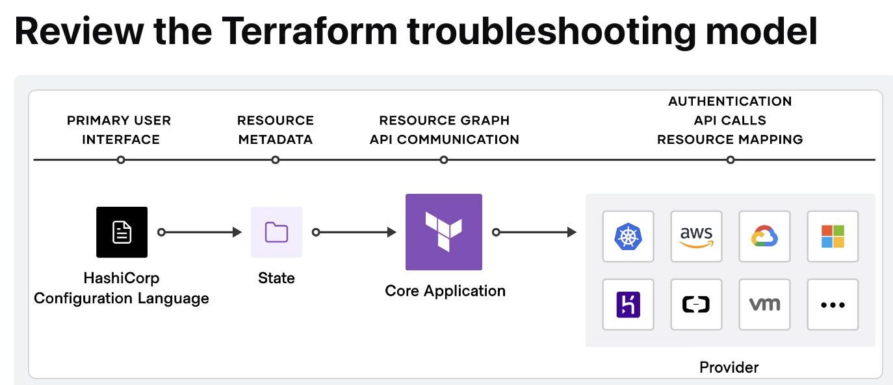
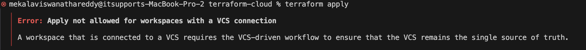
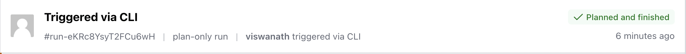
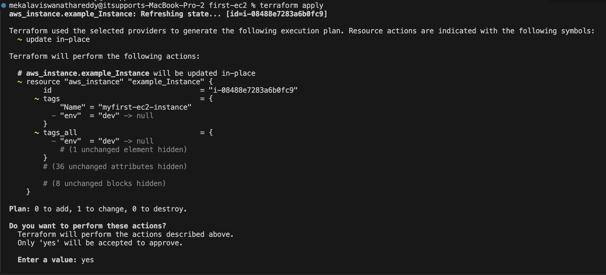

# Terraform Associate 2024 - Complete Guide

## Table of Contents
- [What is Terraform?](#what-is-terraform)
- [How Terraform Works](#how-terraform-works)
- [Advantages of Terraform](#advantages-of-terraform)
- [Terraform Core Functions](#terraform-core-functions)
- [Installation of Terraform](#installation-of-terraform)
- [What is Terraform Provider?](#what-is-terraform-provider)
- [Terraform Commands](#terraform-commands)
- [Terraform State File](#terraform-state-file)
- [Desired State vs Current State](#desired-state-vs-current-state)
- [Provider Versioning](#provider-versioning)
- [Terraform Refresh](#terraform-refresh)
- [AWS Provider Authentication](#aws-provider-authentication)
- [Basics of Attributes](#basics-of-attributes)
- [Cross Referencing Resource Attributes](#cross-referencing-resource-attributes)
- [String Interpolation](#string-interpolation)
- [Output Values](#output-values)
- [Variables](#variables)
- [TF Vars](#tf-vars)
- [Variable Definition Precedence](#variable-definition-precedence)
- [Data Types](#data-types)
- [Count and Count Index](#count-and-count-index)
- [Conditional Expressions](#conditional-expressions)
- [Terraform Functions](#terraform-functions)
- [Local Values](#local-values)
- [Data Sources](#data-sources)
- [Debugging in Terraform](#debugging-in-terraform)
- [Understanding Semantics](#understanding-semantics)
- [Dynamic Blocks](#dynamic-blocks)
- [Terraform Replace (Taint)](#terraform-replace-taint)
- [Terraform Graph](#terraform-graph)
- [Save Terraform Plan to File](#save-terraform-plan-to-file)
- [Terraform Output](#terraform-output)
- [Terraform Settings](#terraform-settings)
- [Dealing with Larger Infrastructure](#dealing-with-larger-infrastructure)
- [Zipmap Function](#zipmap-function)
- [Resource Behavior and Meta Arguments](#resource-behavior-and-meta-arguments)
- [Provisioners](#provisioners)
- [Terraform Modules](#terraform-modules)
- [Terraform Workspaces](#terraform-workspaces)
- [Terraform Backends](#terraform-backends)
- [State File Management](#state-file-management)
- [Terraform Import](#terraform-import)
- [Multiple Provider Configurations](#multiple-provider-configurations)
- [Sensitive Parameters](#sensitive-parameters)
- [HashiCorp Vault](#hashicorp-vault)
- [Terraform Cloud](#terraform-cloud)
- [Practical Scenarios](#practical-scenarios)

---

## What is Terraform?

HashiCorp Terraform is an **immutable, declarative infrastructure as code tool** that lets you define both cloud and on-premises resources in human-readable configuration files that you can version, reuse, and share. The language is based on **HashiCorp Configuration Language (HCL)** or JSON for configuration files.

### How Terraform Works

Terraform creates and manages resources on cloud platforms and other services through their **application programming interfaces (APIs)**. Providers enable Terraform to work with virtually any platform or service with an accessible API.


## Advantages of Terraform

**Infrastructure as Code (IaC)** tools allow you to manage infrastructure with configuration files rather than through a graphical user interface.

### Key Benefits:

- **Manage any infrastructure** → Terraform plugins called providers let Terraform interact with cloud platforms and other services via their APIs
- **Standardize your deployment workflow** → Providers define individual units of infrastructure as resources. You can compose resources from different providers into reusable Terraform configurations called modules
- **Track your infrastructure** → Terraform keeps track of your real infrastructure in a state file, which acts as a source of truth for your environment
- **Collaborate** → Terraform allows you to collaborate on your infrastructure with its remote state backends


**Reference:** [Terraform Infrastructure as Code](https://developer.hashicorp.com/terraform/tutorials/aws-get-started/infrastructure-as-code)

## Terraform Core Functions

The core Terraform workflow has **three steps**:

1. **Write** - Author infrastructure as code
2. **Plan** - Preview changes before applying  
3. **Apply** - Provision reproducible infrastructure

## Installation of Terraform

You can download and install Terraform for different operating systems (Windows, Linux, macOS) from the official link:

**Download Link:** [Terraform Installation](https://developer.hashicorp.com/terraform/install)

## What is Terraform Provider?

A **provider** is a plugin that enables Terraform to interact with a specific cloud or service provider, such as Amazon Web Services (AWS), Microsoft Azure, or Google Cloud Platform (GCP). Providers are responsible for:

- Understanding the APIs and resources the target infrastructure platform provides
- Translating Terraform configuration code into API calls

## Terraform Commands

### Essential Commands

| Command | Description |
|---------|-------------|
| `terraform init` | Initializes and downloads providers, modules, and backend configuration |
| `terraform init -backend-config` | Initializes backend with provided configuration |
| `terraform init -migrate-state` | Migrates existing state file to specified backend |
| `terraform validate` | Validates syntax configuration |
| `terraform plan` | Creates execution plan and determines required changes |
| `terraform plan -refresh-only` | Refreshes state to match remote objects without changes |
| `terraform apply` | Creates resources defined in configuration |
| `terraform apply -refresh-only` | Detects configuration drift by refreshing state |
| `terraform apply -refresh=false` | Prevents state refresh before applying changes |
| `terraform apply -replace` | Forces replacement of specific resource |
| `terraform fmt` | Rewrites configuration files to canonical format |
| `terraform fmt -check -recursive` | Checks formatting recursively |
| `terraform destroy` | Destroys resources created from configuration |
| `terraform show` | Displays state file resources |

### Example Usage

```bash
# Initialize Terraform
terraform init

# Validate configuration
terraform validate

# Plan infrastructure changes
terraform plan

# Apply changes
terraform apply

# Format configuration files
terraform fmt

# Destroy infrastructure
terraform destroy
```

### Provider Download Location
```
.terraform/providers/registry.terraform.io/hashicorp
```

### Targeted Operations
```bash
# Destroy specific resource
terraform destroy -target <resource_type.local_resource_name>

# Example
terraform destroy -target aws_instance.example_instance
```

> **Note:** `terraform apply -destroy` achieves the same result as the `destroy` command.

## Terraform State File

When you run `terraform apply`, it creates a `terraform.tfstate` file containing the resources defined in your configuration. **State file is a requirement for Terraform to function.**

### Key State File Characteristics:

1. **Local state** is stored in plain-text
2. **Terraform Cloud** always encrypts state at rest
3. **Contains sensitive data** - protect from unauthorized access
4. **Remote storage** provides better security

## Desired State vs Current State

### Desired State

Terraform's primary function is to create, modify, and destroy infrastructure resources to match the **desired state** described in Terraform configuration.

**Example:**
```hcl
resource "aws_instance" "example_instance" {
  ami           = "ami-01b799c439fd5516a"
  instance_type = "t2.micro"
}
```

### Current State

**Current state** is the actual state of resources currently deployed.

**Example:**
```hcl
resource "aws_instance" "example_instance" {
  ami           = "ami-01b799c439fd5516a"
  instance_type = "t2.medium"  # Changed manually
}
```

> **Important:** Terraform ensures deployed infrastructure matches desired state. If differences exist, `terraform plan` shows necessary changes to achieve desired state.

### Testing Example:

1. Create EC2 instance with `t2.micro` using Terraform
2. Manually stop instance and change to `t2.medium`
3. Run `terraform plan` - shows "update in-place" with 1 change
4. Run `terraform apply` - reverts to desired state (`t2.medium` → `t2.micro`)

## Provider Versioning

During `terraform init`, if no version is specified, the **most recent provider** will be downloaded.

> **Production Recommendation:** Constrain acceptable provider versions via configuration to prevent automatic installation of versions with breaking changes.

### Version Constraint Example:

```hcl
terraform {
  required_providers {
    aws = {
      source  = "hashicorp/aws"
      version = "~> 5.0"
    }
  }
}
```

### Version Constraint Operators

| Operator | Description |
|----------|-------------|
| `>= 1.0.0` | Versions greater than or equal to 1.0.0 |
| `<= 1.0.0` | Versions less than or equal to 1.0.0 |
| `>= 1.0.0, <= 2.0.0` | Any version between 1.0.0 and 2.0.0 |
| `~> 1.0.0` | Any version in the 1.X range |

### Version Lock File Issue

When you specify a version constraint that conflicts with `.terraform.lock.hcl`:

**Error Example:**
```
Error: Failed to query available provider packages
Could not retrieve the list of available versions for provider hashicorp/aws: 
locked provider registry.terraform.io/hashicorp/aws 5.55.0 does not match 
configured version constraint <= 5.0.0
```

**Solutions:**
- Delete `.terraform.lock.hcl` and re-run `terraform init`
- Use `terraform init -upgrade` to upgrade provider version

> **Why version constraints matter:** Providers are released separately from Terraform itself, so newer versions could introduce breaking changes.

## Terraform Refresh

The `terraform refresh` command updates the state file when resources are manually modified in the AWS console.

### Example Scenarios:

**Example 1:** Security Group Changes
- Create EC2 instance with default security group via Terraform
- Manually create custom security group and attach to EC2
- Run `terraform refresh` - updates state file from "default" to "custom"

**Example 2:** Region Changes
- Change region in `providers.tf` from `us-east-1` to `us-west-2`
- Run `terraform refresh` - empties `terraform.tfstate` file
- Use `terraform.tfstate.backup` to restore configuration

> **Warning:** Don't run `terraform refresh` manually in production environments.

## AWS Provider Authentication

### Best Practices for Authentication:

1. **Never add AWS access keys directly** in provider configuration
2. **Create IAM user** with programmatic access
3. **Download credentials** from Security credentials → Create access key
4. **Install AWS CLI** from [official documentation](https://docs.aws.amazon.com/cli/latest/userguide/getting-started-install.html)
5. **Configure credentials:**

```bash
aws configure
AWS Access Key ID [****************SD2U]: your_access_key
AWS Secret Access Key [****************X1GY]: your_secret_key
Default region name [us-east-1]: 
Default output format [None]:
```

### Alternative: Variable-based Configuration

You can also define variables in your Terraform configuration. Refer to `variables.tf` for implementation.

**For more details:** [AWS Provider Documentation](https://registry.terraform.io/providers/hashicorp/aws/5.53.0/docs)

### Version Comparison Examples

**New Version 5.53.0 Approach:**
```hcl
resource "aws_security_group" "allow_tls" {
  name        = "allow_tls"
  description = "Allow TLS inbound traffic"
  vpc_id      = aws_vpc.main.id

  tags = {
    Name = "allow_tls"
  }
}

resource "aws_vpc_security_group_ingress_rule" "allow_tls_ipv4" {
  security_group_id = aws_security_group.allow_tls.id
  cidr_ipv4         = aws_vpc.main.cidr_block
  from_port         = 443
  ip_protocol       = "tcp"
  to_port           = 443
}
```

**Old Version 4.48.0 Approach:**
```hcl
resource "aws_security_group" "allow_tls" {
  name        = "allow_tls"
  description = "Allow TLS inbound traffic"
  vpc_id      = aws_vpc.main.id

  ingress {
    description      = "TLS from VPC"
    from_port        = 443
    to_port          = 443
    protocol         = "tcp"
    cidr_blocks      = [aws_vpc.main.cidr_block]
    ipv6_cidr_blocks = [aws_vpc.main.ipv6_cidr_block]
  }
}
```

## Basics of Attributes

Each resource has its **associated set of attributes**. Attributes are fields in a resource that hold values ending up in the state.

### Example Attributes in State File:

```json
{
  "schema_version": 0,
  "attributes": {
    "private_dns": null,
    "public_dns": "ec2-100-29-169-75.compute-1.amazonaws.com",
    "public_ip": "100.29.169.75"
  }
}
```

**Reference:** [AWS Instance Attribute Reference](https://registry.terraform.io/providers/hashicorp/aws/5.53.0/docs/resources/instance#attribute-reference)

## Cross Referencing Resource Attributes

Terraform allows referencing attributes of one resource in a different resource.

### Syntax:
```
<RESOURCE_TYPE>.<NAME>.<ATTRIBUTE>
```

### Implementation Steps:

1. Create Elastic IP
2. Create Security Group  
3. Create inbound rule cross-referencing Elastic IP for CIDR IPv4 block

### Example:

```hcl
resource "aws_eip" "lb" {
  domain = "vpc"
}

resource "aws_vpc_security_group_ingress_rule" "allow_tls_ipv4" {
  security_group_id = aws_security_group.allow_tls.id
  cidr_ipv4         = "${aws_eip.lb.public_ip}/32"
}
```

*For more details, check `cross-reference-attributes.tf` file*

## String Interpolation

**Syntax:** `${...}` indicates that Terraform will replace the expression inside curly braces with its calculated value.

**Example:**
```hcl
cidr_ipv4 = "${aws_eip.lb.public_ip}/32"
```

## Output Values

Terraform output values make information about your infrastructure available on the command line and can expose information for other Terraform configurations to use.

### Example 1: Specific Attribute Output

```hcl
resource "aws_eip" "lb" {
  domain = "vpc"
}

output "public_ip" {
  value = aws_eip.lb.public_ip
}
```


### Example 2: All Attributes Output

```hcl
resource "aws_eip" "lb" {
  domain = "vpc"
}

output "public_ip" {
  value = aws_eip.lb
}
```


> **Note:** Output values defined in Project A can be referenced from code in Project B as well.

## Variables

Variables allow you to update important values in one central place instead of searching and replacing throughout your code, saving time and preventing mistakes. Managing variables in production environments is crucial for keeping code clean and reusable.

*Refer to `variables/main.tf` and `variables.tf` for implementation details.*

## TF Vars

**tfvars files** store variable definitions, allowing you to externalize variable definitions for easier management.

### Key Behaviors:

1. **Terraform automatically picks** values from `terraform.tfvars` if not in `variables.tf`
2. **Empty `terraform.tfvars`** causes Terraform to use `variables.tf` values
3. **Values in `terraform.tfvars`** take precedence over `variables.tf`
4. **HashiCorp recommends** creating separate `*.tfvars` files for variable values
5. **Multiple environments** require explicit command-line arguments:

```bash
terraform plan -var-file dev.tfvars
```

## Variable Definition Precedence

Terraform loads variables in the following order, with **later sources taking precedence**:

1. **Environment variables**
2. **terraform.tfvars** file (if present)
3. **terraform.tfvars.json** file (if present)  
4. **\*.auto.tfvars** or **\*.auto.tfvars.json** files (lexical order)
5. **-var** and **-var-file** command-line options

### Testing Examples:

**Example 1: Environment Variable Precedence**
- `variables.tf`: `instance_type = "t2.micro"`
- System env: `TF_VAR_instance_type=t2.medium`
- Result: Uses `t2.medium` (environment variable precedence)

**Example 2: Command Line Precedence**
- System env: `TF_VAR_instance_type=t2.micro`
- `terraform.tfvars`: `instance_type = "t2.large"`
- Command: `terraform plan -var="instance_type=m5.large"`
- Result: Uses `m5.large` (command line precedence)

**Example 3: tfvars vs variables.tf**
- `variables.tf`: `instance_type = "t2.micro"`
- `terraform.tfvars`: `instance_type = "t2.large"`
- Result: Uses `t2.large` (tfvars precedence)

## Data Types

Data types refer to the **type of value**. Terraform supports various data types based on requirements.

### Common Data Types:

| Type | Example | Description |
|------|---------|-------------|
| **String** | `"Hello world"` | Text values |
| **Number** | `7576` | Numeric values |
| **Boolean** | `true` or `false` | Boolean values |
| **List/Tuple** | `["us-west-1a", "us-west-1c"]` | Collection of values |
| **Set** | Unique collection | No secondary identifiers or ordering |
| **Map/Object** | `{name = "Mabel", age = 52}` | Key-value pairs |
| **Null** | `null` | Represents absence or omission |

*See `data-types/` directory for implementation examples*

**Reference:** [Terraform Expression Types](https://developer.hashicorp.com/terraform/language/expressions/types#types)

## Count and Count Index

### Count
**Count** refers to the total number of instances, users, etc., you want to create.

*Example: See `count/count.tf`*

### Count Index
**Count Index** allows fetching the index of each iteration in the loop. `${count.index}` starts from zero.

*Example: See `count-index/count-index.tf`*

> **Note:** Instead of generic names like `loadbalancer0`, `loadbalancer1`, you can create better names like `dev-loadbalancer`, `test-loadbalancer` using count.index.

## Conditional Expressions

A **conditional expression** uses a boolean expression to select one of two values.

### Syntax:
```
condition ? true_val : false_val
```

### Example:
```hcl
var.environment == "production" && var.region == "us-east-1" ? "m5.large" : "t2.micro"
```

*Check `conditional-expression/conditional.tf` for more details*

**Reference:** [Terraform Conditional Expressions](https://developer.hashicorp.com/terraform/language/expressions/conditionals#conditional-expressions)

## Terraform Functions

A **function** is a block of code that performs a specific task.

### Using Terraform Console

`terraform console` allows interactive exploration of Terraform configuration and state. Useful for debugging and exploring the Terraform environment.

> **Note:** CLI must be able to lock state to prevent changes during interactive exploration.


### Key Functions

#### file() Function
Reads contents of a file at given path and returns them as a string.

**Importance:** Reduces overall Terraform code size by loading contents from external sources.

*Example: See `functions/functions.tf` with `iam-user-policy.json`*

#### lookup() Function
Retrieves value of single element from map, given its key.

**Syntax:**
```
lookup(map, key, default)
lookup({a="ay", b="bee"}, "a", "what?")
```

**Real-time Example:**
```hcl
lookup({
  "us-east-1" = "ami-08a0d1e16fc3f61ea", 
  "us-west-2" = "ami-0b20a6f09484773af", 
  "ap-south-1" = "ami-0e1d06225679bc1c5"
}, "us-east-1")
```

#### length() Function
Determines length of given list, map, or string.

**Syntax:**
```
length(["a", "b"])  # Returns: 2
```

**Real-time Example:**
```hcl
length(["firstec2", "secondec2"])
```

#### element() Function
Retrieves single element from list (zero-based index).

**Syntax:**
```
element(list, index)
element(["a", "b", "c"], 1)  # Returns: "b"
```

**Real-time Example:**
```hcl
element(["firstec2", "secondec2"], 0)
```

#### formatdate() Function
Converts timestamp into different time format.

**Syntax:**
```
formatdate("DD MMM YYYY hh:mm ZZZ", "2018-01-02T23:12:01Z")
```

**Real-time Example:**
```hcl
formatdate("DD MMM YYYY hh:mm ZZZ", timestamp())
```

*For more functions, check `functions/functions-challenge/functions-challenge.tf`*

**Reference:** [Terraform Functions](https://developer.hashicorp.com/terraform/language/functions)

## Local Values

A **local value** assigns a name to an expression, allowing multiple uses within a module without repetition.

Local values help **avoid repeating the same values or expressions** multiple times in configuration.

*Refer to `local-values/local-values.tf` for implementation details*

## Data Sources

Data sources allow Terraform to **use/fetch information defined outside of Terraform**. A data source is accessed via a special kind of resource known as **data resource**, declared using a data block.

### Example Syntax:
```hcl
data "aws_instance" "foo" {}
```

### File Data Source Example:
```hcl
data "local_file" "example" {
  filename = "${path.module}/demo.txt"
}
```


> **Note:** `${path.module}` returns the current file system path where your code is located.

### Fetching Latest OS Image

You can fetch the latest AMI ID using data source blocks. Check `data-source/data-source-ami.tf` for region-specific testing.

## Debugging in Terraform

Terraform has **detailed logs** enabled by setting the `TF_LOG` environment variable.

### Log Levels:
- `TRACE` (highest verbosity)
- `DEBUG`
- `INFO`
- `WARN`
- `ERROR`

### Usage:
```bash
export TF_LOG=TRACE
terraform apply

# Store logs in file
export TF_LOG_PATH=/tmp/terraform-crash.log
```

### Debugging Models



1. **Language errors:** Syntax errors with line numbers and explanations
2. **State errors:** State synchronization issues that may destroy/change resources
3. **Core errors:** Potential bugs - report to core development team
4. **Provider errors:** Authentication, API calls, resource mapping issues

## Understanding Semantics

Terraform loads all configuration files within the directory in **alphabetical order**.

Files must end in **`.tf`** or **`.tf.json`** to specify the format in use.

## Dynamic Blocks

In many use cases, there are **repeatable nested blocks** that need definition, leading to longer, difficult-to-manage code.

**Dynamic blocks** allow dynamically constructing repeatable nested blocks supported inside resource, data, provider, and provisioner blocks.

*Check details in `dynamic-block/dynamic.tf`*

## Terraform Replace (Taint)

The **`-replace`** option with terraform apply forces Terraform to replace an object even without configuration changes requiring it.

### Usage:
```bash
terraform apply -replace="aws_instance.web"
```

### Process:
1. Create EC2 instance normally
2. Apply replace command - terminates and recreates instance

> **Note:** Similar functionality was achieved using `terraform taint` in older versions. For Terraform v0.15.2+, HashiCorp recommends using `-replace` option.

## Terraform Graph

Terraform graph creates a **visual representation of dependency relationships** between resources in your configuration.

### Usage:
```bash
# Generate graph output
terraform graph

# Create visual representation
terraform graph | dot -Tsvg > graph.svg

# Install Graphviz
brew install graphviz  # macOS
```

### Process:
1. Run `terraform init` in your configuration directory
2. Execute `terraform graph` to see output
3. Copy content to [Graphviz Online](https://dreampuf.github.io/GraphvizOnline/) or save as SVG
4. Open `graph.svg` in browser for visual representation


## Save Terraform Plan to File

You can run `terraform apply` by referencing a plan file, ensuring infrastructure state remains exactly as shown in the plan.

### Usage:
```bash
# Save plan to file
terraform plan -out infra.plan

# Apply from plan file
terraform apply "infra.plan"

# Read plan file content
terraform show infra.plan
```

### Benefits:
- **Consistency:** Infrastructure matches plan exactly
- **Documentation:** Organizations require proof of planned changes
- **Review Process:** Plan files enable change approval workflows

## Terraform Output

The `terraform output` command extracts output variable values from the state file.

### Usage:
```bash
# Show all outputs
terraform output

# Show specific output
terraform output iam_arn
```


*For implementation details, check `terraform-output/output.tf`*

## Terraform Settings

Terraform settings configure **project-specific Terraform behaviors**, such as requiring minimum Terraform versions.

### Minimum Version Requirement:
```hcl
terraform {
  required_version = "0.13.6"
}
```

### Required Providers:
```hcl
terraform {
  required_providers {
    aws = {
      version = ">= 2.7.0"
      source = "hashicorp/aws"
    }
  }
}
```

**Reference:** [Terraform Settings](https://developer.hashicorp.com/terraform/language/settings)

## Dealing with Larger Infrastructure

### Targeted Resources

The `terraform plan -target=resource` flag targets specific resources, useful for operating on isolated portions of large configurations.

```bash
terraform plan -target=aws_instance.web
```

### Refresh Control

Adding new resources to existing configurations requires `terraform plan` to refresh state and display new resources. Use `terraform plan -refresh=false` to prevent state querying, reducing API calls.

```bash
terraform plan -refresh=false
```

## Zipmap Function

**zipmap** constructs a map from a list of keys and corresponding list of values. Both lists must be the same length.

### Syntax:
```
zipmap(keyslist, valueslist)
```

### Examples:
```hcl
zipmap(["a", "b"], [1, 2])
# Result: {"a" = 1, "b" = 2}

zipmap(["pineapple", "oranges", "strawberry"], ["yellow", "orange", "red"])
# Result: {"oranges" = "orange", "pineapple" = "yellow", "strawberry" = "red"}
```


*For real-time example, check `zipmap-function/zip.tf`*

## Resource Behavior and Meta Arguments

A **resource block** declares that you want a particular infrastructure object to exist with given settings.

### How Terraform Applies Configuration:

1. **Create** resources in configuration but not in state
2. **Destroy** resources in state but not in configuration  
3. **Update in-place** resources with changed arguments

### Default Behavior Example:
- Create EC2 instance with tag `my-first-ec2`
- Manually add `production` tag
- Run `terraform apply` → removes `production` tag (not in configuration)

### Changing Default Behavior:
- Create EC2 instance with Linux AMI
- Change configuration to Windows AMI
- Run `terraform plan` → destroys existing, creates new with Windows AMI

### Meta Arguments

| Argument | Description |
|----------|-------------|
| `create_before_destroy` | Creates replacement before destroying original |
| `prevent_destroy` | Rejects plans that would destroy the resource |
| `ignore_changes` | Ignores certain changes to live resources |
| `replace_triggered_by` | Replaces resource when referenced items change |
| `for_each` | Creates instance for each item in map/set |
| `depends_on` | Handles hidden dependencies Terraform can't infer |

### Lifecycle Meta Arguments

#### ignore_changes
```hcl
lifecycle {
  ignore_changes = [tags]
}
```

*Check `lifecycle-metaarguments/ignore-changes.tf` for details*

#### prevent_destroy
```hcl
lifecycle {
  prevent_destroy = true
}
```


*Check `lifecycle-metaargument/prevent-destroy.tf` for details*

#### for_each
Expects key pair creation. Generate public key from PEM file:
```bash
ssh-keygen -f file.pem -y > public.pub
```

*Check `lifecycle-metaargument/for-each.tf` for details*

## Provisioners

**Provisioners** execute scripts on local or remote machines as part of resource creation or destruction.

**Example:** Install software packages after VM launch.

### Types of Provisioners:

#### 1. local-exec
Executes commands on the machine running Terraform.

**Example:** Fetch IP after EC2 launch and store in `server_ip.txt`

*Check `provisioners/local-exec.tf` for implementation*

#### 2. remote-exec
Executes commands on remote machine (requires connection block).

**Example:** Install Apache after EC2 launch

*Check `provisioners/remote-exec.tf` for implementation*

### Create-Time and Destroy-Time Provisioners

- **Creation provisioner:** Executes during resource creation
- **Destroy provisioner:** Executes during resource destruction

*Check `provisioner/create-destroy-time-provisioner` for examples*

### Important Notes:

- Provisioners work with **any resource type**, not just `aws_instance`
- **Failed provisioners** mark resources as "tainted" in state file
- **Re-running terraform apply** destroys and recreates tainted resources

## Terraform Modules

**Terraform modules** centralize resource configuration, making it easier for multiple projects to reuse Terraform code.

### Choosing the Right Module

- **Inspect source code** on GitHub or other platforms
- **Check repository activity** (forks, stars)
- **Prefer modules** maintained by HashiCorp partners

### Benefits of Modules

1. **Enables code reuse**
2. **Supports local or remote storage**
3. **Supports versioning** for compatibility

### Organizational Usage

Most organizations maintain their own module sets, often forking from Terraform Registry and modifying for specific use cases.

**Reference:** [Terraform Registry Modules](https://registry.terraform.io/search/modules?namespace=terraform-aws-modules)

### Module Types

#### Root Module
Resides in main working directory - entry point of infrastructure definition.

```hcl
module "ec2" {
  source = "../../../modules/ec2-module"
}
```

#### Child Module
A module called by another module.

```hcl
resource "aws_instance" "my-ec2" {
  ami           = "ami-085f9c64a9b75eed5"
  instance_type = "t2.micro"
}
```

> **Note:** Child modules don't inherit all parent module variables. Parent must explicitly pass variables to child modules.

### Publishing Modules

Anyone can publish modules on Terraform Registry with these requirements:

| Requirement | Description |
|-------------|-------------|
| **GitHub** | Must be public repository |
| **Named** | Format: `terraform-<PROVIDER>-<NAME>` |
| **Repository description** | Populates module short description |
| **Standard structure** | Must adhere to standard module structure |
| **x.y.z tags** | Semantic versioning for releases |

**Reference:** [Publishing Modules](https://developer.hashicorp.com/terraform/registry/modules/publish)

## Terraform Workspaces

Terraform workspaces enable managing **multiple deployment sets** from the same configuration files. Each workspace has its own **state file**.

### Workspace Commands

| Command | Description |
|---------|-------------|
| `terraform workspace list` | List available workspaces |
| `terraform workspace show` | Show current workspace |
| `terraform workspace select dev` | Switch to dev workspace |
| `terraform workspace new prod` | Create and switch to prod workspace |
| `terraform workspace delete` | Delete workspace |

### Workspace Structure

Workspaces create `terraform.tfstate.d` directory containing individual state files.

### Terraform .gitignore

When running Terraform commands, certain files/folders are created that shouldn't be committed to source control due to **security/sensitive constraints**:

```gitignore
# Terraform files
.terraform/
.terraform.lock.hcl
terraform.tfstate
terraform.tfvars
terraform.tfstate.backup
*.tfplan
*.tfstate.*
```

## Terraform Backends

### Local Backend

```hcl
terraform {
  backend "local" {
    path = "DevOps/terraform/terraform-associate-2024/terraform.tfstate"
  }
}
```

### Challenges with Local Backend:
- **Not versioned**
- **No state locking**
- **State file corruption**
- **Not suitable for collaboration**

### Remote Backend

Terraform supports many backend types: remote, azurerm, consul, s3, kubernetes, etc.

#### S3 Backend Example:

1. **Create S3 bucket** manually in any region
2. **Create folder path** for state file storage
3. **Add backend configuration** in `backend.tf`

*Check `remote-backend/backend.tf` for details*

### State File Locking

Terraform **locks state file** during write operations to prevent corruption from concurrent operations.

> **Note:** Use `terraform force-unlock <LOCK_ID>` to force unlock state file if needed.

#### State Locking in S3

1. **Create DynamoDB table** with partition key `LockID` (String type)
2. **Add DynamoDB table name** in backend configuration

> **Important:** S3 doesn't support state locking by default. DynamoDB table is required for state locking functionality.

*State locking details in `remote-backend/backend.tf`*

## State File Management

The `terraform state` command modifies current state by removing items.

### State Commands

| Command | Description |
|---------|-------------|
| `terraform state list` | List resources in state file |
| `terraform state show aws_instance.myec2` | Show detailed state data for resource |
| `terraform state pull` | Pull current state to stdout |
| `terraform state push` | Update remote state from local file |
| `terraform state rm` | Remove items from state |
| `terraform state mv` | Move/rename resources without destroying |

### Example:
```bash
# Move resource without recreation
terraform state mv aws_instance.myec2 aws_instance.my-demo-ec2
```

### Important Notes:

1. **Sensitive variables** are stored in state file (obfuscated in CLI output)
2. **Default values** appear in state file if no other value set
3. **Variable names** are not stored in state file
4. **Variable descriptions** are not written to state file

### Fetching Remote State Data

Use remote state to share data between teams:

- **Network team:** Creates Elastic IP with remote backend
- **Security team:** Creates security group, fetches Elastic IP output via remote state backend

*For details: `fetch-remote-state-data/network/` and `fetch-remote-state-data/sg/`*

## Terraform Import

Terraform can **import existing infrastructure resources**, bringing them under Terraform management.

### Import Process:

1. **Create resource manually** (e.g., security group with rules)
2. **Add import block** or use `terraform import` command:

```hcl
import {
  to = aws_security_group.mysg
  id = "sg-0dd1bd5484b8c30c6"
}
```

3. **Generate configuration:**
```bash
terraform plan -generate-config-out=mysg.tf
```

4. **Apply changes:**
```bash
terraform apply
```

5. **Modify and reapply** as needed
6. **Destroy when complete:**
```bash
terraform destroy
```

*Check details: `terraform-import/import.tf`*

**Reference:** [Terraform Import](https://developer.hashicorp.com/terraform/cli/commands/import)

## Multiple Provider Configurations

To create **multiple configurations** for the same provider, include multiple provider blocks with the same provider name, using the **`alias`** meta-argument for additional configurations.

### Purpose:
Provider aliases differentiate between **multiple instances of the same provider** with different settings for different resources.

### Example:
```hcl
provider "aws" {
  region = "us-east-1"
}

provider "aws" {
  alias  = "west"
  region = "us-west-2"
}

resource "aws_instance" "east" {
  ami           = "ami-12345678"
  instance_type = "t2.micro"
}

resource "aws_instance" "west" {
  provider      = aws.west
  ami           = "ami-87654321"
  instance_type = "t2.micro"
}
```

*Check `multi-provider/multiprovider.tf` for details*

**Reference:** [Provider Configuration](https://developer.hashicorp.com/terraform/language/providers/configuration)

## Sensitive Parameters

Adding **sensitive parameter** prevents accidental exposure in CLI output and logs.

### Examples:

#### Basic File Resource:
```hcl
resource "local_file" "foo" {
  content  = "supersecretpassw0rd"
  filename = "password.txt"
}
```

#### Variable with Sensitive Flag:
```hcl
variable "password" {
  default   = "supersecretpassw0rd"
  sensitive = true
}

resource "local_file" "foo" {
  content  = var.password
  filename = "password.txt"
}
```

#### Sensitive File Resource:
```hcl
resource "local_sensitive_file" "foo" {
  content  = "supersecretpassw0rd"
  filename = "password.txt"
}

output "pass" {
  value = local_sensitive_file.foo.content
}
```

**References:**
- [Local File Provider](https://registry.terraform.io/providers/hashicorp/local/latest/docs/resources/file)
- [Local Sensitive File Provider](https://registry.terraform.io/providers/hashicorp/local/latest/docs/resources/sensitive_file)

## HashiCorp Vault

**HashiCorp Vault** allows organizations to securely store secrets (tokens, passwords, certificates) with access management for protecting secrets.

### Vault Provider Features:
- **Read from Vault**
- **Write to Vault** 
- **Configure HashiCorp Vault**

> **Important:** Interacting with Vault from Terraform causes **secrets to be persisted in Terraform's state file**.

## Terraform Cloud

**Terraform Cloud** manages Terraform runs in a consistent, reliable environment with features like:

- **Access controls**
- **Private registry** for sharing modules
- **Policy controls**
- **Remote runs**
- **VCS connection**

### Getting Started with Terraform Cloud:

1. **Create free account:** [Terraform Cloud](https://app.terraform.io/)
2. **Login** with credentials
3. **Create organization** and workspace (e.g., demo-workspace)
4. **Add variables:** `aws_access_key_id`, `aws_secret_access_key` (mark as sensitive)
5. **Create GitHub repository** for demo
6. **Authenticate GitHub** with Terraform Cloud
7. **Connect repository** to workspace
8. **Trigger runs:** Plan → Apply → Monitor results
9. **Destroy resources:** Settings → Destruction and Deletion → Queue destroy plan

### Automatic Triggers:
When workspaces link to VCS repositories, Terraform Cloud automatically initiates runs when changes are committed to specified branches.

### Terraform Cloud Agents:
Primary function is **executing Terraform plans and applying changes to infrastructure**, acting as bridge between Terraform Cloud service and target infrastructure.

### Sentinel and OPA Policy:

**Sentinel** is an embeddable policy-as-code framework enabling fine-grained, logic-based policy decisions for standardization and cost controls.

> **Note:** 
> - Sentinel policies are **paid features**
> - Policies are enforced **after terraform plan** but **before apply phase**
> - HashiCorp also supports **Open Policy Agent (OPA)**

### Remote Backends for Terraform Cloud:

**Full remote operations** allow `terraform plan` or `terraform apply` execution in Terraform Cloud's run environment with log output streaming to local terminal.

#### CLI Authentication:
```bash
terraform login
# Follow browser prompts to generate API token
terraform init
terraform plan
terraform apply
```

> **Important:** Workspace must **not** be connected to VCS for CLI-driven workflows.





### Air Gap Environments:

**Air gap** is a network security measure ensuring secure computer networks are **physically isolated** from unsecured networks.

Air gap deployment is available for **Terraform Enterprise editions**.

**Reference:** [Air Gap Environments](https://www.hashicorp.com/blog/deploying-terraform-enterprise-in-airgapped-environments)

## Practical Scenarios

### Scenario 1: Manual Modifications Detection

**Test:** Create AWS resource with Terraform, modify manually in AWS console, run `terraform apply`

1. **Create tag manually** for EC2 instance after Terraform creation
2. **Run `terraform apply`** → Shows "update in-place"
3. **Result:** Manual modifications destroyed (not in configuration)



### Scenario 2: State File Manipulation

**Test:** Create 2 EC2 instances, remove one from state file, run `terraform apply`

1. **Create 2 EC2 instances** with Terraform
2. **Remove one from state:**
```bash
terraform state rm aws_instance.example2
```
3. **Run `terraform apply`** → Creates replacement instance
4. **Result:** 3 instances in AWS (2 managed by Terraform, 1 orphaned)
5. **Run `terraform destroy`** → Destroys only 2 managed instances

### Scenario 3: Configuration Drift Detection

**Question:** What command reconciles state with real-world infrastructure to detect drift?

**Answer:** Use `terraform apply -refresh-only` to sync changes into state file without making infrastructure changes.


### Scenario 4: Resource Replacement

**Question:** How to replace existing resource without configuration changes?

**Answer:** Use `terraform apply -replace <resource_type.resource_name>` to destroy and recreate resource.

### Scenario 5: Module Version Management

**Test:** Remove version parameter from module block and run `terraform init`

```hcl
module "iam" {
  source  = "terraform-aws-modules/iam/aws"
  version = "5.4.0"  # Remove this line
}
```

**Process:**
1. **Create module configuration** with version 5.4.0
2. **Run `terraform init`** → Downloads version 5.4.0
3. **Check `.terraform/modules/modules.json`** → Confirms version 5.4.0
4. **Remove version parameter** and re-run `terraform init`
5. **Result:** Uses cached version 5.4.0 (doesn't download newer version)

**Reason:** Once specific version is downloaded, Terraform caches it locally unless explicitly updated.

---

## Summary

This comprehensive guide covers **Terraform Associate 2024** certification topics including:

- **Core Concepts:** Infrastructure as Code, state management, providers
- **Configuration:** Variables, data types, functions, expressions
- **Advanced Features:** Modules, workspaces, backends, provisioners
- **Cloud Integration:** AWS provider, Terraform Cloud, remote state
- **Best Practices:** Security, collaboration, version management
- **Troubleshooting:** Debugging, state management, import/export

### 📚 Reference Links

- [Terraform Documentation](https://developer.hashicorp.com/terraform)
- [Terraform Registry](https://registry.terraform.io/)
- [AWS Provider Documentation](https://registry.terraform.io/providers/hashicorp/aws/latest/docs)
- [Terraform Cloud](https://app.terraform.io/)
- [HashiCorp Learn](https://learn.hashicorp.com/terraform)

---

*Last updated: September 30, 2025*